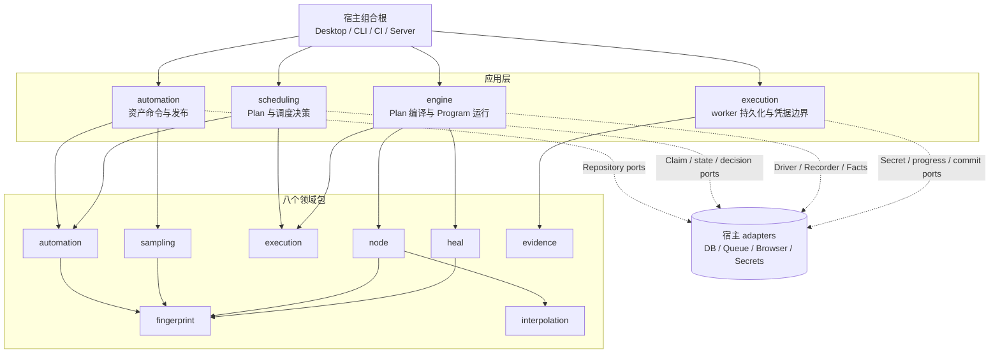
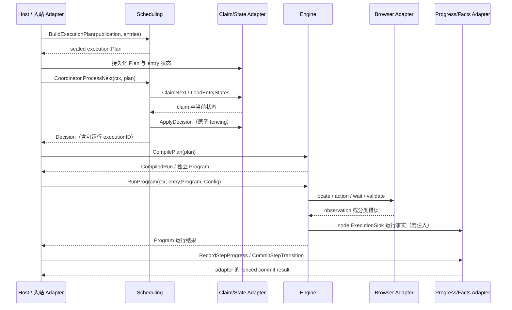

# healix-core

`healix-core` 是一个面向浏览器自动化产品的 Go 领域与执行内核。它把可发布的自动化资产、不可变执行计划、确定性节点运行、自愈决策和执行事实建模为与传输、数据库和浏览器实现无关的包，供 Desktop、CLI、CI Runner 或 Server 作为库嵌入。

当前公开 API 仍处于 **v0**：代码可用且受测试约束，但尚未承诺 v1 兼容性。

## 它是什么，不是什么

**它提供：**

- Environment、Folder、Node、Workflow、TestTask 等版本化自动化资产及其不变量；
- 从已发布快照构建并封存多入口 `execution.Plan`；
- 按入口顺序和失败策略进行纯调度决策与 claim 协调；
- 把每个 Plan entry 独立编译为 `node.Program`，并通过注入端口运行；
- 选择器、元素指纹、变量插值、采样会话、确定性自愈和不可变执行事实；
- Repository、Driver、Recorder、Secret、调度和事实提交等宿主端口。

**它不提供：**

- HTTP API、数据库 schema、消息协议、UI 或查询投影；
- Rod、Playwright、Wails、SQLite、rrweb、凭据库或文件存储；
- 生产级数据库、队列、浏览器、密钥或事实存储 adapter；
- 一个完整的“领取任务 → 编译 → 运行 → 持久化终态”worker 循环。

换言之，Core 负责规则、决策和编排契约；宿主负责 IO、事务、并发控制、授权、审计与部署。

## 架构一览



依赖始终由宿主指向应用层，再指向领域层；Core 不反向依赖基础设施。

## 八个领域与四个应用模块

### 领域层

| 包 | 已实现能力 |
|---|---|
| `domain/automation` | 版本化资产、Revision、发布快照、引用锁定、生命周期和文件夹树规则 |
| `domain/sampling` | 交互式采样会话、capture 幂等、匹配和临时工作流 |
| `domain/execution` | 密封多入口 Plan、Run/entry 状态、预算与转换不变量 |
| `domain/node` | 可运行节点树、动作/等待/校验、重试、生命周期和运行端口 |
| `domain/heal` | 无浏览器或 LLM 依赖的确定性重定位、评分、评估与候选证据 |
| `domain/evidence` | 进度事实、终态事件、修复/校验观察和原子提交值语义 |
| `domain/fingerprint` | `NodeSpec`、Selector、Fingerprint 和框架检测值对象 |
| `domain/interpolation` | `${name}` 表达式解析与展开 |

以上领域行为均已实现；涉及浏览器、存储或外部服务的部分仍只是端口边界。

### 应用层

| 模块 | 已实现 | 仅端口契约 / 宿主义务 |
|---|---|---|
| `application/automation` | 聚合命令服务、Revision 冲突、采样发布、修复审核 | Repository 事务、ID/时钟、授权、查询 API |
| `application/scheduling` | `BuildExecutionPlan`、`DecideAdvance`、`Coordinator` | 原子 claim、租约/fencing、状态事务、完整队列 |
| `application/engine` | `CompilePlan`、`RunProgram`、步骤元数据映射 | 选择已调度 entry，注入并实现运行端口 |
| `application/execution` | `WorkerScope`、凭据装配、进度与事实提交接口 | Secret 后端、授权审计、进度存储和原子终态提交 |

接口存在不代表生产 adapter 已存在。

## 端到端执行



关键边界：`Plan` 是成员、顺序、依赖版本和 failure policy 的唯一封印快照；每个 entry 拥有独立 `Program` 和全新的 Runtime。claim token、step revision、commit identity 与终态 facts 的原子性必须由 adapter 兑现。

## 安装

远端版本可用时：

```bash
go get github.com/Capsule7446/healix-core@<version>
```

在相邻目录进行本地联调时，可在宿主 `go.mod` 中使用：

```go
require github.com/Capsule7446/healix-core v0.0.0

replace github.com/Capsule7446/healix-core => ../healix-core
```

本模块当前声明 Go `1.26.4`，生产代码仅依赖 Go 标准库和本模块内部包。

## 使用示例

### 1. 封存传输无关的执行计划

`execution.Seal` 会验证 Draft、复制输入并按 `SequenceNumber` 固定入口顺序。真实运行还应提供 Plan 引用到的 workflow、node 与 reference snapshots。

```go
package main

import (
    "log"

    "github.com/Capsule7446/healix-core/domain/execution"
)

func main() {
    plan, err := execution.Seal(execution.Draft{
        RunID:         "run-42",
        FailurePolicy: execution.FailurePolicyStopOnFailure,
        Entries: []execution.WorkflowEntry{
            {
                ExecutionID:      "execution-1",
                TestTaskItemID:   "item-1",
                SequenceNumber:   1,
                WorkflowID:       "workflow-login",
                WorkflowVersionID: "workflow-login-v3",
            },
        },
        Workflows: []execution.WorkflowSnapshot{
            {
                ID:         "workflow-login",
                WorkflowID: "workflow-login",
                VersionID:  "workflow-login-v3",
                DisplayName:   "登录",
                VersionNumber: 3,
                Steps: []execution.Step{
                    {
                        ID:          "step-wait",
                        DisplayName: "短暂等待",
                        Kind:        execution.WaitStep,
                        WaitKind:    "sleep",
                        WaitMS:      100,
                    },
                },
            },
        },
    })
    if err != nil {
        log.Fatal(err)
    }

    _ = plan // 可交给 scheduling.DecideAdvance 或 engine.CompilePlan
}
```

### 2. 从已发布 TestTask 快照构建 Plan

应用集成通常从 `automation.TestTaskVersionPlan` 出发，由宿主生成唯一 RunID/ExecutionID：

```go
plan, err := scheduling.BuildExecutionPlan(scheduling.BuildExecutionPlanInput{
    RunID:       runID,
    Publication: publication,
    Entries: []scheduling.ExecutionEntryInput{
        {
            ExecutionID:      executionID,
            TestTaskItemID:   itemID,
            SequenceNumber:   1,
            WorkflowID:       workflowID,
            WorkflowVersionID: workflowVersionID,
        },
    },
})
if err != nil {
    return fmt.Errorf("build execution plan: %w", err)
}
```

`BuildExecutionPlan` 会拒绝无法无损映射的参数语义，而不是静默丢失数据。

### 3. 编译并运行被调度的 entry

```go
compiled, err := engine.CompilePlan(plan)
if err != nil {
    return fmt.Errorf("compile plan: %w", err)
}

entry, ok := compiled.Entry(executionID)
if !ok {
    return fmt.Errorf("compiled entry %q not found", executionID)
}

err = engine.RunProgram(ctx, entry.Program, engine.Config{
    RunID:        runID,
    ClaimToken:   claimToken,
    Driver:       driver,   // node.Driver，由宿主实现
    Recorder:     recorder, // node.Recorder，由宿主实现
    Facts:        facts,    // node.ExecutionSink，由宿主实现
    Healer:       heal.NewDefaultHealer(), // nil 表示关闭自愈
    Variables:    variables,
    StepInterval: 100 * time.Millisecond,
})
```

宿主必须先通过调度决定 entry 可运行，再执行对应 Program；`CompilePlan` 本身不会领取任务或写数据库。

## Adapter 必须保证什么

- **入站：** 校验外部 DTO，生成唯一 ID 和时间戳，组装完整 publication snapshot；不得绕过 `Seal`。
- **自动化持久化：** 使用 opaque Revision 做 CAS，并在同一事务保存聚合、版本与指针变化。
- **调度：** 原子 claim、不可伪造 token、worker fencing、事务化应用 decision，并返回与 Plan 完全一致的 entry 状态集合。
- **浏览器执行：** 实现 `node.Driver`/`Element`/`Locator`，尊重 `context.Context`；目标缺失必须返回或包装 `node.ErrElementNotFound`，只有该类别会触发确定性自愈。
- **记录与事实：** 对进度实施 fencing；按 revision、commit identity 和封印依赖目标原子提交终态与 facts。
- **凭据：** 先经 `CredentialAuthorizer` 授权逻辑引用，再由 `SecretProvider` 取值；不得把 secret 写入日志或持久化快照。
- **错误：** 保留 `errors.Is` / `errors.As` 分类并补充上下文，不依赖完整错误字符串。

详见[适配器职责](docs/integration/adapter-responsibilities.md)。

## 当前不支持或明确延期

- lease heartbeat 与租约过期恢复；
- active cancellation registry；
- 完整队列与持久 worker loop；
- 参数优先级合并；
- 无损映射 run parameter scopes、entry parameter snapshots、TestTask item 参数，以及必填或非文本参数语义；
- 生产级 adapters 和 read projections；
- HTTP、数据库 schema、消息格式及序列化兼容性承诺。

这些是当前代码边界，不是对宿主能力的暗示或路线图承诺。

## 本地验证

```bash
make test       # go test ./...
make race       # go test -race ./...
make vet        # go vet ./...
make build      # go build ./...
make coverage   # 生成 coverage.out 并检查 80% 门槛
make lint       # golangci-lint run ./...
make check      # fmt-check + vet + test + race + coverage + build + lint
```

也可直接运行：

```bash
go test ./...
go test -race ./...
go vet ./...
go build ./...
```

## 继续阅读

从[文档导航](docs/README.md)选择适合角色的阅读路径。建议优先阅读：

- [系统总览](docs/architecture/system-overview.md)：领域、应用和 adapter 的全局边界；
- [上下文地图](docs/architecture/context-map.md)：Automation、Execution 与共享内核的协作；
- [依赖规则](docs/architecture/dependency-rules.md)：允许的依赖方向与原子写入要求；
- [端到端执行](docs/architecture/end-to-end-execution.md)：从 TestTask 发布到终态 Evidence；
- [公开契约](docs/integration/public-contract.md)：稳定入口、错误面和兼容边界；
- [适配器职责](docs/integration/adapter-responsibilities.md)：宿主必须兑现的事务与 IO 语义。

源码与测试是最终事实来源；文档中的“已实现”“仅端口契约”“适配器义务”和“不支持”均描述当前仓库事实。
