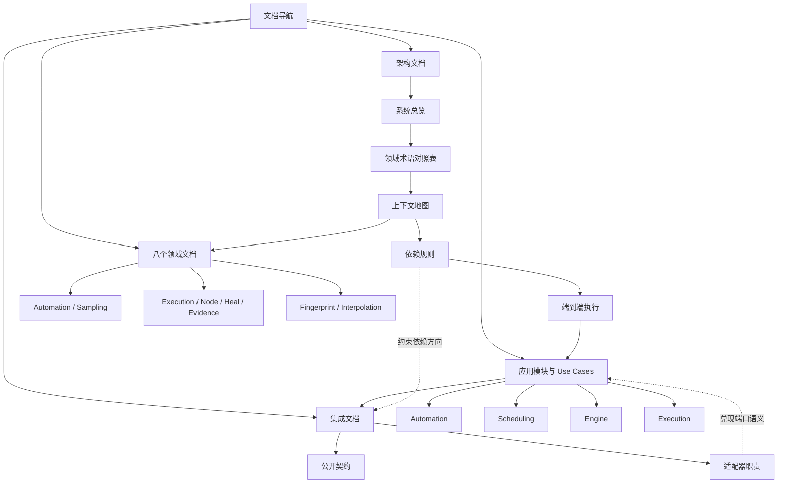

# Healix Core 文档导航

本页只负责组织文档、标明阅读顺序和维护边界；项目定位与功能介绍请阅读仓库根目录的 [`README.md`](../README.md)。

## 推荐阅读路径

### 架构学习者

1. [系统总览](architecture/system-overview.md)：建立八个领域包、四个应用模块与宿主适配器的整体视图。
2. [领域术语对照表](terminology.md)：统一业务名称、代码符号、所属领域与模型角色。
3. [上下文地图](architecture/context-map.md)：理解 Automation、Execution 与共享内核的协作边界。
4. [依赖规则](architecture/dependency-rules.md)：确认允许的依赖方向、端口位置与原子写入要求。
5. [端到端执行](architecture/end-to-end-execution.md)：沿 TestTask、Plan、Program、Progress 与 Evidence 串起完整执行链路。
6. 按需进入下方的领域、应用与集成文档。

### 领域工程师

1. 先读[上下文地图](architecture/context-map.md)和[依赖规则](architecture/dependency-rules.md)。
2. 从[八个领域文档](#领域文档八个)中选择目标领域，核对聚合、值对象、不变量、失败语义与源码证据。
3. 若修改跨领域流程，再读[端到端执行](architecture/end-to-end-execution.md)以及相关应用模块 README。
4. 用源码与测试验证文档中的“已实现”结论，并同步更新受影响文档。

### 应用实现者

1. 先读[系统总览](architecture/system-overview.md)中的四个应用模块职责。
2. 阅读目标模块 README，掌握编排边界和端口约束。
3. 阅读对应的逐 Use Case 文档，核对输入、输出、时序、不变量、失败与重试语义。
4. 最后阅读[适配器职责](integration/adapter-responsibilities.md)，确认哪些事务、并发与 IO 能力不能下沉到 Core。

### 适配器实现者

1. [公开契约](integration/public-contract.md)：先确定稳定入口、错误面与兼容边界。
2. [适配器职责](integration/adapter-responsibilities.md)：实现入站、调度持久化、执行驱动与原子事实提交。
3. [依赖规则](architecture/dependency-rules.md)：避免反向依赖，并兑现 CAS、fencing、幂等与事务约束。
4. [端到端执行](architecture/end-to-end-execution.md)：逐段核对 claim、编译、运行、进度和终态 Evidence 的衔接。
5. 回到相关应用 Use Case 文档，落实端口调用的具体时序与失败处理。

## 状态图例

| 标签 | 判定标准 |
|---|---|
| **已实现** | Core 中已有可执行领域行为或应用编排，并有当前源码或测试支撑。 |
| **仅端口契约** | Core 只定义接口、命令、结果或值对象；如需对应能力，可实现或接入该端口。 |
| **适配器义务** | 调用方实现端口时必须满足该端口声明的事务、并发、幂等与安全语义。 |
| **不支持** | 当前 Core 明确拒绝该输入或语义，或者尚无能够表达它的契约。 |

状态标签描述的是**当前代码事实**，不是路线图、承诺或宿主系统能力。

## 导航与知识关系图

## 完整文档索引

### 架构文档

- [系统总览](architecture/system-overview.md)：领域、应用和适配器的全局结构与能力状态。
- [领域术语对照表](terminology.md)：业务名称、代码符号、所属领域、模型角色及跨上下文转换。
- [上下文地图](architecture/context-map.md)：上下文边界、协作关系、共享内核与禁止捷径。
- [依赖规则](architecture/dependency-rules.md)：可执行依赖约束、端口规则及原子写入要求。
- [端到端执行](architecture/end-to-end-execution.md)：从 TestTask 发布到终态 Evidence 的完整链路。

### 领域文档（八个）

1. [Automation](domains/automation.md)：环境、文件夹、节点、工作流与测试任务的聚合和生命周期。
2. [Sampling](domains/sampling.md)：采样会话、匹配、处理结果与发布输入。
3. [Execution](domains/execution.md)：密封 Plan、入口顺序、预算与状态不变量。
4. [Node](domains/node.md)：可运行节点树、运行端口、动作、等待与校验机制。
5. [Heal](domains/heal.md)：定位修复、评分、评估与候选证据。
6. [Evidence](domains/evidence.md)：进度事实、终态事件、观察与原子提交不变量。
7. [Fingerprint](domains/fingerprint.md)：节点规格、选择器、指纹与框架检测值语义。
8. [Interpolation](domains/interpolation.md)：运行变量插值规则。

### 应用文档

#### Automation

- [模块 README](application/automation/README.md)：通用约束、模块内索引与源码入口。
- 环境：[创建环境](application/automation/create-environment.md)、[更新环境](application/automation/update-environment.md)、[删除环境](application/automation/delete-environment.md)、[恢复环境](application/automation/restore-environment.md)。
- 节点：[创建节点](application/automation/create-node.md)、[更新节点](application/automation/update-node.md)、[发布节点版本](application/automation/publish-node-version.md)、[删除节点](application/automation/delete-node.md)、[恢复节点](application/automation/restore-node.md)。
- 工作流：[创建工作流](application/automation/create-workflow.md)、[更新工作流](application/automation/update-workflow.md)、[发布工作流版本](application/automation/publish-workflow-version.md)、[删除工作流](application/automation/delete-workflow.md)、[恢复工作流](application/automation/restore-workflow.md)。
- 测试任务与采样：[创建测试任务](application/automation/create-test-task.md)、[保存已发布测试任务](application/automation/save-published-test-task.md)、[发布采样](application/automation/publish-sampling.md)。
- 文件夹：[创建文件夹](application/automation/create-folder.md)、[移动文件夹](application/automation/move-folder.md)、[删除文件夹](application/automation/delete-folder.md)。
- 修复审核：[批准修复候选](application/automation/approve-heal-candidate.md)、[拒绝修复候选](application/automation/reject-heal-candidate.md)。

#### Scheduling

- [模块 README](application/scheduling/README.md)：调度流程、端口边界与当前限制。
- [构建执行计划](application/scheduling/build-execution-plan.md)。
- [决定下一个入口](application/scheduling/decide-next-entry.md)。
- [处理下一个 Claim](application/scheduling/process-next-claim.md)。

#### Engine

- [模块 README](application/engine/README.md)：编译与运行边界及当前限制。
- [编译执行计划](application/engine/compile-plan.md)。
- [运行程序](application/engine/run-program.md)。

#### Execution

- [模块 README](application/execution/README.md)：worker 持久化边界、凭据装配与当前限制。
- [提交步骤状态迁移](application/execution/commit-step-transition.md)。
- [记录执行进度](application/execution/record-progress.md)。
- [解析凭据](application/execution/resolve-credential.md)。

### 集成文档

- [公开契约](integration/public-contract.md)：稳定入口、错误面、契约边界与证据。
- [适配器职责](integration/adapter-responsibilities.md)：入站、调度持久化、执行适配器及原子性要求。

## 文档事实与维护规则

1. **源码和测试是最终事实来源。** 文档必须描述当前仓库可证明的行为；若文档与代码冲突，以代码和测试为准，并修正文档。
2. **状态必须有证据。** 标为“已实现”的能力应能链接或追溯到源码、测试或自动化架构检查；不能把接口存在等同于基础设施已经实现。
3. **区分 Core 行为与端口接入。** 文档只描述 Core 行为和端口语义；如需端口所代表的能力，使用“实现或接入该端口”说明，不展开具体实现方案。
4. **不把设想写成现状。** 尚未支持的映射、参数或流程使用“不支持”标记；未来方案应放入独立设计记录，而不是混入当前行为说明。
5. **变更必须成套更新。** 修改领域不变量、应用时序、端口、公开契约或适配器责任时，同一变更应更新相关领域文档、Use Case 文档、架构图和本索引。
6. **Use Case 文档逐项维护。** 新增、重命名或删除应用用例时，必须同步更新模块 README 与本页完整索引；不得只依赖目录发现。
7. **领域数量显式校验。** 当前领域索引固定列出八个领域文档；领域拆分或合并时，必须同步修改系统总览、上下文地图、关系图和本节标题。
8. **链接必须可解析。** 所有相对链接以当前文档所在目录为基准；提交前检查目标文件或目录存在，并避免链接到已删除或仅在宿主仓库存在的路径。
9. **架构约束自动验证。** 依赖方向以 [`architecture/dependencies_test.go`](../architecture/dependencies_test.go) 的自动检查为准；文档中的依赖规则应与该测试保持一致。
10. **本页不重复项目介绍。** 根 README 负责项目入口与对外说明；本页只维护文档的信息架构、阅读路径、状态含义和事实治理。
