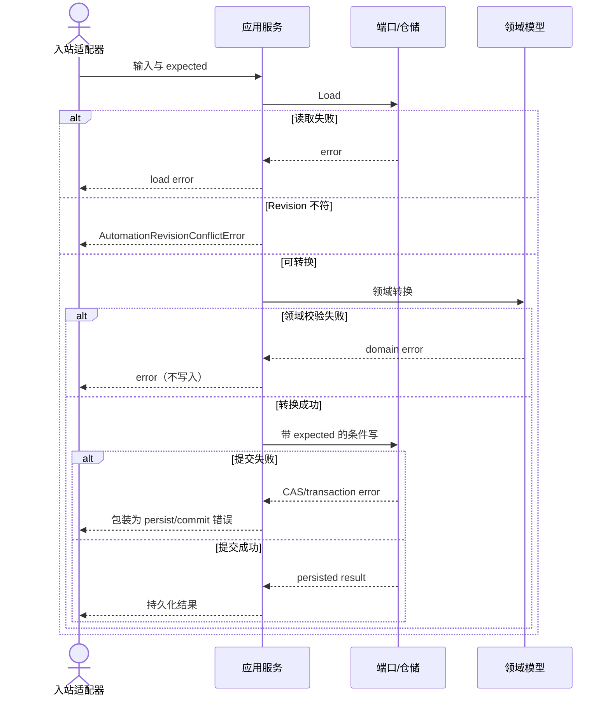
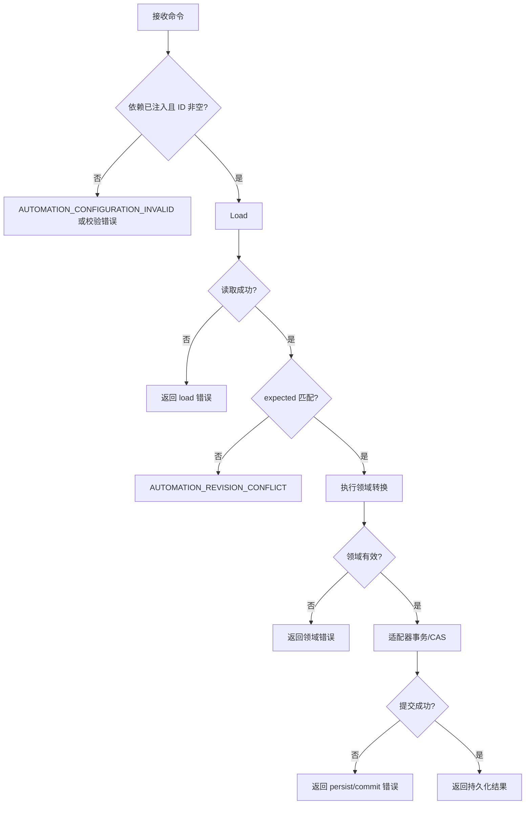
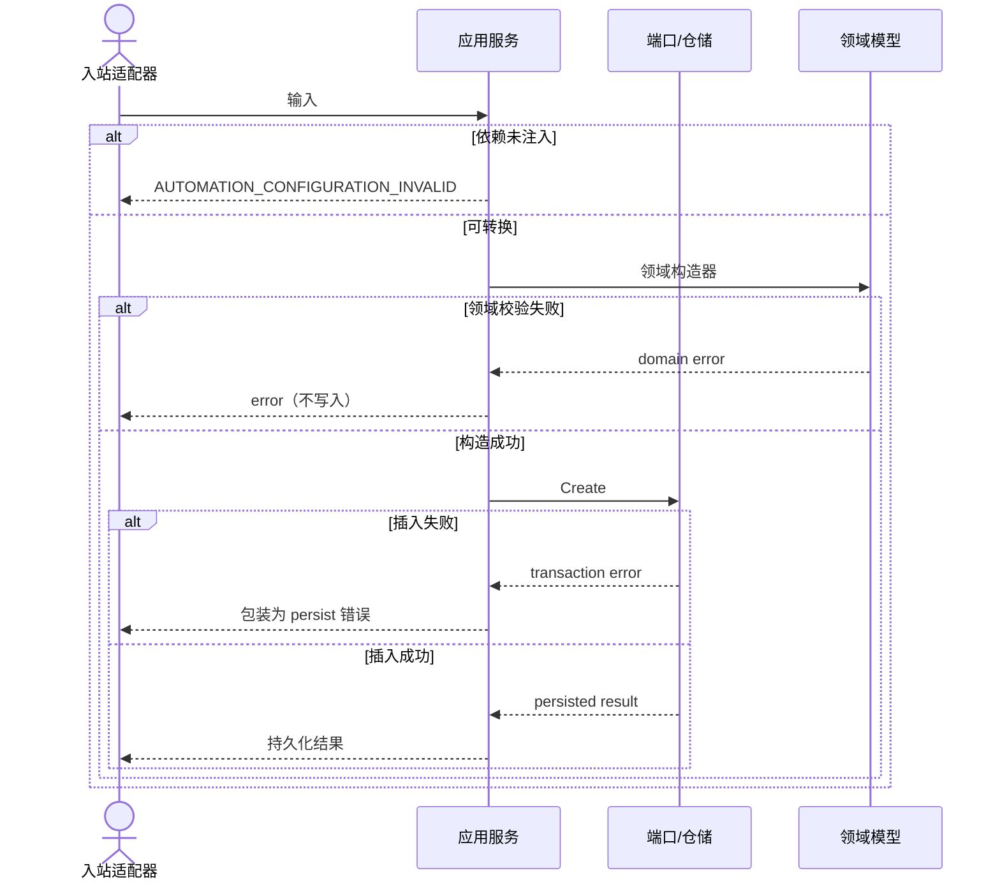

# 自动化应用层用例

本目录逐一记录已实现的自动化写用例；适配器能力不被虚构为核心实现。

多数用例只是把下面两种形状之一填上具体的服务方法与领域转换。形状写在本文件里，只写一次；各用例文件只记录它自己独有的方法签名、领域转换、端口与错误偏差。读某个用例时，先看它声明的形状，再看它自己那几行。

## 通用约束

- 领域对象负责业务不变量；应用服务负责用例编排。
- 更新操作的预检不能替代仓储事务内 CAS。
- `delete-folder`、`approve-heal-candidate` 与 `reject-heal-candidate` 是多资源原子提交。
- 错误一律以 `domain/fault` 的稳定码表达，本目录各文件列出的 `AUTOMATION_*` 就是那些码。判定用 `fault.CodeOf`（边界分类，用于路由）或 `fault.IsCode`（链上是否出现），不要匹配错误字符串；本层不再导出 `Err*` 哨兵值。
- 应用服务先完成显式参数和并发前置校验，再委托领域模型验证必填字段、生命周期、结构、版本连续性等不变量。`at`、审核身份等可信数据必须由入站适配器提供。领域失败时不调用写端口。

## 形状 A：先读后写（带 Revision CAS）

`update-*`、`delete-*`、`restore-*`、`publish-*-version` 以及三个文件夹用例都是这个形状。服务先 `Load` 当前状态，比对 `expected`，再执行领域转换，最后带 `expected` 写回。

应用层的 Revision 比对只提供快速失败；仓储适配器必须在存储事务中以 `expected` 执行条件写，竞争窗口中的失败也应映射为冲突。

environment / node / workflow 三个聚合家族由各自服务里同名的 `transition` 辅助函数实现，领域转换自己推进 Revision；`ExecutionFlowService.PublishVersion` 是同样的形状但直接展开在方法里，没有共用辅助函数。文件夹家族由 [`folder_service.go`](../../../application/automation/folder_service.go) 的 `change`/`persist` 实现，转换后用 `domain.NewFolderForest` 重新校验整片森林，并在应用层用 `expected.Next()` 算出下一个 Revision。

## 形状 B：直接构造插入（无 CAS）

四个 `create-*` 资产用例（environment、node、workflow、test task）是这个形状。创建路径不接收 `expected`，不预读、不做应用层 Revision 比对，因此**不会**返回 `AUTOMATION_REVISION_CONFLICT`；唯一约束冲突由仓储适配器自行映射。领域构造器统一把 Revision 置为 1。

`create-folder` 不属于这里：文件夹创建要先读出整片森林才能校验父子关系，所以它是形状 A。

## 共同的错误约定

形状 A 与形状 B 共享下面四条；用例文件只写自己偏离或补充的部分。

- 依赖未注入：`AutomationConfigurationError()`，分类码 `AUTOMATION_CONFIGURATION_INVALID`（[`errors.go`](../../../application/automation/errors.go)）。
- 输入/领域错误：原样保留在错误链中，不加未分类的外层包装——领域构造器和聚合转换返回的都已经是带码的 fault。
- 读取错误：包装为 `load ...`，不继续转换（仅形状 A）。
- Revision 不符：`AutomationRevisionConflictError()`，分类码 `AUTOMATION_REVISION_CONFLICT`（仅形状 A）。
- 写入、事务或 CAS 失败：包装为 persist、publish 或 commit 错误，不能返回部分成功。

## 已实现与适配器责任

已实现的是应用编排、领域调用、错误包装和端口契约。入站适配器负责鉴权、DTO、可信身份/时间及协议错误映射；出站适配器负责数据库事务、CAS、唯一约束、幂等、存储错误翻译和可观测性。核心未宣称存在 HTTP 或数据库实现。

## 索引

| 用例 | 形状 | 服务 |
|---|---|---|
| [创建环境](create-environment.md) | B | `EnvironmentService` |
| [更新环境](update-environment.md) | A | `EnvironmentService` |
| [删除环境](delete-environment.md) | A | `EnvironmentService` |
| [恢复环境](restore-environment.md) | A | `EnvironmentService` |
| [创建节点](create-node.md) | B | `NodeService` |
| [更新节点](update-node.md) | A | `NodeService` |
| [发布节点版本](publish-node-version.md) | A | `NodeService` |
| [删除节点](delete-node.md) | A | `NodeService` |
| [恢复节点](restore-node.md) | A | `NodeService` |
| [创建工作流](create-workflow.md) | B | `FlowFragmentService` |
| [更新工作流](update-workflow.md) | A | `FlowFragmentService` |
| [发布工作流版本](publish-workflow-version.md) | A | `FlowFragmentService` |
| [删除工作流](delete-workflow.md) | A | `FlowFragmentService` |
| [恢复工作流](restore-workflow.md) | A | `FlowFragmentService` |
| [创建测试任务](create-test-task.md) | B | `ExecutionFlowService` |
| [发布测试任务版本](publish-test-task-version.md) | A | `ExecutionFlowService` |
| [发布采样](publish-sampling.md) | 幂等事务 | `SamplingPublicationService` |
| [创建文件夹](create-folder.md) | A | `FolderService` |
| [移动文件夹](move-folder.md) | A | `FolderService` |
| [删除文件夹](delete-folder.md) | A（双 CAS） | `FolderService` |
| [批准修复候选](approve-heal-candidate.md) | 幂等事务 | `HealReviewService` |
| [拒绝修复候选](reject-heal-candidate.md) | 幂等事务 | `HealReviewService` |

三个「幂等事务」用例不共用上面的形状：它们以命令 ID 加请求摘要为幂等键，先查回放再原子提交，并且会复核适配器返回的结果。各自文件里有自己的时序与失败流。

## 源码

- [应用层](../../../application/automation/)
- [领域层](../../../domain/automation/)
- [共享错误构造器](../../../application/automation/errors.go)
