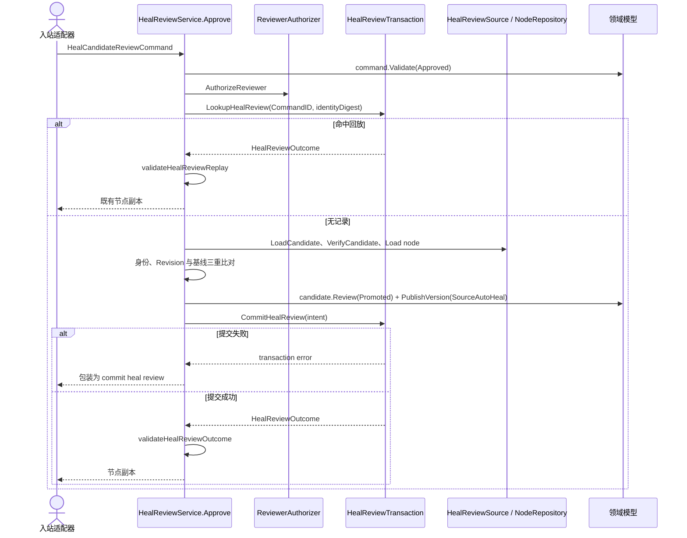
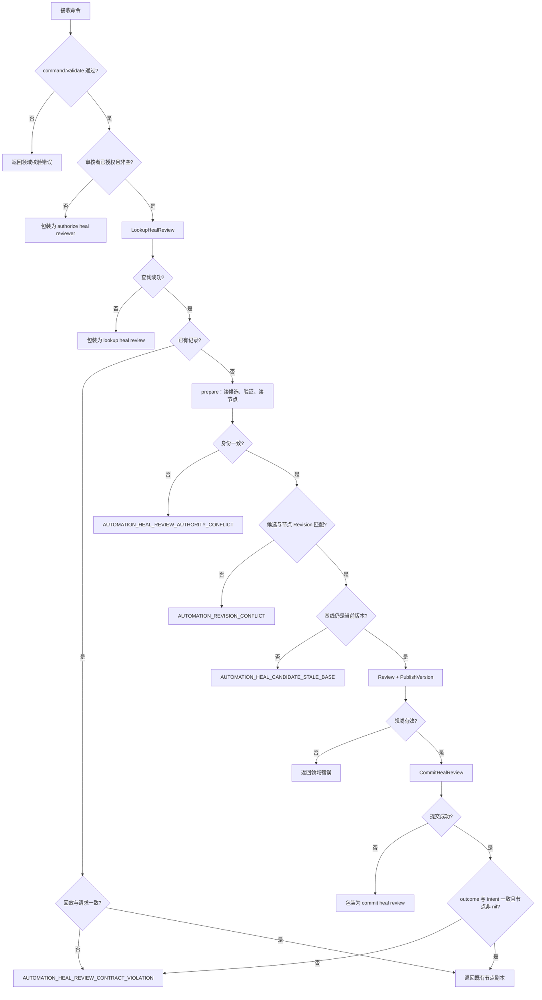

# 批准修复候选

不属于 [模块 README](README.md) 的形状 A / 形状 B：这是幂等事务用例。它以 `CommandID` 加请求身份摘要为幂等键，先查回放再原子提交，并且会把适配器返回的结果与自己的意图逐字段复核一遍。README 的错误约定里只有「不加未分类外层包装」和「不能返回部分成功」两条适用于这里。

## 方法、输入与输出

- 方法：`HealReviewService.Approve(context.Context, domain.HealCandidateReviewCommand)`
- 输出：`domain.ElementTargetAggregate` 的深拷贝；只有事务提交成功（或命中回放）才返回成功结果。
- 领域转换：`HealCandidate.Review(HealCandidatePromoted)` + `ElementTargetAggregate.PublishVersion(..., domain.SourceAutoHeal, ...)`。候选状态与节点版本在同一次提交里原子更新。

## 构造与端口

`NewHealReviewService` 返回 `(HealReviewService, error)`，按固定顺序注入并检查七个端口：`HealReviewSource`（`LoadCandidate` / `LoadStreak`）、`NodeRepository`、`HealReviewTransaction`（`LookupHealReview` / `CommitHealReview`）、`ReviewerAuthorizer`、`ReviewClock`、`CandidateVerifier`、`HealReviewIdentityProvider`。顺序是刻意的而不是排版：早先用 map 遍历，两个依赖同时缺失时同一次调用在不同运行里会报出不同的那一个。

构造失败返回的是未分类的 `"%s is required"`，**不是** `AUTOMATION_CONFIGURATION_INVALID`——这一条与本目录其他用例不同。

幂等键是 `CommandID` + `HealReviewRequestIdentityDigest(request)`。命中回放直接返回既有节点的副本，不重复发布版本。

## 三重前置校验

`prepare` 在提交前依次比对三样东西，任何一样不符都不写入：

| 检查 | 不符时 |
|---|---|
| 候选的 `ElementTargetID` / `BaseNodeVersionID` / `Hash` 与命令一致，节点 `ID` 与命令一致 | `AUTOMATION_HEAL_REVIEW_AUTHORITY_CONFLICT` |
| 候选 Revision == `ExpectedCandidateRevision`，节点 Revision == `ExpectedNodeRevision` | `AUTOMATION_REVISION_CONFLICT` |
| 节点 `CurrentVersionID` == 命令的 `BaseNodeVersionID` | `AUTOMATION_HEAL_CANDIDATE_STALE_BASE` |

## 错误

- 输入/领域错误：原样保留在错误链中。
- 端口传输错误各有自己的包装：`authorize heal reviewer`、`lookup heal review`、`load heal candidate`、`verify heal candidate`、`load node`、`allocate heal node version identity`、`commit heal review`。
- 适配器回放或提交结果形状不合法：`AUTOMATION_HEAL_REVIEW_CONTRACT_VIOLATION`（INTERNAL，调用方无法修复）。批准路径下 `Result.ElementTarget` 为 nil 也归这一类。
- 另有两个码由宿主适配器产出而不是本服务：`HealReviewIdentityConflictError()`（`AUTOMATION_HEAL_REVIEW_IDENTITY_CONFLICT`，同一 CommandID 摘要不符，由 `ValidateHealReviewIntentDigest` 抛出）与 `HealReviewDecisionConflictError()`（`AUTOMATION_HEAL_REVIEW_DECISION_CONFLICT`，候选已不可审核；Core 当前没有任何调用点，仅供适配器使用）。

## 时序

## 失败流

## 源码

- [应用服务](../../../application/automation/heal_review_service.go)
- [端口与摘要](../../../application/automation/heal_candidate_repository.go)
- [领域模型](../../../domain/automation/healing.go)
- [测试](../../../application/automation/heal_review_service_test.go)、[用例矩阵](../../../application/automation/publication_review_usecase_matrix_test.go)
