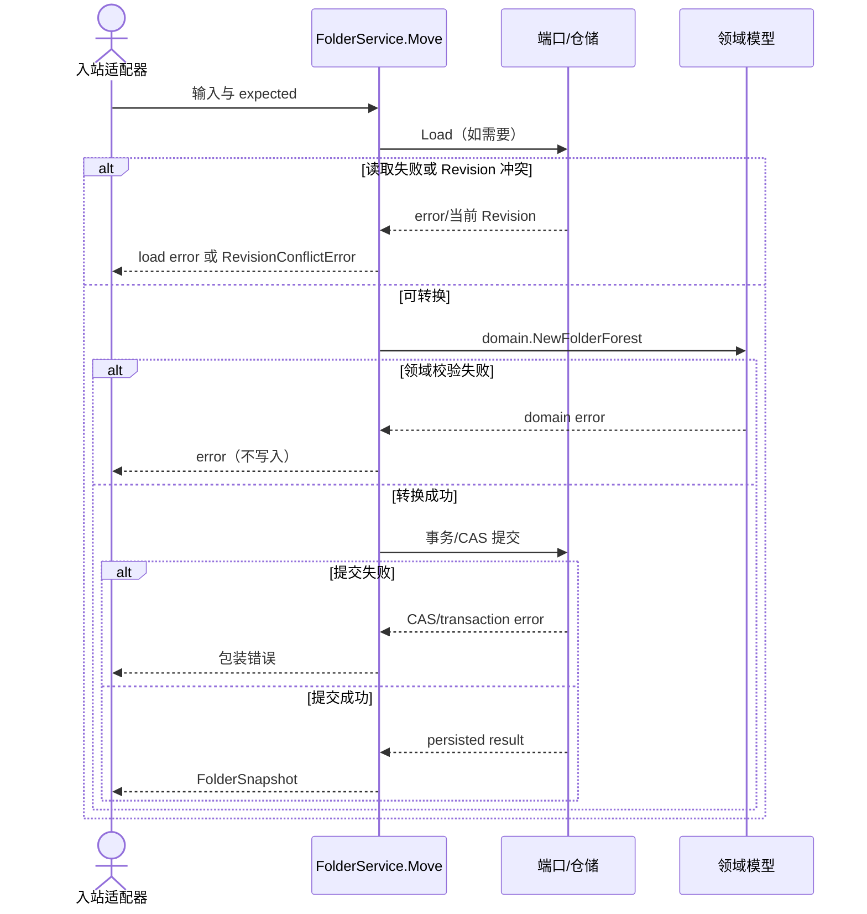
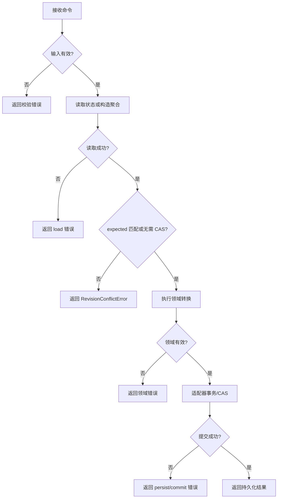

# 移动文件夹

## 方法、输入与输出

- 方法：`FolderService.Move(context.Context, kind、id、parentID、expected、at)`
- 输出：`FolderSnapshot`；只有端口提交成功才返回成功结果。
- 领域转换：`domain.NewFolderForest`。目标必须存在；新父节点同类且不得形成环。

## 校验与领域状态转换

应用服务先完成显式参数和并发前置校验，再委托领域模型验证必填字段、生命周期、结构、版本连续性等不变量。`at`、审核身份等可信数据必须由入站适配器提供。领域失败时不调用写端口。

## 端口、事务与 CAS

使用 `FolderRepository.Load/Save`。应用层的 Revision 比对只提供快速失败；仓储适配器必须在存储事务中以 `expected` 执行条件写，竞争窗口中的失败也应映射为冲突。目标必须存在；新父节点同类且不得形成环。

## 错误

- 输入/领域错误：原样保留在错误链中，服务增加 create、transition 或 validate 上下文。
- 读取错误：包装为 `load ...`，不继续转换。
- Revision 不符：`RevisionConflictError`，支持 `errors.Is(err, ErrRevisionConflict)`。
- 写入、事务或 CAS 失败：包装为 persist、publish 或 commit 错误，不能返回部分成功。

## 已实现与适配器责任

已实现的是应用编排、领域调用、错误包装和端口契约。入站适配器负责鉴权、DTO、可信身份/时间及协议错误映射；出站适配器负责数据库事务、CAS、唯一约束、幂等、存储错误翻译和可观测性。核心未宣称存在 HTTP 或数据库实现。

## 时序

## 失败流

## 相对源码链接

- [应用服务](../../../application/automation/folder_service.go)
- [端口](../../../application/automation/folder_repository.go)
- [领域模型](../../../domain/automation/)
- [测试](../../../application/automation/folder_service_test.go)
