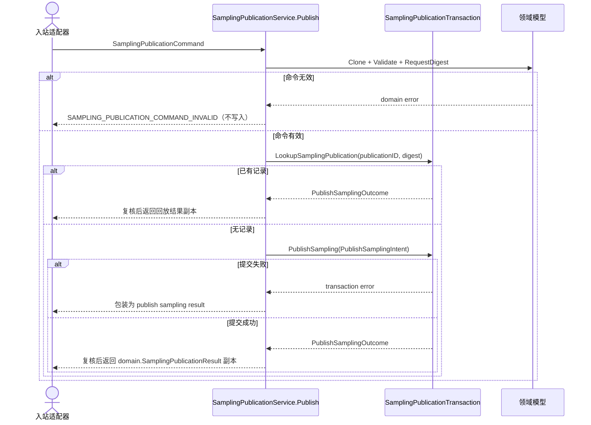
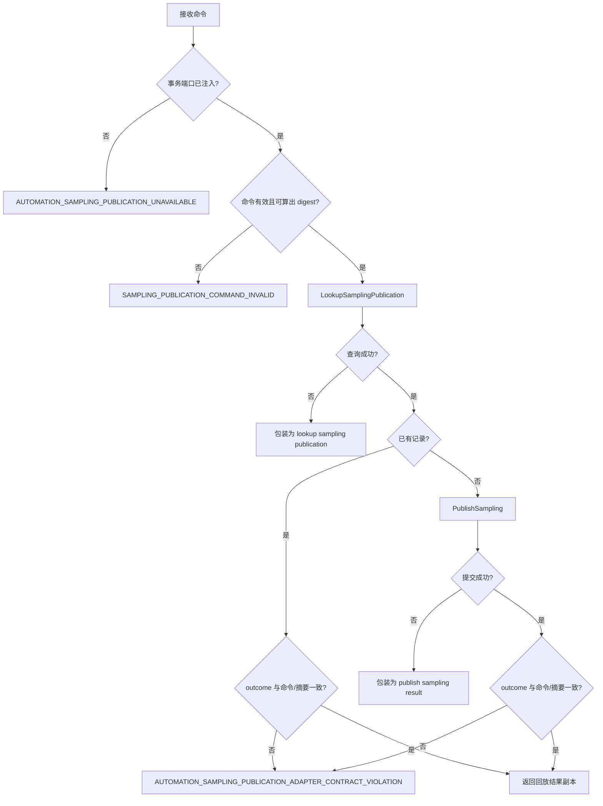

# 发布采样

不属于 [模块 README](README.md) 的形状 A / 形状 B：这是幂等事务用例。它以 `PublicationID` 加请求摘要为幂等键，先查回放再原子提交，并且会把适配器返回的结果与命令逐字段复核一遍。README 的错误约定里只有「不加未分类外层包装」和「不能返回部分成功」两条适用于这里。

## 方法、输入与输出

- 方法：`SamplingPublicationService.Publish(context.Context, SamplingPublicationCommand{PublicationID, Publication})`
- 输出：`domain.SamplingPublicationResult`；只有端口提交成功才返回成功结果，返回值是深拷贝。
- 领域转换：`SamplingPublication.Clone` + `Validate`。服务先深拷贝命令，再算出 `SamplingPublicationRequestDigest`，之后所有幂等判断都以 `(PublicationID, requestDigest)` 为键。

## 端口与幂等

使用 `SamplingPublicationTransaction` 的两个方法：`LookupSamplingPublication(ctx, publicationID, requestDigest)` 查回放，`PublishSampling(ctx, PublishSamplingIntent)` 原子发布。这条路径没有 Revision CAS，幂等键是 `PublicationID` + request digest；两个方法返回的 `PublishSamplingOutcome` 都会被服务按命令和摘要复核一遍。

## 错误

- 输入/领域错误：原样保留在错误链中；命令形状错误经 `classifySamplingPublicationCommand` 归为 `SAMPLING_PUBLICATION_COMMAND_INVALID`，已带码的失败原样透传。
- 事务端口未注入：`AUTOMATION_SAMPLING_PUBLICATION_UNAVAILABLE`。
- 回放摘要与命令不符：`AUTOMATION_SAMPLING_PUBLICATION_DIGEST_MISMATCH`。
- 适配器返回的 outcome 与命令/摘要不一致：`AUTOMATION_SAMPLING_PUBLICATION_ADAPTER_CONTRACT_VIOLATION`（INTERNAL，调用方无法修复）。
- 无 Revision CAS：这条路径不会返回 `AUTOMATION_REVISION_CONFLICT`。
- 查询与写入的传输错误：分别包装为 `lookup sampling publication` / `publish sampling result`，不能返回部分成功。

## 时序

## 失败流

## 相对源码链接

- [应用服务与端口](../../../application/automation/sampling_publication_transaction.go)
- [规范化摘要](../../../application/automation/sampling_publication_canonical.go)
- [领域模型](../../../domain/automation/sampling_publication.go)
- [测试](../../../application/automation/sampling_publication_transaction_test.go)
