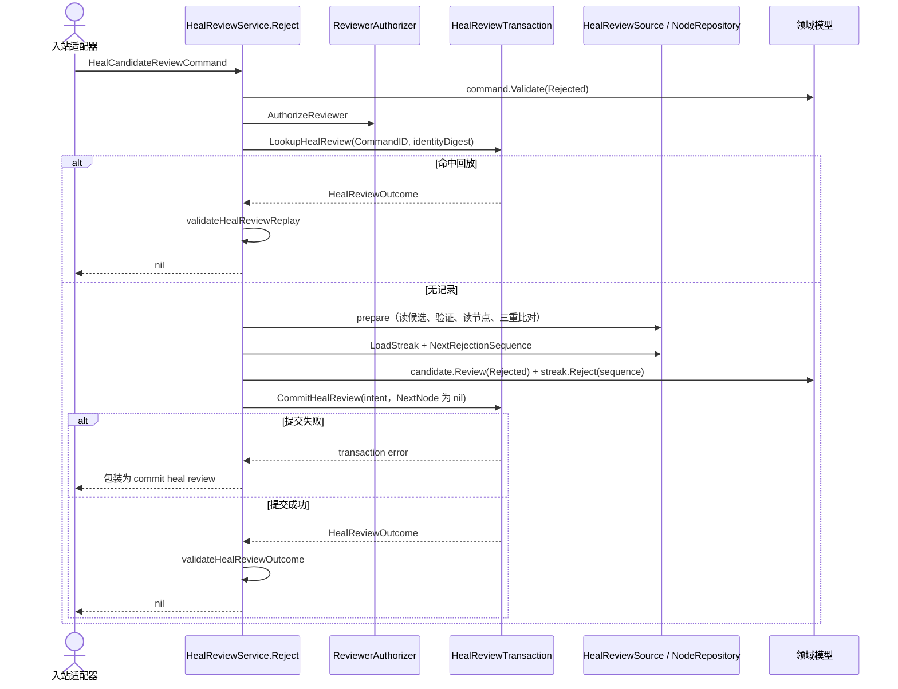
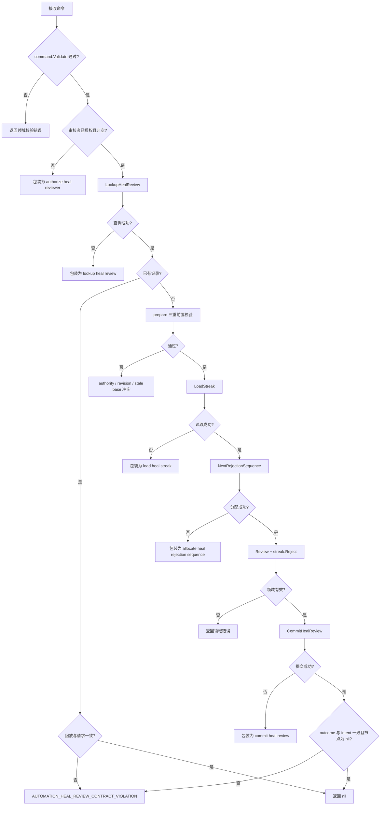

# 拒绝修复候选

与 [批准修复候选](approve-heal-candidate.md) 是同一个服务、同一套端口、同一个 `prepare`，因此构造约束、七个端口、幂等键、三重前置校验和治理专用错误码全部相同——那些内容只在批准文件里写一次。本文件只记录拒绝路径与批准路径的差异。

## 方法、输入与输出

- 方法：`HealReviewService.Reject(context.Context, domain.HealCandidateReviewCommand)`
- 输出：`error`（成功为 `nil`）。批准返回节点聚合，拒绝什么都不返回。
- 领域转换：`HealCandidate.Review(HealCandidateRejected)` + `HealStreak.Reject(sequence)`。提交的是候选状态与 streak 转移，**不发布节点版本**。

## 与批准路径的差异

- 命中回放时直接返回 `nil`，没有可复核的节点副本可返回。
- 共用 `prepare`，因此仍然会读取节点并比对节点 Revision 与基线版本——即使这条路径不写节点。`prepare` 返回的 intent 里 `NextNode` 是有值的，拒绝路径随后显式把它置为 `nil`。
- `prepare` 之后额外做三步：`HealReviewSource.LoadStreak`（包装为 `load heal streak`）、`HealReviewIdentityProvider.NextRejectionSequence`（包装为 `allocate heal rejection sequence`）、`HealStreak.Reject(sequence)`。
- intent 里因此多带 `ExpectedStreak`、`ExpectedStreakDigest`（`HealReviewStreakDigest`）与 `NextStreak`；请求摘要在这些字段填好之后才计算。
- 不调用 `HealReviewIdentityProvider.NewNodeVersionID`，所以没有 `allocate heal node version identity` 这一层包装。
- 结果形状检查方向相反：回放或提交结果里 `Result.ElementTarget` 必须为 nil、`Result.Streak` 必须非 nil、候选状态必须是 `HealCandidateRejected`，否则 `AUTOMATION_HEAL_REVIEW_CONTRACT_VIOLATION`。

## 时序

## 失败流

## 源码

- [应用服务](../../../application/automation/heal_review_service.go)
- [端口与摘要](../../../application/automation/heal_candidate_repository.go)
- [领域模型](../../../domain/automation/healing.go)
- [测试](../../../application/automation/heal_review_service_test.go)、[用例矩阵](../../../application/automation/publication_review_usecase_matrix_test.go)
