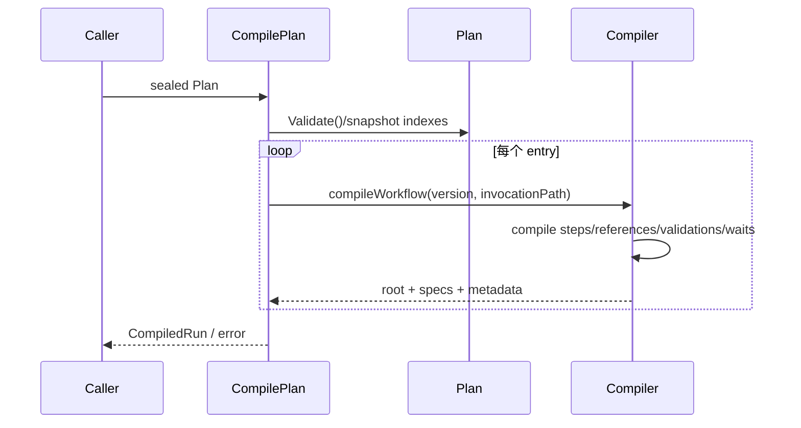
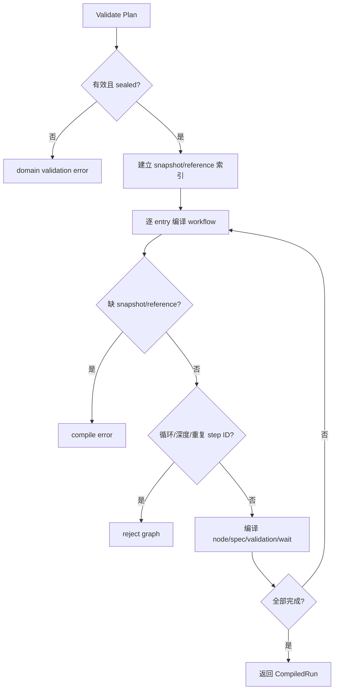

# 编译执行计划

## 目标

把不可变 execution plan 的每个入口编译为独立、可执行的节点树和精确 spec 映射。

## 输入

- `execution.Plan`：必须 sealed、通过 Validate，含 run identity、entries、workflow/node/reference snapshots。

## 输出

`CompiledRun{RunID, FailurePolicy, Entries}`；每个 `CompiledEntry` 含 execution identity、workflow identity、`node.Program`、metadata。失败返回 error。

## 时序

## 流程与错误

## 不变量

- 只从 sealed snapshot 编译，不读取 mutable automation model。
- 重复入口和共享子 workflow 调用必须具有不碰撞的 runtime identity。
- node snapshot 必须按 node ID + version ID 精确绑定。
- 编译结果不得与 plan 的可变 map/slice alias。
- 缺失解析、循环和不可达状态必须显式失败。

补充矩阵测试：[`application/engine/compiler_matrix_test.go`](../../../application/engine/compiler_matrix_test.go)。

## 当前边界与延期能力

以下能力当前**不受支持或明确延期**：lease heartbeat 与过期恢复、active cancellation registry、完整队列实现、参数优先级合并、生产级 adapters 与 read projections。调用方不得从现有接口推断这些能力已经存在。

## 源码与测试

- 源码：[`application/engine/compiler.go`](../../../application/engine/compiler.go)
- 测试：[`application/engine/compiler_test.go`](../../../application/engine/compiler_test.go)
