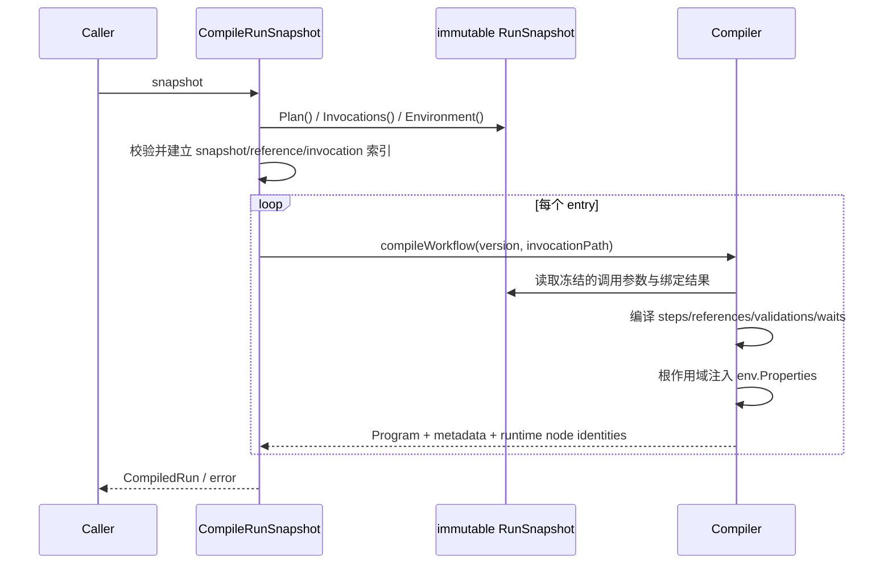
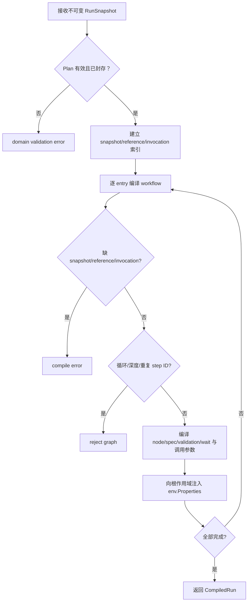

# 编译执行实例快照

## 目标

通过公开入口 `engine.CompileRunSnapshot(snapshot execution.RunSnapshot)`，把不可变执行实例快照中的每个顶层 entry 编译为独立、可执行的节点树和精确 spec 映射。

## 输入

- `execution.RunSnapshot`：不可变执行实例快照，包含已封存并通过验证的 Plan、按调用路径冻结的 invocation 参数值与绑定解析结果，以及冻结的 Environment `Properties`。

编译不能只接收 `snapshot.Plan()`。Plan 提供 entries 及 workflow/node/reference snapshots，但完整快照还承载每次调用冻结的参数值和 `parameter.Binding` 解析结果；编译器必须把这些值放入对应调用作用域，并将 Environment `Properties` 以 `env.` 前缀注入根调用作用域。旧的公开 plan-only 编译 API 不存在。

## 输出

`CompiledRun` 的实际导出字段只有：

| 字段 | 类型 | 含义 |
|---|---|---|
| `Entries` | `[]CompiledEntry` | 按快照 entry 顺序生成的编译结果 |

`CompiledRun.Entry(executionID)` 可按 execution identity 查询 entry；其查找索引是私有实现细节。`CompiledRun` 没有 `RunID` 或 `FailurePolicy` 导出字段。

`CompiledEntry` 的实际导出字段为：

| 字段 | 类型 | 含义 |
|---|---|---|
| `ExecutionID` | `string` | 顶层执行项 identity |
| `TestTaskItemID` | `string` | 来源 TestTask item identity |
| `SequenceNumber` | `int` | 顶层执行顺序 |
| `WorkflowID` | `string` | 稳定 Workflow identity |
| `WorkflowVersionID` | `string` | 冻结的 Workflow version identity |
| `Program` | `node.Program` | 该 entry 独立的可执行程序 |
| `Metadata` | `map[string]StepMetadata` | runtime step identity 到工作区步骤元数据的映射 |
| `RuntimeNodes` | `map[string]RuntimeNodeIdentity` | runtime NodeSpec identity 到稳定 Node/version identity 的映射 |

失败返回 error，不返回部分编译结果。

## 时序

## 流程与错误

## 不变量

- 只从不可变 `execution.RunSnapshot` 编译，不读取 mutable automation model。
- 重复入口和共享子 workflow 调用必须具有不碰撞的 runtime identity。
- node snapshot 必须按 node ID + version ID 精确绑定。
- 每个 invocation 使用创建 Run 时冻结的类型化参数值和绑定结果；运行时不得重新解析绑定。
- Environment `Properties` 只从快照读取，并以 `env.` 前缀注入根调用作用域；名称碰撞必须显式失败。
- 编译结果不得与快照的可变 map/slice alias。
- 缺失解析、循环和不可达状态必须显式失败。

补充矩阵测试：[`application/engine/compiler_matrix_test.go`](../../../application/engine/compiler_matrix_test.go)。

## 当前边界与延期能力

以下能力当前**不受支持或明确延期**：lease heartbeat 与过期恢复、active cancellation registry、完整队列实现、参数优先级合并、生产级 adapters 与 read projections。调用方不得从现有接口推断这些能力已经存在。

## 源码与测试

- 源码：[`application/engine/compiler.go`](../../../application/engine/compiler.go)
- 测试：[`application/engine/compiler_test.go`](../../../application/engine/compiler_test.go)
