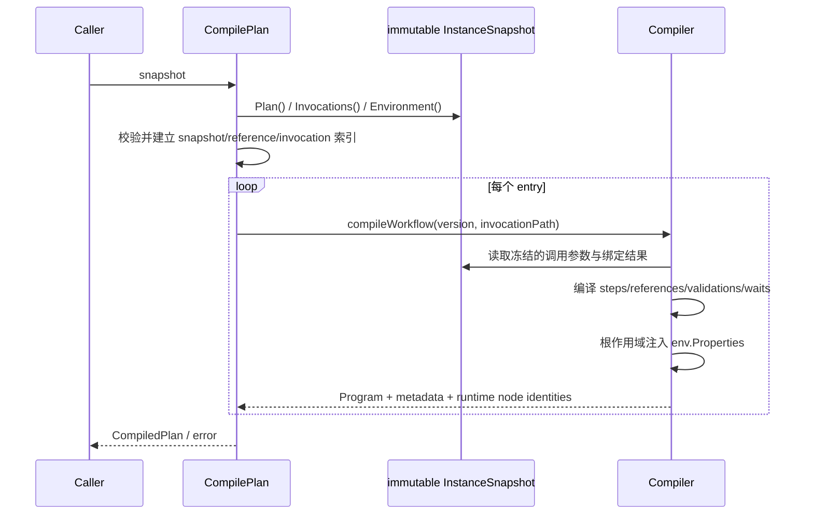
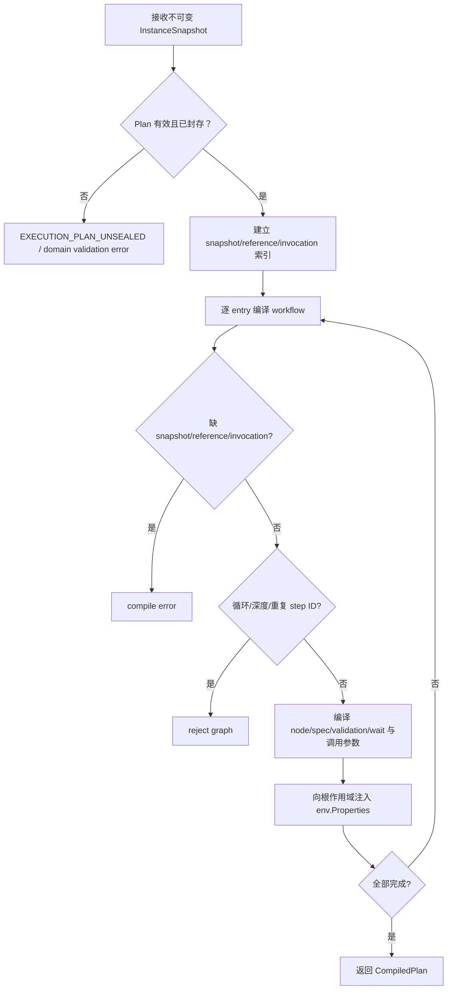

# 编译执行实例快照

## 目标

通过唯一公开编译入口 `engine.CompilePlan(snapshot execution.InstanceSnapshot)`，把不可变执行实例快照中的每个顶层 entry 编译为独立、不可伪造的执行项和精确 spec 映射。

## 输入

- `execution.InstanceSnapshot`：不可变执行实例快照，包含已封存并通过验证的 Plan、按调用路径冻结的 invocation 参数值与绑定解析结果，以及冻结的 Environment 变量。

编译不能只接收 `snapshot.Plan()`。Plan 提供 entries 及 workflow/node/reference snapshots，但完整快照还承载每次调用冻结的参数值和 `parameter.Binding` 解析结果；编译器必须把这些值放入对应调用作用域，并将 Environment `Properties` 以 `env.` 前缀注入根调用作用域。旧的公开 plan-only 编译 API 不存在。

## 输出

`CompiledPlan` 不导出内部 entry 切片或索引，只提供以下访问器：

| 访问器 | 返回值 | 含义 |
|---|---|---|
| `Entries()` | `[]CompiledEntry` | 按快照顺序返回调用方拥有的 entry 与 map 副本 |
| `Entry(entryID)` | `(CompiledEntry, bool)` | 校验私有身份封印后返回调用方拥有的 entry 副本 |

查找索引和原始 entry 切片都是私有实现细节。`CompiledPlan` 没有 `InstanceID` 或 `FailurePolicy` 导出字段。

`CompiledEntry` 的实际导出字段为：

| 字段 | 类型 | 含义 |
|---|---|---|
| `InstanceID` | `execution.InstanceID` | 编译时封印的执行实例 identity |
| `SnapshotDigest` | `string` | 编译时封印的快照摘要 |
| `EntryID` | `execution.EntryID` | 顶层执行项 identity |
| `TestTaskItemID` | `string` | 来源 TestTask item identity |
| `SequenceNumber` | `int` | 顶层执行顺序 |
| `FlowFragmentID` | `string` | 稳定 FlowFragment identity |
| `WorkflowVersionID` | `string` | 冻结的 FlowFragment version identity |
| `Metadata` | `map[string]StepMetadata` | runtime step identity 到工作区步骤元数据的映射 |
| `RuntimeNodes` | `map[string]RuntimeNodeIdentity` | runtime ElementTargetSpec identity 到稳定 ElementTarget/version identity 的映射 |

`node.Program` 与 `(InstanceID, SnapshotDigest, EntryID)` 私有身份封印不导出；调用方只能把 `CompiledEntry` 交给 `RunProgram`，不能提取或替换 Program。

`StepMetadata` 有一个 `InvocationPath execution.InvocationPath` 字段，但编译器当前从不填它：`compiler.go` 里三处 `StepMetadata{...}` 字面量（workflow、step、validation group member）都没有给它赋值，`compileValidationGroup` 收下的 `scopePath` 参数在函数体里也没有被读过。因此调用方读到的 `InvocationPath` 恒为零值，不能用它区分同一 workflow 被多次调用产生的元数据；要区分只能用 map 的 runtime step key（它已经带上了 invocation path）。

失败返回 error，不返回部分编译结果。

## 时序

## 流程与错误

## 不变量

- 只从不可变 `execution.InstanceSnapshot` 编译，不读取 mutable automation model。
- 重复入口和共享子 workflow 调用必须具有不碰撞的 runtime identity。
- node snapshot 必须按 node ID + version ID 精确绑定。
- 每个 invocation 使用创建执行实例时冻结的类型化参数值和绑定结果；运行时不得重新解析绑定。
- Environment `Variables` 只从快照读取，并以 `env.` 前缀注入根调用作用域；名称碰撞必须显式失败（当前这一条碰撞错误还没有 fault 码，只是 `errors.New`）。
- 编译结果不得与快照的可变 map/slice alias。
- `CompiledEntry` 必须绑定 InstanceID、snapshot digest 与 EntryID；访问器必须拒绝内部索引或身份封印不一致。
- 缺失解析、循环和不可达状态必须显式失败。

补充矩阵测试：[`application/engine/compiler_matrix_test.go`](../../../application/engine/compiler_matrix_test.go)。

## 源码与测试

- 源码：[`application/engine/compiler.go`](../../../application/engine/compiler.go)
- 测试：[`application/engine/compiler_test.go`](../../../application/engine/compiler_test.go)
