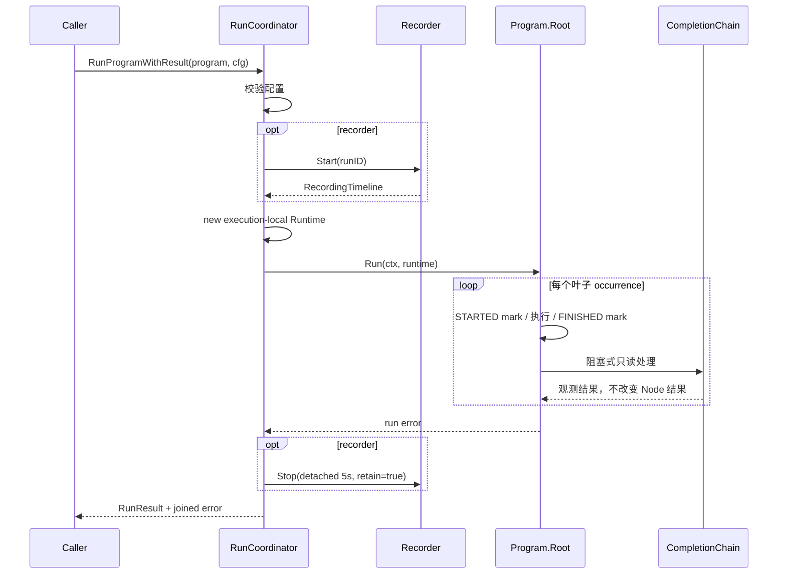

# 运行程序

## 目标

为一次 compiled Program 创建 execution-local Runtime，管理 Recorder、共享相对时间轴、叶子步骤时间线和完成处理链，并执行 root node。

## 输入

- `ctx context.Context`。
- `node.Program{Root, Specs}`。
- `Config`：RunID、Driver 必填；Facts 非空时 ClaimToken 必填；Healer、Recorder、Facts、StepTimeline、CompletionChain、ReadOnlyBrowser、CompletionObserver 可选；另含 StepInterval 与 Variables。

配置约束：

- StepTimeline 非空时 Recorder 必须非空，且 Recorder.Start 必须返回非 nil Timeline。
- CompletionChain 非空时 ReadOnlyBrowser 必须非空。
- Recorder 与 StepTimeline 均为空时保持无录制执行能力。

## 输出

`RunProgram` 保留 error-only 入口并委托 `RunProgramWithResult`。`RunProgramWithResult` 返回：

```go
type RunResult struct {
    ExecutionOutcome ExecutionOutcome
    RecordingOutcome RecordingOutcome
    TimelineOutcome  TimelineOutcome
}
```

结构化结果分别表达执行、录制和时间线，不要求调用方解析错误字符串。root、timeline finish 与 recorder stop 可通过错误链同时保留。

## 时序



## 不变量

- 每次调用创建新的 Runtime 和 Scratchpad；Variables 被复制。
- Recorder Start 失败时不执行 root；成功后始终尝试 detached Stop。
- Recorder Start 建立本次运行唯一的相对时间轴零点。
- StepTimeline STARTED 写入失败时叶子行为不执行。
- FINISHED 写入失败不改写叶子真实结果；`RunResult` 分别表达 ExecutionOutcome 与 TimelineOutcome。
- completion Handler 在叶子返回前严格串行执行；Handler 失败不改变节点结果。
- 当前总是 `retain=true`，不提供 active cancellation registry。

补充契约矩阵：[`application/engine/engine_contract_matrix_test.go`](../../../application/engine/engine_contract_matrix_test.go)。

## 当前契约边界

- `RunProgramWithResult` 只编排本次 Program 的运行及其已注入端口。
- 当前不提供 active cancellation registry。
- 如需接收步骤时间线，可接入 `StepTimelineSink`。
- 如需在叶子完成后进行只读处理，可接入 `NodeCompletionChain` 及 `ReadOnlyBrowser`。

## 源码与测试

- 源码：[`application/engine/coordinator.go`](../../../application/engine/coordinator.go)、[`application/engine/engine.go`](../../../application/engine/engine.go)
- 测试：[`application/engine/engine_test.go`](../../../application/engine/engine_test.go)、[`application/engine/result_test.go`](../../../application/engine/result_test.go)
