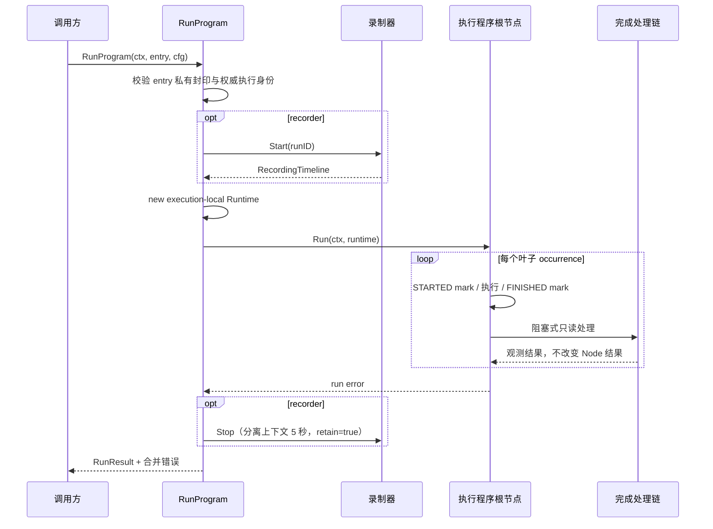

# 执行程序

## 目标

为一次已编译的执行程序创建执行实例局部运行时，管理录制器、共享相对时间轴、叶子步骤时间线和完成处理链，并执行根节点。

## 输入

- `ctx context.Context`。
- `CompiledEntry`：由不可变 `execution.RunSnapshot` 编译得到，包含 `node.Program`、执行身份与元数据；入口不接受裸 `node.Program`。
- `Config`：`RunID + SnapshotDigest + ExecutionID + ClaimToken` 必须来自已领取执行权的独立权威；前三项与 entry 的私有封印一致，ClaimToken 必须非空。Driver 必填；Healer、录制器、Facts、StepTimeline、CompletionChain、ReadOnlyBrowser、CompletionObserver 可选；另含 StepInterval。运行时参数不属于 `Config`，而是在 `CompilePlan` 时从不可变 RunSnapshot 编入私有 Program。

配置约束：

- StepTimeline 非空时 录制器 必须非空，且 录制器.Start 必须返回非 空值 Timeline。
- CompletionChain 非空时 ReadOnlyBrowser 必须非空。
- 录制器 与 StepTimeline 均为空时保持无录制执行能力。

## 输出

唯一公开运行入口 `RunProgram(ctx, entry, cfg)` 返回：

```go
type RunResult struct {
    ExecutionOutcome ExecutionOutcome
    RecordingOutcome RecordingOutcome
    TimelineOutcome  TimelineOutcome
}
```

结构化结果分别表达执行、录制和时间线，不要求调用方解析错误字符串。root、timeline finish 与 recorder stop 可通过错误链同时保留。

## 时序



## 不变量

- 身份校验发生在创建 Runtime 或访问 Driver、Recorder、Facts 等端口之前；错配返回 `ErrExecutionIdentityMismatch` 与 `ExecutionNotStarted`。
- 每次调用根据 `CompiledEntry` 私有 Program 创建新的运行时和 Scratchpad；运行变量来自编译后的不可变调用作用域与 Environment 数据。
- 录制器 Start 失败时不执行 root；成功后始终尝试 分离的 Stop。
- 录制器 Start 建立本次运行唯一的相对时间轴零点。
- StepTimeline STARTED 写入失败时叶子行为不执行。
- FINISHED 写入失败不改写叶子真实结果；`RunResult` 分别表达 ExecutionOutcome 与 TimelineOutcome。
- completion Handler 在叶子返回前严格串行执行；Handler 失败不改变节点结果。
- 当前总是 `retain=true`，不提供 活动取消注册表。

补充契约矩阵：[`application/engine/engine_contract_matrix_test.go`](../../../application/engine/engine_contract_matrix_test.go)。

## 当前契约边界

- `RunProgram` 只编排本次 `CompiledEntry` 中私有程序的运行及其已注入端口。
- 当前不提供 活动取消注册表。
- 如需接收步骤时间线，可接入 `StepTimelineSink`。
- 如需在叶子完成后进行只读处理，可接入 `NodeCompletionChain` 及 `ReadOnlyBrowser`。

## 源码与测试

- 源码：[`application/engine/coordinator.go`](../../../application/engine/coordinator.go)、[`application/engine/engine.go`](../../../application/engine/engine.go)
- 测试：[`application/engine/engine_test.go`](../../../application/engine/engine_test.go)、[`application/engine/result_test.go`](../../../application/engine/result_test.go)
