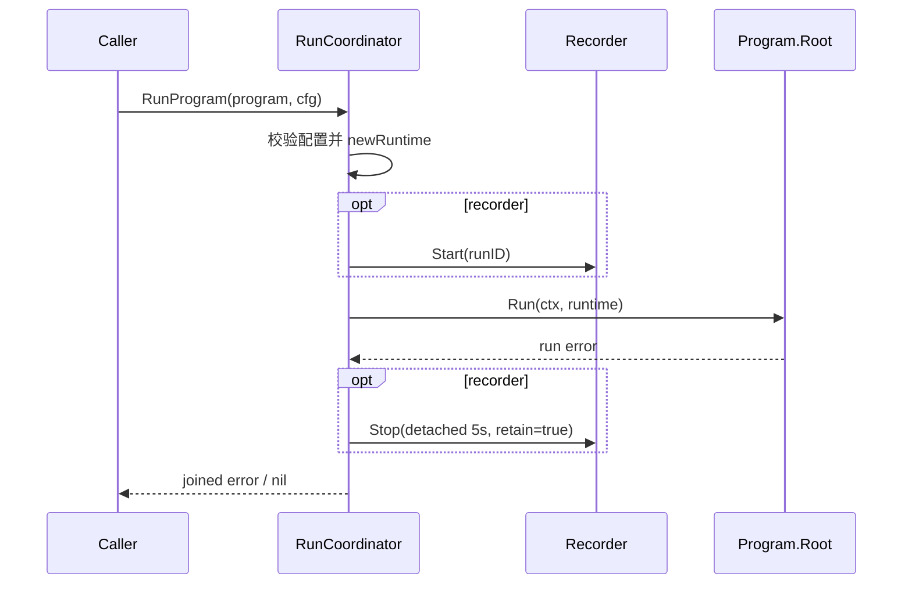
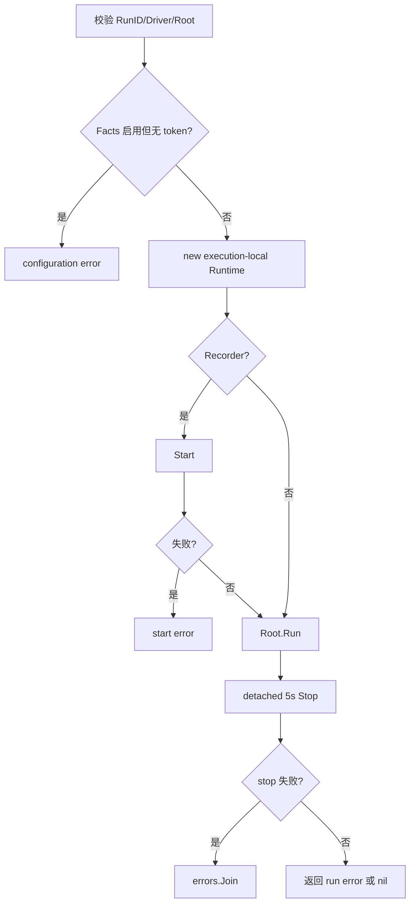

# 运行程序

## 目标

为一次 compiled Program 创建 execution-local Runtime，管理 recorder 生命周期，并执行 root node。

## 输入

- `ctx context.Context`。
- `node.Program{Root, Specs}`。
- `Config`：RunID 必填；Driver 必填；Facts 非空时 ClaimToken 必填；Healer/Recorder/Facts 可选；StepInterval；Variables。

## 输出

成功返回 nil；配置、recorder start/stop 或 root 执行失败返回 error。root 与 stop 同时失败时用 `errors.Join` 保留二者。

## 时序

## 流程与错误

## 不变量

- 每次调用创建新的 Runtime 和 Scratchpad。
- Variables 被复制；运行中修改不得反向修改输入 map。
- Facts 启用时必须携带 claim token。
- recorder start 失败时不执行 root；成功后始终尝试 detached stop。
- 当前总是 `retain=true`，不提供 active cancellation registry。

补充契约矩阵：[`application/engine/engine_contract_matrix_test.go`](../../../application/engine/engine_contract_matrix_test.go)。

## 当前边界与延期能力

以下能力当前**不受支持或明确延期**：lease heartbeat 与过期恢复、active cancellation registry、完整队列实现、参数优先级合并、生产级 adapters 与 read projections。调用方不得从现有接口推断这些能力已经存在。

## 源码与测试

- 源码：[`application/engine/coordinator.go`](../../../application/engine/coordinator.go)
- 测试：[`application/engine/engine_test.go`](../../../application/engine/engine_test.go)
