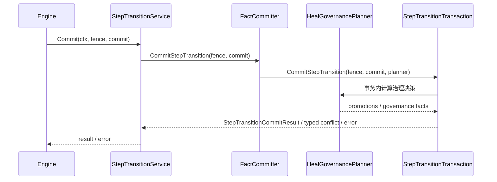
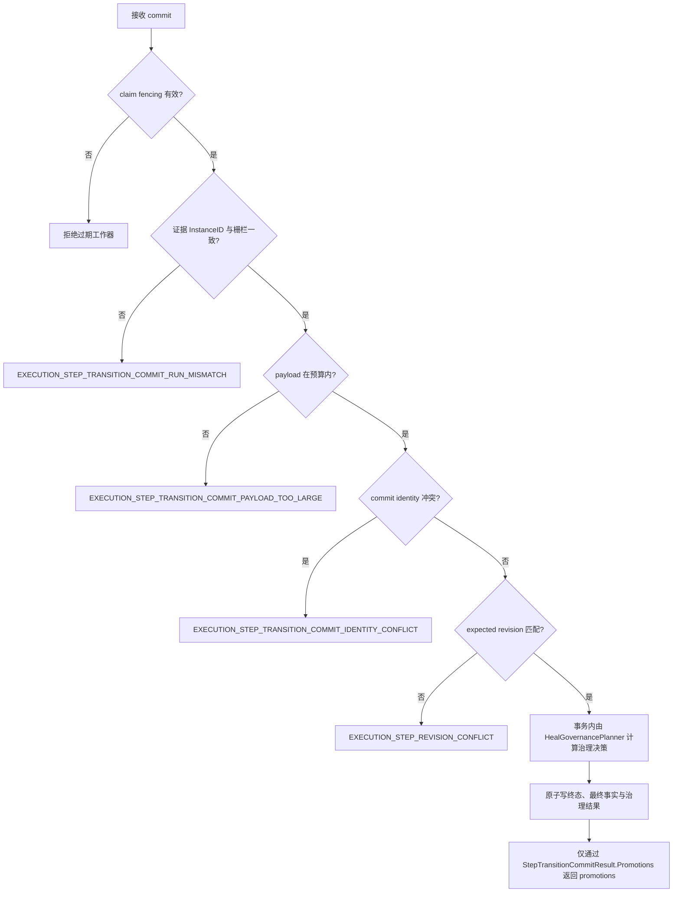

# 提交步骤终态迁移

## 目标

定义一次原子提交步骤终态及最终事实的应用服务与端口契约；`StepTransitionService` 已实现，但当前不包含生产持久化适配器。

## 输入

- `context.Context`。
- fenced `WorkerFence`。
- `evidence.StepTransitionCommit`，含 commit identity、期望 revision、终态事件、终态验证证据、`HealObservation` 与 `OriginalSelectorResets`；不含 promotions。

## 输出

`evidence.StepTransitionCommitResult` 或 error；标准冲突分类为 `EXECUTION_STEP_REVISION_CONFLICT`（`StepRevisionConflictError()`）与 `EXECUTION_STEP_TRANSITION_COMMIT_IDENTITY_CONFLICT`（`CommitIdentityConflictError()`）。事务内通过 `HealGovernancePlanner` 计算的 promotions 仅由 `StepTransitionCommitResult.Promotions` 返回。

## 时序

## 流程与错误

## 不变量

- 终态迁移与最终 facts 必须同一原子事务。
- `StepTransitionService.Commit` 在把 commit 交给适配器前依次做四件事：`fence.Validate()`、`commit.Validate()`、校验每条证据的 `InstanceID` 与栅栏一致（否则 `EXECUTION_STEP_TRANSITION_COMMIT_RUN_MISMATCH`）、以及 payload 预算检查。四者都返回各自已分类的 fault，服务直接透传分类结果。
- payload 预算按走查到的内容字节计量，不是 `json.Marshal` 的长度：总量上限 `MaxStepTransitionPayloadBytes = 1 << 20`（1 MiB），单个字符串上限 64 KiB，两者超限返回同一个 `EXECUTION_STEP_TRANSITION_COMMIT_PAYLOAD_TOO_LARGE`。计量的走查另有 64 层深度上限，但那只是防环护栏，超过深度的部分不计入字节数，不会因此报错。条数由 `domain/evidence` 以 10,000 条另行封顶。
- adapter 必须校验 fencing、revision 与 commit identity 幂等性。
- `StepTransitionCommit` 携带终态证据、`HealObservation` 与 `OriginalSelectorResets`，调用方不得提交 promotions。
- promotions 必须在事务内通过 `HealGovernancePlanner` 计算，并且仅在 `StepTransitionCommitResult.Promotions` 中返回。
- `StepTransitionService` 已实现；port 契约与应用服务不等于已存在生产持久化适配器。

## 源码与测试

- 源码：[`application/execution/ports.go`](../../../application/execution/ports.go)、[`application/execution/heal_governance.go`](../../../application/execution/heal_governance.go)
- 测试：[`application/execution/ports_test.go`](../../../application/execution/ports_test.go)、[`application/execution/heal_governance_test.go`](../../../application/execution/heal_governance_test.go)
