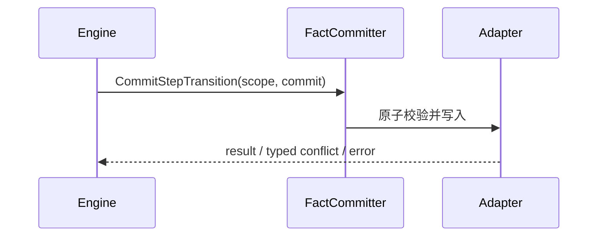
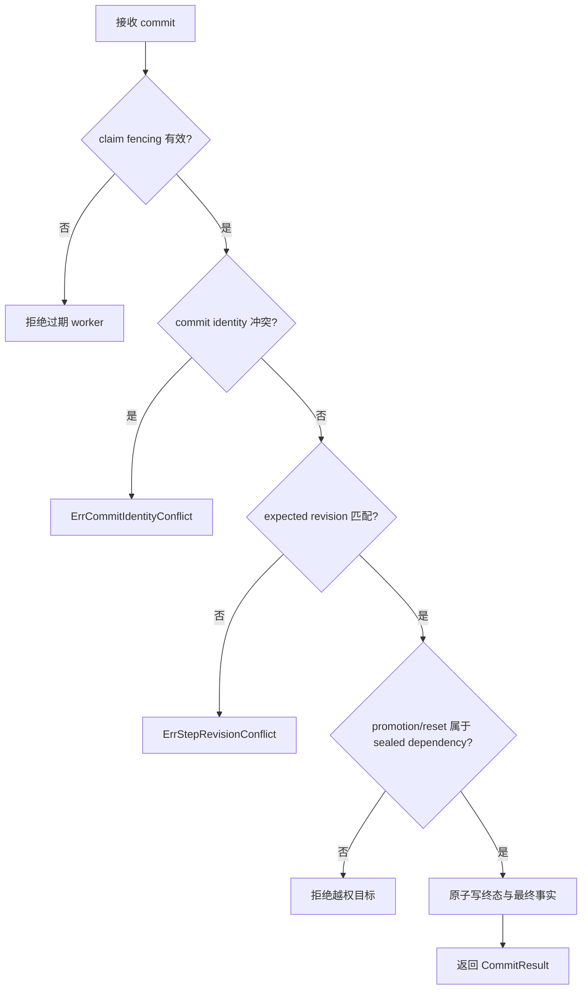

# 提交步骤终态迁移

## 目标

定义一次原子提交步骤终态及最终事实的端口契约；当前没有 application service 实现。

## 输入

- `context.Context`。
- fenced `WorkerScope`。
- `evidence.StepTransitionCommit`，含 commit identity、期望 revision、终态事实及 promotion/reset 目标。

## 输出

`evidence.StepTransitionCommitResult` 或 error；标准冲突分类为 `ErrStepRevisionConflict`、`ErrCommitIdentityConflict`。

## 时序

## 流程与错误

## 不变量

- 终态迁移与最终 facts 必须同一原子事务。
- adapter 必须校验 fencing、revision 与 commit identity 幂等性。
- promotion/reset 目标必须属于被提交步骤的 sealed node dependencies。
- port 契约不等于已存在持久化实现。

## 当前边界与延期能力

以下能力当前**不受支持或明确延期**：lease heartbeat 与过期恢复、active cancellation registry、完整队列实现、参数优先级合并、生产级 adapters 与 read projections。调用方不得从现有接口推断这些能力已经存在。

## 源码与测试

- 源码：[`application/execution/ports.go`](../../../application/execution/ports.go)
- 测试：[`application/execution/ports_test.go`](../../../application/execution/ports_test.go)
