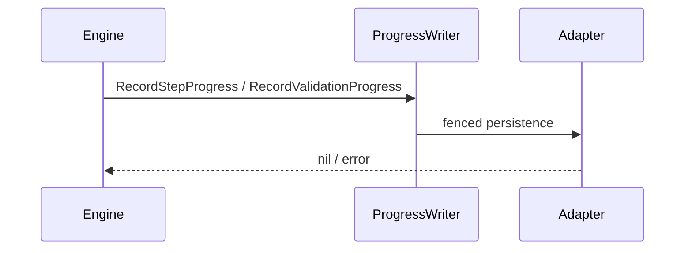
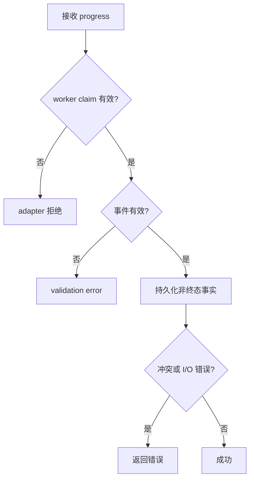

# 记录执行进度

## 目标

定义 active worker claim 下写入非终态步骤事件和验证观测的端口契约；当前没有 application service 实现。

## 输入

- `WorkerScope{RunID, ClaimToken}`。
- `evidence.StepProgressEvent` 或 `evidence.ValidationProgressObservation`。
- `context.Context`。

## 输出

`error`；无返回实体。具体持久化与 fencing 由 adapter 负责。

## 时序

## 流程与错误

## 不变量

- 仅用于非终态观测，不替代终态原子 commit。
- adapter 必须以 RunID + ClaimToken fencing。
- 不得把进度写入成功解释为步骤终态已提交。
- 当前 core 只定义端口，不提供生产存储。

## 当前边界与延期能力

以下能力当前**不受支持或明确延期**：lease heartbeat 与过期恢复、active cancellation registry、完整队列实现、参数优先级合并、生产级 adapters 与 read projections。调用方不得从现有接口推断这些能力已经存在。

## 源码与测试

- 源码：[`application/execution/ports.go`](../../../application/execution/ports.go)
- 测试：[`application/execution/ports_test.go`](../../../application/execution/ports_test.go)
