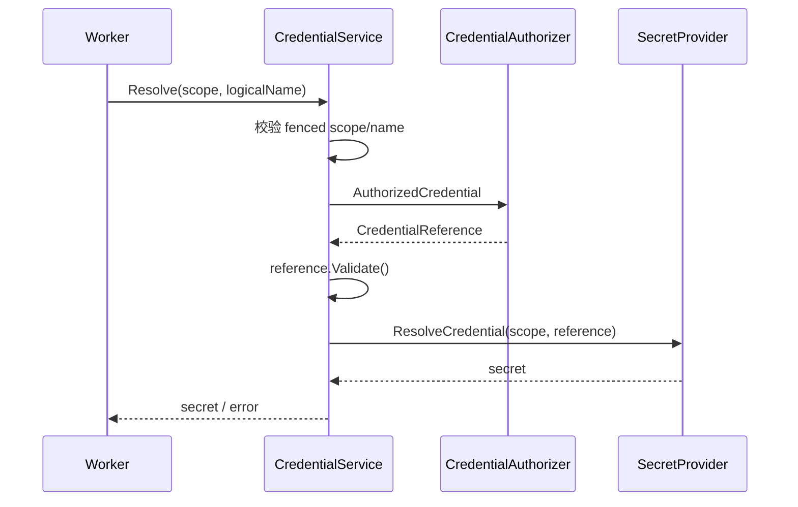
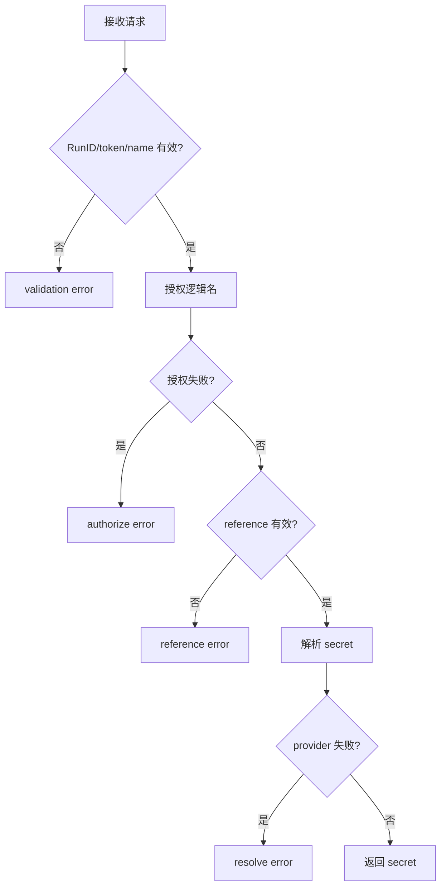

# 解析凭据

## 目标

先在当前 worker claim 下授权逻辑凭据名，再仅按授权引用向 secret provider 取值。

## 输入

- `ctx context.Context`。
- `WorkerScope{RunID, ClaimToken}`：两者 trim 后均非空。
- `logicalName string`：trim 后非空。
- `CredentialAuthorizer`、`SecretProvider`。

## 输出

成功返回 secret 字符串；失败返回空字符串及分层包装错误。

## 时序

## 流程与错误

## 不变量

- provider 只能接收 authorizer 返回且通过领域校验的引用。
- worker scope 同时传递给授权与取密端口。
- service 不持久化、不缓存、不记录 secret。
- 错误包含逻辑名和 run 身份，但不得包含 secret。

## 当前边界与延期能力

以下能力当前**不受支持或明确延期**：lease heartbeat 与过期恢复、active cancellation registry、完整队列实现、参数优先级合并、生产级 adapters 与 read projections。调用方不得从现有接口推断这些能力已经存在。

## 源码与测试

- 源码：[`application/execution/credential_service.go`](../../../application/execution/credential_service.go)
- 测试：[`application/execution/credential_service_test.go`](../../../application/execution/credential_service_test.go)
