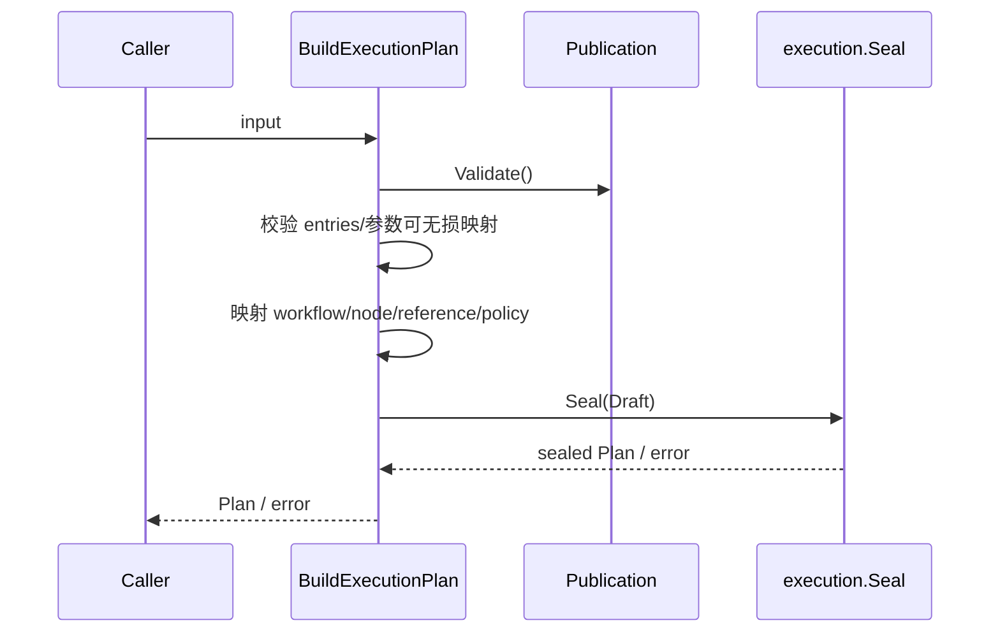
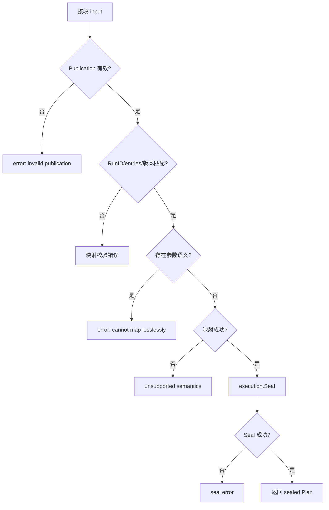

# 构建执行计划

## 目标

把已发布测试任务快照和逐入口运行身份无损映射为已封印的 `execution.Plan`。

## 输入

- `BuildExecutionPlanInput.RunID: string`：非空。
- `Publication: automation.TestTaskVersionPlan`：必须通过领域校验。
- `Entries: []ExecutionEntryInput`：数量、顺序、任务项、版本策略均须匹配 publication。
- `ParameterScopes` 与每个 entry 的 `ParameterSnapshot`：当前必须为空。

## 输出

成功返回 `execution.Plan`（sealed）；失败返回零值 Plan 与带上下文的 error。

## 时序

## 流程与错误

## 不变量

- entry 数量等于 publication item 数量，并按索引一一对应。
- `ExecutionID` 在计划内唯一；同一 workflow 可重复出现且保持独立 identity。
- fixed/latest 版本解析必须与 publication 快照一致。
- 当前无法表达的参数直接拒绝，而非静默降级。
- 返回计划必须通过 `execution.Seal`。

## 当前边界与延期能力

以下能力当前**不受支持或明确延期**：lease heartbeat 与过期恢复、active cancellation registry、完整队列实现、参数优先级合并、生产级 adapters 与 read projections。调用方不得从现有接口推断这些能力已经存在。

## 源码与测试

- 源码：[`application/scheduling/plan_mapper.go`](../../../application/scheduling/plan_mapper.go)
- 测试：[`application/scheduling/plan_mapper_test.go`](../../../application/scheduling/plan_mapper_test.go)
