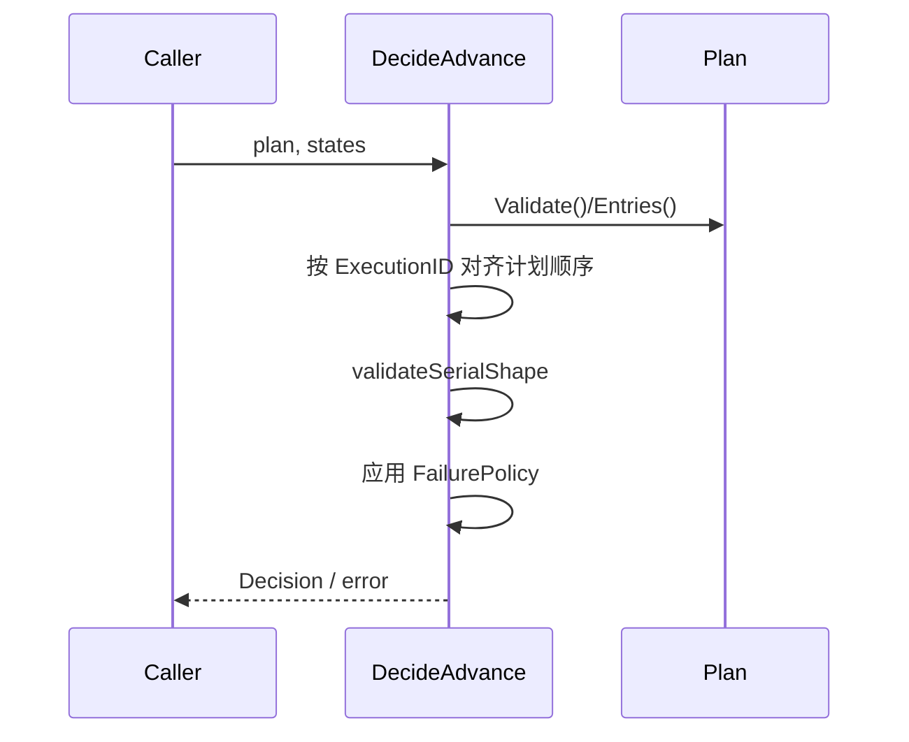
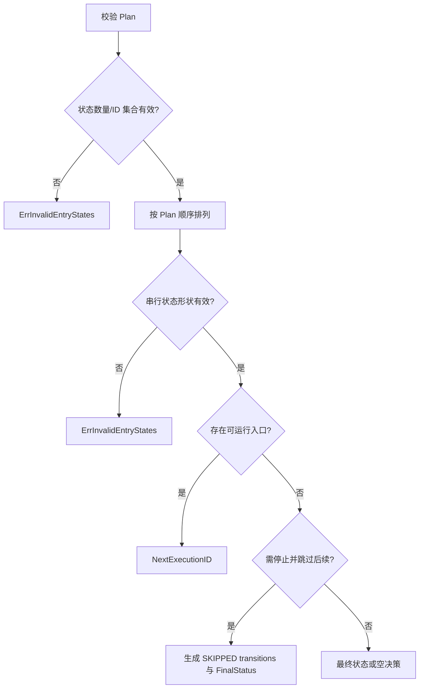

# 决定下一入口

## 目标

以 sealed plan 为成员、顺序和失败策略的唯一权威，纯函数式计算串行推进结果。

## 输入

- `plan execution.Plan`：必须 sealed 且有效。
- `states []EntryState`：每个计划入口恰好一个状态；允许无序输入，但 ID 必须唯一且集合完全相等。

## 输出

`Decision`：`NextExecutionID`、零或多个 `ExecutionTransition`、可选 `FinalStatus`；校验失败返回 `ErrInvalidEntryStates` 包装错误。

## 时序

## 流程与错误

## 不变量

- plan 决定成员和顺序，调用方状态顺序不影响结果。
- 不允许重复、缺失或额外 execution identity。
- 同时最多推进一个串行入口。
- stop-on-failure/cancellation/abort 的 skip cause 必须可追溯。
- 函数不执行 I/O、不修改输入。

## 当前边界与延期能力

以下能力当前**不受支持或明确延期**：lease heartbeat 与过期恢复、active cancellation registry、完整队列实现、参数优先级合并、生产级 adapters 与 read projections。调用方不得从现有接口推断这些能力已经存在。

## 源码与测试

- 源码：[`application/scheduling/decision.go`](../../../application/scheduling/decision.go)
- 测试：[`application/scheduling/decision_test.go`](../../../application/scheduling/decision_test.go)
