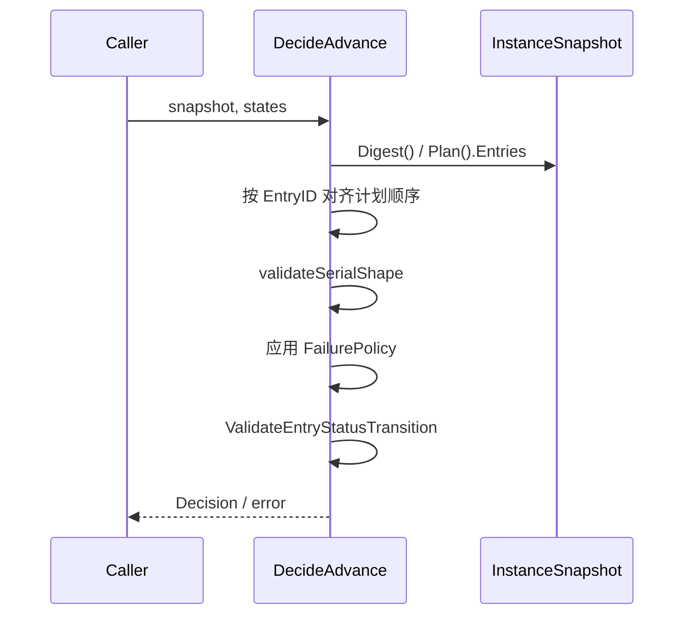
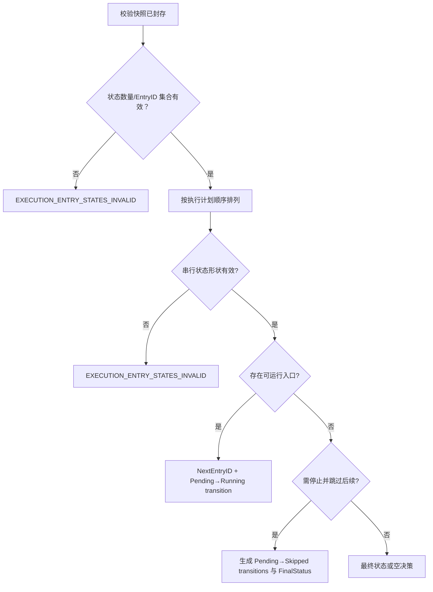

# 决定下一入口

## 目标

以 sealed plan 为成员、顺序和失败策略的唯一权威，纯函数式计算串行推进结果。

## 输入

`DecideAdvance(snapshot execution.InstanceSnapshot, states []EntryState) (Decision, error)`

- `snapshot execution.InstanceSnapshot`：必须已封存（`snapshot.Digest() != ""`），成员与顺序取自 `snapshot.Plan().Entries`。
- `states []EntryState`：每个计划入口恰好一个状态；允许无序输入，但 EntryID 必须唯一且集合完全相等。

## 输出

`Decision{NextEntryID, Transitions []ExecutionTransition, FinalStatus *execution.InstanceStatus}`：

- 选出下一个入口时，`NextEntryID` 与一条 `Pending→Running` 的 `ExecutionTransition` 同时产出。
- 需要停止级联时，`Transitions` 是全部 `Pending→Skipped`（带 `SkipCause`），并附 `FinalStatus`。
- 全部到达终态时只有 `FinalStatus`；仍有入口在 `Running` 时返回零值 `Decision`。

`DecideAdvance` 保证 `NextEntryID` 非零时，它的 `Pending→Running` 就在 `Transitions` 里。但这只是这个函数的行为，不是 `Decision` 类型的不变量：`Decision` 是纯数据，调用方完全可以构造出 `NextEntryID` 有值而 `Transitions` 为空的值（`fence_conformance_test.go` 就这么做）。适配器写入时应以 `Transitions` 为准，把 `NextEntryID` 只当作"哪个入口正在启动"的引用。

校验失败返回 `EXECUTION_ENTRY_STATES_INVALID`（`invalidEntryStatesError()`，无 cause）。

每条产出的转移都送进 `execution.ValidateEntryStatusTransition`，但当前状态机允许 `Pending→Running` 与 `Pending→Skipped`，所以这两个校验今天都不会失败——它们是防御性的，作用是让状态机而不是本函数成为"什么转移合法"的唯一权威。两条路径万一失败时的分类并不一致：`Pending→Running` 原样返回状态机自己的 `EXECUTION_STATUS_TRANSITION_INVALID`，`Pending→Skipped` 则被折叠成 `EXECUTION_ENTRY_STATES_INVALID`。

## 时序

## 流程与错误

## 不变量

- 快照中的 plan 决定成员和顺序，调用方状态顺序不影响结果。
- 不允许重复、缺失或额外 entry identity。
- 同时最多推进一个串行入口，且推进被表达为显式的 `Pending→Running` 转移，而不是只由 `NextEntryID` 隐含。
- 每条产出的转移都经 `execution.ValidateEntryStatusTransition` 校验。
- stop-on-failure/cancellation/abort 的 skip cause 必须可追溯。
- 函数不执行 I/O、不修改输入。

## 源码与测试

- 源码：[`application/scheduling/decision.go`](../../../application/scheduling/decision.go)
- 测试：[`application/scheduling/decision_test.go`](../../../application/scheduling/decision_test.go)
