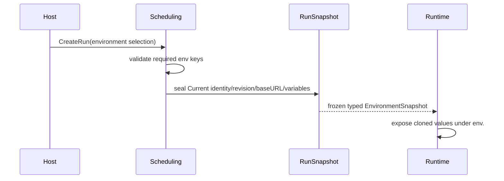

# 注入环境属性

## 目标

在创建 Run 时冻结所选 Environment 的类型化 `Variables`，并在执行时通过 `env.` 作用域提供；Core 不区分、授权或解析 secret。新 Run 默认写 Current（当前为 V2）；底层调用方可显式选择 V1 或 V2，V1 字符串按 TEXT 读取且保持原摘要。

## 输入

- 已选 Environment 的身份、修订、显示名、Base URL 与 `Variables map[string]parameter.Value`。
- Test Task 声明的必需环境键。
- 创建 Run 时使用的一致目录视图。

## 输出

- 密封在 `execution.RunSnapshot` 中的 `EnvironmentSnapshot`。
- 执行入口的 `env.` 变量作用域。

## 时序

## 不变量

- Environment 只有一组普通类型化 `Variables`；Core 不按键名或内容推断敏感性。
- 每个变量键非空、值必须是合法的五种 `parameter.Value`；资产和 Run 快照边界均深拷贝，包含 MULTI_SELECT 切片。
- V1/V2 均可显式选择；默认 Current 当前指向 V2。V1 按旧字符串摘要验证并提升为 TEXT，V2 摘要包含类型与 payload。
- TEXT、NUMBER、BOOLEAN、SINGLE_SELECT 可用于字符串插值；MULTI_SELECT 不隐式字符串化。
- Base URL 如存在，必须是绝对 HTTP(S) URL 且不含 user info。
- Test Task 只声明必需键名，不保存环境属性值。
- Run 创建后，环境修订或属性变化不会改变既有快照。

## 不属于 Core 的能力

凭据分类、Vault/provider 集成、授权、轮换、脱敏和 reveal 审计均不属于当前 Core 模型。宿主若需要这些能力，应在向 Core 提供普通属性之前自行完成，且不得把宿主凭据模型反向引入领域契约。

## 源码与测试

- [`domain/automation/assets.go`](../../../domain/automation/assets.go)：Environment 与 `EnvironmentVariables` 规则。
- [`domain/execution/instance_snapshot.go`](../../../domain/execution/instance_snapshot.go)：不可变环境快照。
- [`application/scheduling/create_instance_builder.go`](../../../application/scheduling/create_instance_builder.go)：创建 Run 时组装输入。
- [`domain/automation/lifecycle_test.go`](../../../domain/automation/lifecycle_test.go)：普通属性与 Base URL 规则。
- [`domain/execution/instance_snapshot_corrections_test.go`](../../../domain/execution/instance_snapshot_corrections_test.go)：快照复制和环境语义。
