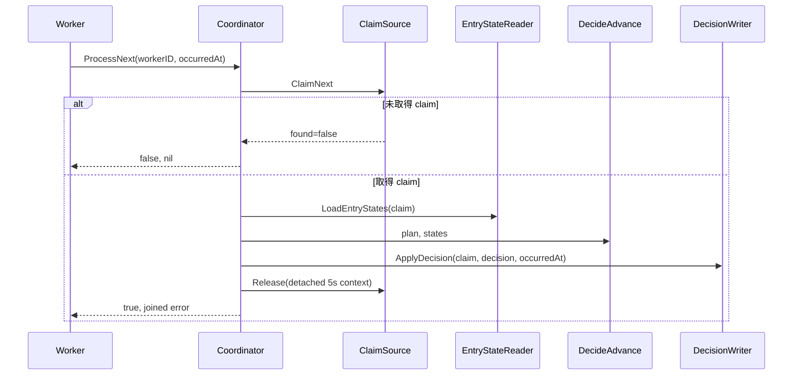
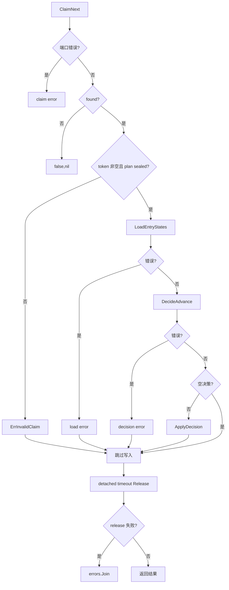

# 处理下一 Claim

## 目标

在一个 fenced claim 下读取状态、计算决策并委托原子写入，最后尽力释放 claim。

## 输入

- `ctx context.Context`。
- `workerID string`、`occurredAt int64`。
- 注入端口：`ClaimSource`、`EntryStateReader`、`DecisionWriter`。

## 输出

`claimed bool` 表示是否取得工作；`error` 可能包含 claim/read/decision/write/release 错误，release 错误通过 `errors.Join` 保留。

## 时序

## 流程与错误

## 不变量

- 未取得 claim 时不得读状态或写决策。
- 无效 claim 不得进入状态读取。
- 空决策不得写入。
- adapter 必须使用 claim token fencing 并原子应用 decision。
- 即使 ctx 已取消也使用独立、最多 5 秒上下文释放 claim。

## 当前边界与延期能力

以下能力当前**不受支持或明确延期**：lease heartbeat 与过期恢复、active cancellation registry、完整队列实现、参数优先级合并、生产级 adapters 与 read projections。调用方不得从现有接口推断这些能力已经存在。

## 源码与测试

- 源码：[`application/scheduling/coordinator.go`](../../../application/scheduling/coordinator.go)
- 测试：[`application/scheduling/coordinator_test.go`](../../../application/scheduling/coordinator_test.go)
