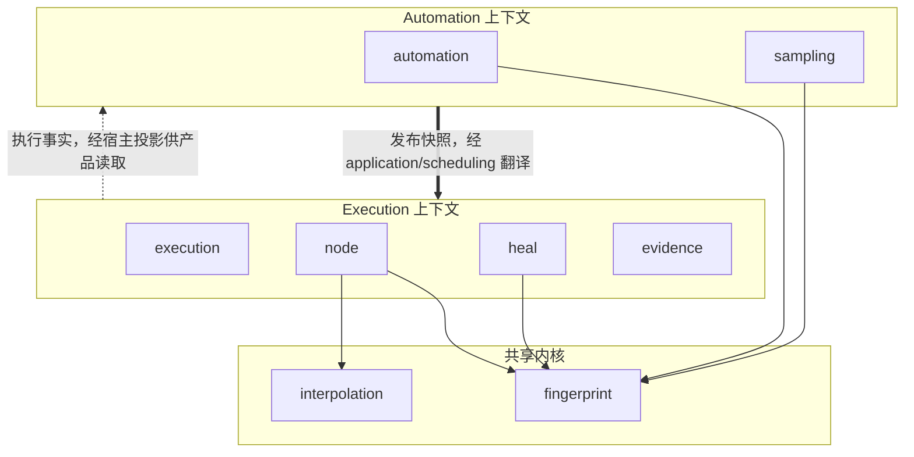

# 上下文地图

## 边界

当前八个领域包被归入三个依赖区域：Automation 上下文、Execution 上下文和共享内核。该映射不是约定俗成，而由 [`TestBoundedContextIsolation`](../../architecture/dependencies_test.go) 执行检查。

## 协作关系

### Automation → Execution：发布语言到执行语言

`automation.TestTaskVersionPlan` 是发布结果，携带 TestTask 版本、Workflow/Node 依赖快照及 Workflow 引用解析。`application/scheduling.BuildExecutionPlan` 是反腐层：它验证发布物与 entry 的一一对应关系，然后映射为 `execution.Draft` 并调用 `execution.Seal`。

这条边界明确避免让 Execution 在运行时重新读取可变的 Workflow 或 Node 聚合。固定版本和“最新发布版”都必须在计划构建前解析为具体版本。

### Execution → Automation：事实而非反向领域依赖

Execution 产生进度、终态、校验与修复观察。Core 不让 Execution 领域直接调用 Automation 聚合，也不提供业务读模型。宿主可订阅或投影 [`domain/evidence`](../../domain/evidence) 的事实，再驱动修复审核等应用用例。

### 共享内核

`fingerprint` 和 `interpolation` 可被两个业务上下文依赖。非共享上下文之间禁止直接领域 import；跨边界协作必须经应用层映射或宿主适配器完成。

## 上下文关系表

| 上游 | 下游 | 集成形式 | 保证 |
|---|---|---|---|
| Automation | Scheduling | `TestTaskVersionPlan` + entry 输入 | 发布依赖完整、版本已锁定 |
| Scheduling | Execution | `execution.Plan` | 密封、排序、不可变快照 |
| Scheduling | Engine | 宿主选择 `NextExecutionID`，再从编译结果取 entry | Core 分离“决策”和“执行” |
| Engine/Node | Evidence | `ExecutionSink` 与 application execution 端口 | 非终态进度与终态提交分流 |
| Evidence | 产品读侧 | 宿主投影 | Core 不拥有指标或查询模型 |

## 禁止的捷径

- Automation 领域不能直接 import Execution 领域，反之亦然。
- 领域包不能定义 Repository、Store、Projection、Query 等持久化/读模型角色。
- 领域与应用不得接触 HTTP、宿主环境变量或文件路径。
- 浏览器 Driver、数据库、队列、密钥库和产品查询均不得伪装成领域实现。
