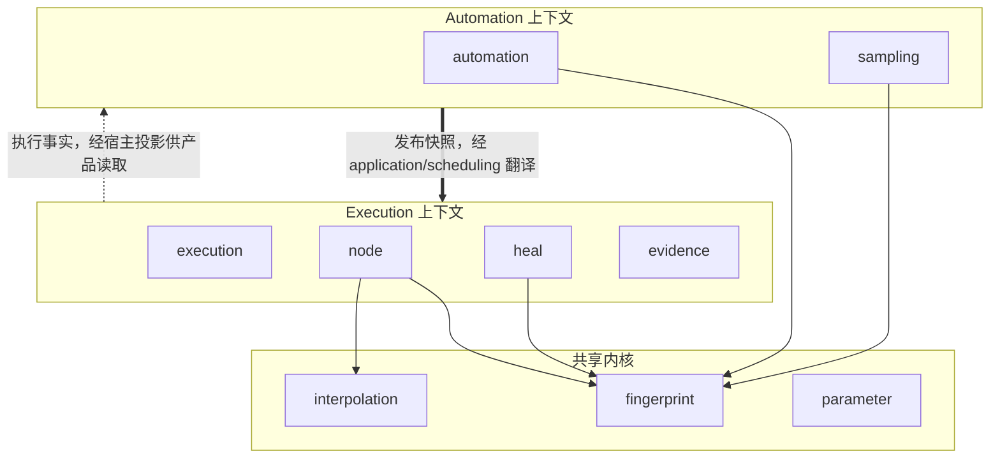

# 上下文地图

## 边界

当前九个领域包被归入两个有界上下文与一个共享内核：自动化（`automation`、`sampling`）、执行（`execution`、`node`、`heal`、`evidence`）和共享内核（`fingerprint`、`interpolation`、`parameter`）。共享内核不是第三个有界上下文。该映射由 [`TestBoundedContextIsolation`](../../architecture/dependencies_test.go) 执行检查。

## 协作关系

### 自动化 → 执行：发布语言到执行语言

`automation.TestTaskVersionPlan` 是发布结果；调度的 `CreateRun` 服务在单次创建事务中读取发布物、把固定版与 `latest` 解析为具体版本，将受修订号控制的普通可变 Environment 当前状态克隆为 `execution.EnvironmentSnapshot`，并将策略、类型化参数、Workflow/Node 快照及引用闭包冻结到不可变 `execution.Run` 中。

这条边界明确避免执行在运行时重新读取可变的 Workflow 或 Node 聚合。`latest` 的冻结点是调度创建执行实例时，而不是发布时、排队后或执行引擎编译时。

### 执行 → 自动化：事实而非反向领域依赖

执行产生进度、终态、校验与修复观察。Core 不让执行领域直接调用自动化聚合，也不提供业务读模型。宿主可订阅或投影 [`domain/evidence`](../../domain/evidence) 的事实，再驱动修复审核等应用用例。

### 共享内核

`fingerprint`、`interpolation` 和 `parameter` 可被两个业务上下文依赖。`parameter.Value`/`Binding` 提供跨上下文一致的类型化参数语义。非共享上下文之间禁止直接领域 import；跨边界协作必须经应用层映射或宿主适配器完成。

## 上下文关系表

| 上游 | 下游 | 集成形式 | 保证 |
|---|---|---|---|
| 自动化 | 调度 | `TestTaskVersionPlan` + `CreateRun` 输入 | 发布依赖完整；`latest` 尚可存在 |
| 调度 | 执行 | 不可变 `execution.Run` | 具体发布版本、Environment 快照、策略、类型化参数与依赖闭包已冻结 |
| 调度 | 执行引擎 | 执行实例顶层执行项 | Core 分离“决策”和“执行” |
| 执行引擎/Node | 执行证据 | `ExecutionSink` 与 application execution 端口 | 非终态进度与终态提交分流；`HealObservation` 的晋升是结果数据 |
| 执行证据 | 产品读侧 | 宿主投影 | Core 不拥有指标或查询模型 |

## 禁止的捷径

- 自动化领域不能直接 import 执行领域，反之亦然。
- 领域包不能定义 Repository、Store、Projection、Query 等持久化/读模型角色。
- 领域与应用不得接触 HTTP、宿主环境变量或文件路径。
- 浏览器 Driver、数据库、队列、密钥库和产品查询均不得伪装成领域实现。
