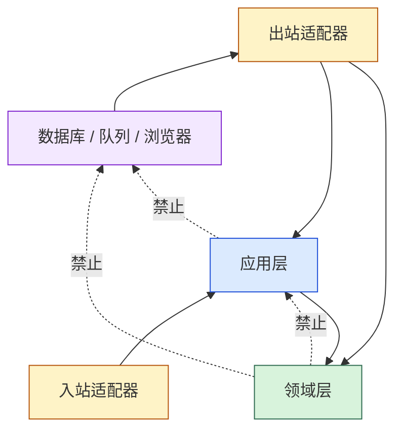

# 依赖规则

本文回答「谁能 import 谁」。包与模块清单见[系统总览](system-overview.md)，业务边界的含义见[上下文地图](context-map.md)。**本文的每一条都由测试执行，不是约定。**

## 允许方向

依赖倒置的含义是：应用模块在**使用点**定义小接口，宿主实现接口并注入；Core 不 import 宿主实现。

## 自动执行的规则

全部位于 `architecture/dependencies_test.go`。

| # | 规则 | 守卫 |
|---|---|---|
| 1 | `domain` 只能 import 标准库或其他 `domain/*` 包 | [`dependencies_test.go`](../../architecture/dependencies_test.go) · `TestDependencyDirectionAndPurity` |
| 2 | `application` 只能 import 标准库或本 Core 模块 | 同上 |
| 3 | `domain` 与 `application` 禁止 `embed`、`net/http`、`os`、`path/filepath` | 同上 |
| 4 | `domain` 还禁止 `encoding/json`、`encoding/xml`、`database/sql`、`gopkg.in/yaml.v3`，以及 `json:` / `yaml:` / `xml:` / `db:` / `gorm:` 这五种 struct tag | 同上 |
| 5 | 非共享领域上下文不能直接跨上下文 import | [`dependencies_test.go`](../../architecture/dependencies_test.go) · `TestBoundedContextIsolation` |
| 6 | 领域接口不得承担聚合查询、持久化或投影职责 | [`dependencies_test.go`](../../architecture/dependencies_test.go) · `TestDomainOwnsBehaviorNotReadModelsOrStoragePorts` |
| 7 | Core 不拥有业务指标投影（`domain/metrics` 不得存在） | [`dependencies_test.go`](../../architecture/dependencies_test.go) · `TestCoreOwnsNoBusinessMetricsProjection` |
| 8 | 采样不得构造或持久化自动化聚合 | [`dependencies_test.go`](../../architecture/dependencies_test.go) · `TestSamplingOwnsNoAutomationAggregateConstructionOrPersistence` |

规则 3 与规则 4 的区别值得注意：**宿主类 import 对领域和应用都禁止，编解码与 SQL 类 import 只对领域禁止。** 应用层可以知道自己在跟什么样的端口说话，领域层不可以。

规则 6 判定的是接口的**名字加方法组合**：`FolderReader{ListFolders, GetFolder}`、`RunQuery{Execute}`、`NodeRepository{Resolve}`、`Gateway{FindNode}` 都会被拒；而 `Reader{Exists, Visible, Text, Attribute}` 这种运行能力端口是允许的。判定函数本身另有单元测试（[`dependencies_test.go`](../../architecture/dependencies_test.go) · `TestForbiddenDomainInterfaceReason`），因此规则的边界也被钉住。

## 端口归属

| 端口类型 | 应放位置 | 示例 | 适配器义务 |
|---|---|---|---|
| 聚合持久化 | 应用使用点 | `ExecutionFlowRepository`、`NodeRepository` | 乐观并发、原子保存、错误映射 |
| 调度租约 | `application/scheduling` | `ClaimSource` | 独占领取、token 栅栏校验、可靠释放 |
| 调度状态 | `application/scheduling` | `EntryStateReader`、`DecisionWriter` | 同一领取执行权下读取并原子应用决策 |
| 浏览器能力 | `domain/node` 运行端口 | `Driver`、`Recorder` | 页面生命周期、超时、取消、截图/录制 |
| 执行事实 | `application/execution` 与 `domain/node` | `FactCommitter`、`ProgressWriter`、`ExecutionSink` | 幂等、修订检查、终态事务原子性 |
| 参数值 | `domain/parameter` 共享内核 | `Value`、`Binding` | 保持类型、复制隔离并在边界校验 |
| 执行实例创建与读取 | `application/scheduling` | `CreateInstanceStore`、`CreateInstanceTx`、`ClaimSource` | 原子冻结不可变快照；快照随 `Claim` 一并交出，Core 没有单独的执行实例读端口 |
| 顶层执行项进入授权 | `application/execution` | `EntryAuthorizer` | 在浏览器会话建立阶段判定该工作器是否仍持有该顶层执行项的权限 |

## 原子性与并发要求

### 调度写入

`DecisionWriter.ApplyDecision` 不是逐条更新建议。**`Decision.Transitions` 才是该次决策的完整写入清单**，`NextEntryID` 只是指向其中「正在被启动的那一项」的快捷引用 —— 该项的 `PENDING → RUNNING` 已经包含在 `Transitions` 里，适配器不必再自行推断。

适配器应在一个受领取令牌保护的事务中应用：

- 待运行顶层执行项的 `PENDING → RUNNING`；或
- 后续顶层执行项的 `PENDING → SKIPPED` 及其因果；和
- 执行实例的最终状态。

这两个状态迁移在 `DecideAdvance` 里就已经过 `execution.ValidateEntryStatusTransition`；合法迁移表见[执行领域](../domains/execution.md#状态与流程)。**失败时不得留下部分转换。**

### 执行证据写入

`FactCommitter.CommitStepTransition` 表示一个终态步骤事件及其最终校验、修复观察、截图和 selector reset 的**原子**提交。适配器必须同时校验 `execution.WorkerFence`、`CommitID` 和 `ExpectedRevision`，并对重复提交返回稳定结果。非终态 `RUNNING`/`HEALING`/`TRANSITIONING`/`VALIDATING` 通过 `ProgressWriter` 单独记录，不得冒充终态。

### 持久化摘要

封存快照与幂等记录的 digest 依赖一组域分隔 wire tag。改动其中任何一个都会静默作废全部已存 digest，且没有测试能自然发现 —— 摘要只会变成另一个同样合法的字符串。完整清单与已发生的一次失效见[摘要 wire tag 登记表](../contracts/digest-wire-tags.md)，由 [`digest_wire_tag_test.go`](../../architecture/digest_wire_tag_test.go) 守住。

## 当前禁止的边界与命名

当前执行 API 只允许以下入口和命名。架构守卫同时阻止文档和代码重新引入已禁止的第二套执行模型：

| 禁止符号或形状 | 当前契约 | 守卫 |
|---|---|---|
| `domain/workspace` 包 | Core 不包含该领域包 | [`dependencies_test.go`](../../architecture/dependencies_test.go) · `TestWorkspacePackageIsRemoved` |
| `CompileRunSnapshot`、`RunCompiledEntry`、`RunCompiledEntryWithResult`、`RunCoordinator.Run` | 禁止出现在公开执行 API；执行入口固定为 `CompilePlan` 与 `RunProgram` | [`dependencies_test.go`](../../architecture/dependencies_test.go) · `TestEngineHasSingleCanonicalExecutionAPI` |
| `RunSnapshot`、`CreateRunCommand`/`CreateRunService`、`AbortRunService`、`RunReader` | 执行模型使用 `InstanceSnapshot`、`CreateInstanceCommand`/`CreateInstanceService`、`AbortInstanceService`，快照随 `Claim` 交出 | [`unified_language_boundary_test.go`](../../architecture/unified_language_boundary_test.go) · 命名边界测试 |
| 公开类型兼容别名 | 不允许；直接使用当前类型名 | [`unified_language_boundary_test.go`](../../architecture/unified_language_boundary_test.go) · `TestNoExportedTypeAliasKeepsAnOldNameAlive` |
| 以弃用标记承诺兼容行为 | 不允许；能力移交只能登记在退役契约中 | [`unified_language_boundary_test.go`](../../architecture/unified_language_boundary_test.go) · `TestNoDeprecationMarkersPromiseAnOldNameStillWorks` |

`RootVersionID`、`CompileExecution`、封存的 Plan/Draft 主模型和凭据服务同样已从当前执行契约移除。
