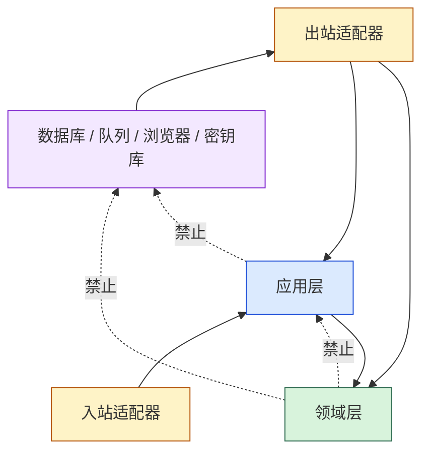

# 依赖规则

## 允许方向

依赖倒置的含义是：应用模块在使用点定义小接口，宿主实现接口并注入；Core 不 import 宿主实现。

## 自动执行的规则

[`architecture/dependencies_test.go`](../../architecture/dependencies_test.go) 检查：

1. `domain` 只能依赖标准库或其他 `domain/*` 包。
2. `application` 只能依赖标准库或本 Core 模块。
3. `domain` 与 `application` 禁止 `embed`、`net/http`、`os`、`path/filepath`。
4. `domain` 还禁止 SQL、JSON/XML/YAML 编解码依赖和持久化 struct tag。
5. 非共享领域上下文不能直接跨上下文 import。
6. 领域接口不得承担聚合查询、持久化或投影职责。
7. 已移除的 `domain/workspace` 不得重新出现；当前契约中也不使用该旧边界。

## 端口归属

| 端口类型 | 应放位置 | 示例 | 适配器义务 |
|---|---|---|---|
| 聚合持久化 | 应用使用点 | `TestTaskRepository`、`NodeRepository` | 乐观并发、原子保存、错误映射 |
| 调度租约 | `application/scheduling` | `ClaimSource` | 独占领取、token fencing、可靠释放 |
| 调度状态 | `application/scheduling` | `EntryStateReader`、`DecisionWriter` | 同一 claim 下读取并原子应用决策 |
| 浏览器能力 | `domain/node` 运行端口 | `Driver`、`Recorder` | 页面生命周期、超时、取消、截图/录制 |
| 执行事实 | `application/execution` 与 `domain/node` | `FactCommitter`、`ProgressWriter`、`ExecutionSink` | 幂等、修订检查、终态事务原子性 |
| 凭据读取 | `application/execution` | `CredentialReader` | 安全存储、授权、审计；只向 Runtime 提供内存值 |

## 原子性与并发要求

### 调度写入

`DecisionWriter.ApplyDecision` 不是逐条更新建议。适配器应在一个受 claim token 保护的事务中应用：

- 待运行 entry 的 `PENDING → RUNNING`；或
- 后续 entry 的 `PENDING → SKIPPED` 及其因果；和
- Run 的最终状态。

失败时不得留下部分转换。

### Evidence 写入

`FactCommitter.CommitStepTransition` 表示一个终态步骤事件及其最终校验、修复观察、截图和 selector reset 的原子提交。适配器必须同时校验 `WorkerScope`、`CommitID` 和 `ExpectedRevision`，并对重复提交返回稳定结果。非终态 `RUNNING/HEALING/TRANSITIONING/VALIDATING` 通过 `ProgressWriter` 单独记录，不得冒充终态。

## 删除过的旧概念

旧的 `RootVersionID` 与 `CompileExecution` 已从当前执行契约移除：Plan 现在有多个显式 entry，编译入口是 `engine.CompilePlan`，结果按 `ExecutionID` 索引。文档不得再把它们描述成现行 API。
