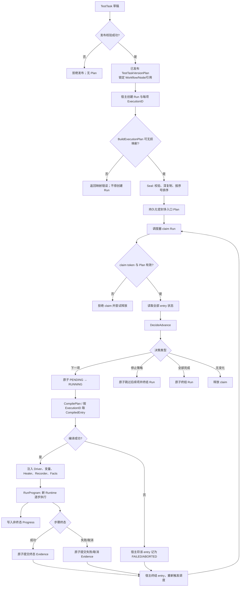
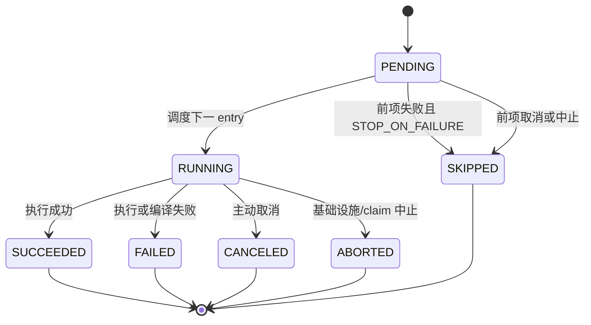
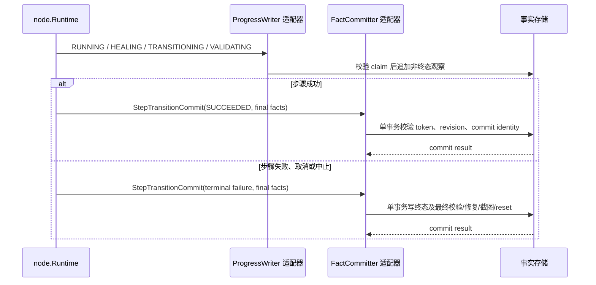

# 端到端执行

本页区分 Core 已实现的纯行为/编排与宿主必须补齐的运行基础设施。

## 全链路

## 1. TestTask 发布

**已实现：** `domain/automation` 定义 TestTask 聚合、条目顺序、失败策略与发布生命周期。发布结果 `TestTaskVersionPlan` 包含版本化 Workflow、Node 和 Workflow 引用解析，避免执行时追随可变“最新版”。应用服务通过 Repository 端口保存发布结果。

**仅端口契约：** Core 不提供数据库 schema、发布 API 或跨聚合读取实现。

**适配器义务：** 在发布事务中保证版本唯一、预期 revision、依赖读取一致性与 publication 幂等。

## 2. 构建并密封多入口 Plan

[`BuildExecutionPlan`](../../application/scheduling/plan_mapper.go) 验证 entry 数量、顺序、TestTaskItemID、WorkflowID、固定/最新版策略与解析后的依赖。`execution.Seal` 再校验完整 Draft、深复制并按 `SequenceNumber` 排序。

Plan 的每个 `WorkflowEntry` 都有独立 `ExecutionID`；它不是单根执行树。Workflow 引用的子版本也已通过 `ReferenceResolution` 锁定。

**不支持并明确拒绝：**

- 任意运行参数 scope；
- entry 参数快照；
- TestTask item 参数值；
- required、options 或非 text 的 Workflow 参数；
- 无法解析或与发布策略不一致的 Workflow 版本。

## 3. 有序调度

[`DecideAdvance`](../../application/scheduling/decision.go) 使用 Plan 顺序重排状态输入并验证串行形状：终态不能出现在活动前沿之后，同一时刻至多一个 `RUNNING`。

`CONTINUE_ON_FAILURE` 允许失败后继续下一个 entry，但最终 Run 为失败；取消与中止总会停止后续 entry。Coordinator 负责 claim、读状态、决策、写入和带超时释放；其端口的基础设施实现不在 Core。

## 4. 每个 entry 编译与运行

**已实现：** `engine.CompilePlan` 遍历全部 Plan entry，每项独立编译为 `node.Program`，同时生成步骤展示元数据和 Node 版本身份映射。Workflow 引用被递归展开，并受最大深度与最大展开节点预算约束。宿主用 `CompiledRun.Entry(executionID)` 选择当前调度项。

**已实现：** `engine.RunProgram` 为一次 Program 创建全新 Runtime，复制初始变量，按节点树执行，并在启用 Recorder 时负责启动和清理。

**适配器义务：** 宿主必须将 scheduling 的 `NextExecutionID` 与编译项对齐，注入实际浏览器 Driver、Facts sink、Recorder 和可选 Healer，并把编译/运行错误可靠映射为 entry 终态。Core 当前没有内建常驻 worker loop。

## 5. Progress 与原子终态 Evidence

[`StepTransitionCommit`](../../domain/evidence/commits.go) 只接受终态步骤事件，并约束附属事实属于同一 execution/step。`FactCommitter` 要求一次原子提交终态与最终事实；`ProgressWriter` 只接收非终态观察。

**重要边界：** Core 定义这些不变量与端口，但不会自动提供数据库事务。若适配器先写终态再写 Evidence，或忽略 claim/revision fencing，即违反当前契约。

## 故障处理摘要

| 故障点 | Core 行为 | 宿主义务 |
|---|---|---|
| 发布/Plan 校验失败 | 返回错误，不产生密封 Plan | 不持久化半成品 Run |
| claim 无效 | Coordinator 拒绝并释放 | token fencing、可观测告警 |
| 状态形状非法 | `ErrInvalidEntryStates` | 不猜测修复；人工/补偿处理 |
| entry 编译失败 | 返回带 ExecutionID 的错误 | 原子标记 entry 失败或中止并重调度 |
| Program 运行失败 | 返回执行错误；Recorder 清理错误会合并 | 提交终态事实与 execution 状态 |
| Progress 写失败 | 由端口返回错误 | 明确重试策略，不能伪造终态 |
| 终态提交冲突 | revision/commit identity 错误契约 | 幂等判定或停止陈旧 worker |
