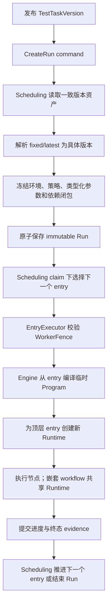

# 端到端执行

## 主路径

## 1. 发布与创建执行实例

自动化领域负责手工发布 TestTask 版本及 Workflow/Node 等资产版本。采样和自愈可以发布其他资产，但 TestTask 版本不由它们自动生成。

[`CreateRunService`](../../application/scheduling/create_run_service.go) 是冻结边界：它在调度创建事务中读取一致版本的发布物，把所有 `latest` 解析为具体版本，并调用 [`create_run_builder.go`](../../application/scheduling/create_run_builder.go) 构造并封存不可变的 [`execution.RunSnapshot`](../../domain/execution/run_snapshot.go)。执行实例快照保存顶层执行项、环境 `Properties`、截图/修复策略、类型化参数、Workflow/Node 快照和引用闭包；执行期不得回读可变的自动化聚合。

参数使用共享内核 [`parameter.Value`](../../domain/parameter/value.go) 与 [`parameter.Binding`](../../domain/parameter/binding.go)，支持标量和复合值。环境是普通 Properties，并在执行绑定中出现在 `env.` 命名空间；不存在 CredentialReference、CredentialReader 或 CredentialService 子系统。

## 2. 调度与状态

调度命令服务负责领取执行权、串行顶层执行项顺序、失败策略、取消和中止。所有写入必须受当前工作器栅栏保护，并在宿主事务中原子兑现。显式中止由 `AbortRunService` 要求宿主事务先原子提交权威的 `execution.Aborted` 并失效栅栏，再发送取消信号；信号失败不回滚提交，而是携带已提交结果返回 `ErrRunSignalRetryable`。普通执行上下文取消仍映射为 `CANCELED`，属于不同操作。实现与验收见 [`run_command_services.go`](../../application/scheduling/run_command_services.go)、[`run_command_services_test.go`](../../application/scheduling/run_command_services_test.go) 和 [`run_command_transaction_conformance_test.go`](../../application/scheduling/run_command_transaction_conformance_test.go)。

## 3. 编译与运行时

执行引擎从当前执行实例的顶层执行项及冻结快照编译 `node.Program`，并在运行时创建临时 `node.Runtime`；`Program` 和 `Runtime` 都不属于持久化执行实例。`application/execution.EntryExecutor` 为每个 TestTask 顶层执行项调用宿主的 `BrowserSessionFactory.Create`，把这一个全新的宿主所有 `BrowserSession` 交给宿主的 `EntryRunner` 连接至引擎执行，并在该顶层执行项结束后同步关闭会话。该顶层执行项内递归展开的工作流复用同一 `BrowserSession` 和 `node.Runtime`，并使用分层参数作用域。

参数按执行实例 → 顶层执行项 → TestTask 项 → 工作流调用覆盖。绑定和插值失败会显式终止执行，不退化为仅字符串替换。

## 4. 执行证据与自愈结果

Node 通过执行端口写非终态进度和终态提交。[`StepTransitionCommit`](../../domain/evidence/commits.go) 把同一步骤的终态、最终验证、截图、selector reset 与 [`HealObservation`](../../domain/evidence/observations.go) 组合成原子提交意图。`HealObservation` 是该提交的输入证据，不包含晋升；提交应用后，`StepTransitionCommitResult.Promotions` 返回权威的已晋升 NodeVersion 身份。自动化领域可通过后续独立交互观察这些结果，但执行证据不直接修改已创作资产。

## 5. 采样边界

`sampling.Session` 负责捕获幂等、身份映射和录制顺序；`SamplingWorkspace`/draft 负责可编辑的临时资产、重写和发布准备。二者相关但不同：Workspace 不是 Session 快照，也不替代 Session 生命周期。

## 失败与恢复责任

| 失败点 | Core 行为 | 宿主责任 |
|---|---|---|
| 执行实例创建解析或校验失败 | 返回错误，不暴露半成品执行实例 | 回滚创建事务 |
| 领取执行权/栅栏过期 | 拒绝状态或事实写入 | 重新领取或终止旧工作器 |
| 执行程序编译失败 | 顶层执行项不启动 | 按失败策略写顶层执行项/执行实例状态 |
| 运行时/Driver 失败 | 返回分类错误，清理 Recorder | 原子提交终态并推进调度 |
| 执行证据提交冲突 | 返回稳定冲突/幂等结果 | 校验修订号、commit ID 与栅栏 |

## 关键源码与测试

- [执行实例创建服务](../../application/scheduling/create_run_service.go)、[执行实例创建测试](../../application/scheduling/create_run_test.go)
- [不可变执行实例快照](../../domain/execution/run_snapshot.go)、[快照不变量测试](../../domain/execution/run_snapshot_invariants_test.go)
- [顶层执行项执行器](../../application/execution/entry_executor.go)、[执行器测试](../../application/execution/entry_executor_test.go)
- [执行引擎编译器](../../application/engine/compiler.go)、[参数绑定测试](../../application/engine/binding_test.go)
