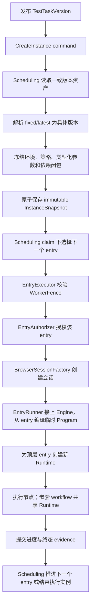

# 端到端执行

本文回答「一次执行怎么从发布走到证据」。包清单见[系统总览](system-overview.md)，边界含义见[上下文地图](context-map.md)，import 方向见[依赖规则](dependency-rules.md)。

## 主路径

## 1. 发布与创建执行实例

自动化领域负责手工发布 TestTask 版本及 Workflow/Node 等资产版本。采样和自愈可以发布其他资产，但 **TestTask 版本不由它们自动生成**。

[`CreateInstanceService`](../../application/scheduling/create_instance_service.go) 是冻结边界：它在调度创建事务中读取一致版本的发布物，把所有 `latest` 解析为具体版本，并调用 [`create_instance_builder.go`](../../application/scheduling/create_instance_builder.go) 构造并封存不可变的 [`execution.InstanceSnapshot`](../../domain/execution/instance_snapshot.go)。快照保存顶层执行项、环境、截图/修复策略、类型化参数、Workflow/Node 快照和引用闭包；**执行期不得回读可变的自动化聚合。**

参数使用共享内核 [`parameter.Value`](../../domain/parameter/value.go) 与 [`parameter.Binding`](../../domain/parameter/binding.go)，支持标量和复合值。当前默认快照 schema（`V2`）的环境载荷是类型化的 `Variables`，引擎在 [`compiler.go`](../../application/engine/compiler.go) 上把它们逐项展开成 `env.<name>` 注入根参数作用域，同名冲突直接让编译失败；V1 仅在显式恢复兼容快照时接受字符串 `Properties`，细节见[执行领域](../domains/execution.md#环境快照有两种形状当前只用一种)。**不存在 CredentialReference、CredentialReader 或 CredentialService 子系统。**

## 2. 调度与状态

调度命令服务负责领取执行权、串行顶层执行项顺序、失败策略、取消和中止。所有写入必须受当前工作器栅栏保护，并在宿主事务中原子兑现。

显式中止由 `AbortInstanceService` 要求宿主事务**先**原子提交权威的 `execution.Aborted` 并失效栅栏，**再**发送取消信号；信号失败不回滚提交，而是携带已提交结果以 `EXECUTION_INSTANCE_SIGNAL_RETRYABLE` 返回。普通执行上下文取消仍映射为 `CANCELED`，属于不同操作。实现与验收见 [`instance_command_services.go`](../../application/scheduling/instance_command_services.go)、[`instance_command_services_test.go`](../../application/scheduling/instance_command_services_test.go) 和 [`instance_command_transaction_conformance_test.go`](../../application/scheduling/instance_command_transaction_conformance_test.go)。

## 3. 授权、会话与编译

[`application/execution.EntryExecutor`](../../application/execution/entry_executor.go) 一次只执行**一个**已授权的顶层执行项：顺序和「失败后是否继续」属于调度，不属于执行器。

它的把关顺序是固定的三步（[`entry_executor.go`](../../application/execution/entry_executor.go)）：

1. `fence.Validate()` —— 栅栏返回自己已分类的 fault，此处直接透传，避免把分类藏在未分类的外层错误后面。
2. `EntryAuthorizer.AuthorizeEntry` —— 同样原样返回授权者的 fault。
3. `BrowserSessionFactory.Create` —— 到这一步才创建宿主资源。

**授权必须先于会话创建。** `engine.RunProgram` 的身份校验位于宿主的 `EntryRunner`，该阶段浏览器会话已经创建。因此 `NewEntryExecutor` 的第一个参数就是 `EntryAuthorizer`，缺它构造直接失败（[`entry_executor.go`](../../application/execution/entry_executor.go)）。

会话建成后，这一个全新的、宿主所有的 `BrowserSession` 交给宿主的 `EntryRunner` 连接至引擎执行，并在该顶层执行项结束后同步关闭。**该顶层执行项内递归展开的工作流复用同一 `BrowserSession` 和 `node.Runtime`**，并使用分层参数作用域。`Program` 和 `Runtime` 都不属于持久化执行实例。

引擎返回的 [`EntryResult.ExecutionOutcome`](../../application/engine/engine.go)（`engine.go`）用 `OutcomeSucceeded` / `OutcomeFailed` / `OutcomeCanceled` / `ExecutionNotStarted` 表达一次运行的结果。它们**不是** `execution.EntryStatus`：两组常量分属不同包、没有自动映射。写入顶层执行项终态是调度和宿主事务的事。

参数按执行实例 → 顶层执行项 → TestTask 项 → 工作流调用覆盖。绑定和插值失败会显式终止执行，不退化为仅字符串替换。

## 4. 执行证据与自愈结果

Node 通过执行端口写非终态进度和终态提交。[`StepTransitionCommit`](../../domain/evidence/commits.go) 把同一步骤的终态、最终验证、截图、selector reset 与 [`HealObservation`](../../domain/evidence/observations.go) 组合成**原子**提交意图。

`HealObservation` 是该提交的输入证据，**不包含晋升**；提交应用后，`StepTransitionCommitResult.Promotions` 返回权威的已晋升 NodeVersion 身份。自动化领域可通过后续独立交互观察这些结果，但执行证据不直接修改已创作资产。

证据坐标 `(EntryID, InvocationPath, Occurrence)` 三个分量都有来源：编译器把调用域写进 `StepMetadata`，宿主据此填事件上的 `InvocationPath`。强制范围与两条剩余边界见[执行证据领域](../domains/evidence.md#证据坐标与它保证的范围)。

## 5. 采样边界

`sampling.Session` 负责捕获幂等、身份映射和录制顺序；`UnpublishedFlowFragment`/`UnpublishedElementTarget` 负责可编辑的临时资产、重写和发布准备。二者相关但不同：**临时工作区不是 Session 快照，也不替代 Session 生命周期。** 未发布资产不得携带正式身份，唯一允许的引用字段是指向已发布 ElementTarget 的 `ExistingNodeID`。

## 失败与恢复责任

| 失败点 | Core 行为 | 宿主责任 |
|---|---|---|
| 执行实例创建解析或校验失败 | 返回错误，不暴露半成品执行实例 | 回滚创建事务 |
| 领取执行权/栅栏过期 | 拒绝状态或事实写入 | 重新领取或终止失效工作器 |
| 顶层执行项授权被拒 | 原样返回授权者的 fault，不创建任何宿主资源 | 判定该工作器是否仍持有权限，必要时重新领取 |
| 会话工厂失败 | 以 `EXECUTION_SCHEDULING_ADAPTER_UNAVAILABLE` 返回；若工厂在报错的同时仍交回了非 nil 会话，该半成品会话会被关闭，关闭错误一并 join 进结果 | 修复适配器可达性 |
| 会话工厂返回 nil 会话却不报错 | 以 `EXECUTION_ENTRY_BROWSER_SESSION_ADAPTER_CONTRACT_VIOLATION` 返回 | 修复适配器的契约实现 |
| 执行程序编译失败 | 顶层执行项不启动 | 按失败策略写顶层执行项/执行实例状态 |
| 运行时/Driver 失败 | 返回分类错误，清理 Recorder | 原子提交终态并推进调度 |
| 执行证据提交冲突 | 返回稳定冲突/幂等结果 | 校验修订号、commit ID 与栅栏 |

执行器的 defer 还处理两类异常：`EntryRunner` 的 panic 与 `session.Close` 的 panic 会被合并为 `EntryLifecyclePanic` 重新抛出，关闭动作本身在 `context.WithoutCancel` 上带独立超时执行，因此上游取消不会让会话泄漏。

## 关键源码与测试

- [执行实例创建服务](../../application/scheduling/create_instance_service.go)、[执行实例创建测试](../../application/scheduling/create_instance_test.go)
- [不可变执行实例快照](../../domain/execution/instance_snapshot.go)、[快照不变量测试](../../domain/execution/instance_snapshot_invariants_test.go)
- [顶层执行项执行器](../../application/execution/entry_executor.go)、[执行器测试](../../application/execution/entry_executor_test.go)
- [单执行项边界守卫](../../architecture/unified_language_boundary_test.go) · `TestEntryExecutorTakesOneEntryNotACollection`
- [执行引擎编译器](../../application/engine/compiler.go)、[参数绑定测试](../../application/engine/binding_test.go)
