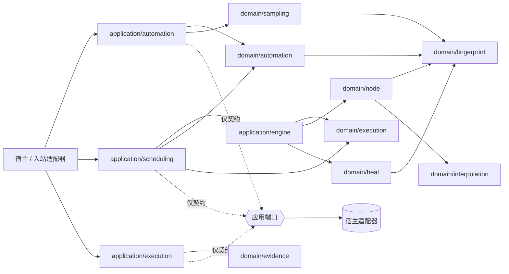

# 系统总览

## 架构定位

Healix Core 把“可发布的自动化定义”和“不可变的执行实例快照及浏览器执行”分离。领域层保存规则与值语义；应用层负责跨聚合、创建执行实例、调度和编译；宿主适配器负责 IO 与事务。Core 没有独立凭据子系统。

## 九个领域包

| 包 | 上下文 | 当前职责 | 状态 |
|---|---|---|---|
| [`domain/automation`](../../domain/automation) | 自动化 | Environment、Folder 等受修订号控制的普通可变资产，以及 Node、Workflow、TestTask 的不可变版本发布、生命周期、发布快照与引用锁定规则 | **已实现** |
| [`domain/sampling`](../../domain/sampling) | 自动化 | 采样会话、匹配、处理结果及发布输入 | **已实现** |
| [`domain/execution`](../../domain/execution) | 执行 | 不可变执行实例快照、预算、栅栏校验与状态不变量 | **已实现** |
| [`domain/node`](../../domain/node) | 执行 | 临时执行程序/运行时、Driver/Recorder/`ExecutionSink` 等运行端口、等待/动作/校验机制 | **已实现**；执行程序/运行时不持久化 |
| [`domain/heal`](../../domain/heal) | 执行 | 定位修复、评分、评估和候选证据 | **已实现**；审核工作流由应用层完成 |
| [`domain/evidence`](../../domain/evidence) | 执行 | 进度事实、终态事件、校验/修复观察及原子提交不变量 | **已实现**；`HealObservation` 是观察事实，晋升由栅栏校验的 `StepTransitionCommitResult` 作为权威结果返回 |
| [`domain/fingerprint`](../../domain/fingerprint) | 共享内核 | NodeSpec、选择器、指纹、框架检测值语义 | **已实现** |
| [`domain/interpolation`](../../domain/interpolation) | 共享内核 | 运行变量插值 | **已实现** |
| [`domain/parameter`](../../domain/parameter) | 共享内核 | 类型化 Value、Binding 与跨上下文参数语义 | **已实现** |

## 四个应用模块

| 模块 | 职责 | Core 提供什么 | 宿主仍需提供什么 |
|---|---|---|---|
| [`application/automation`](../../application/automation) | 聚合命令、乐观并发保存、采样发布、修复审核 | 服务与 Repository 接口 | 数据库事务、ID/时钟策略、查询 API |
| [`application/scheduling`](../../application/scheduling) | 创建不可变执行实例、冻结 `latest`、串行推进与失败策略 | `CreateRun` 服务、纯决策器、命令服务与端口 | 队列、租约、原子状态迁移、重试与唤醒 |
| [`application/engine`](../../application/engine) | 从执行实例顶层执行项编译临时执行程序，并在新运行时中运行 | 编译器、运行协调器、元数据映射 | 注入 Driver/Recorder/Facts/Healer、调用运行 |
| [`application/execution`](../../application/execution) | 顶层执行项工作器、栅栏校验、事实提交与自愈治理 | `EntryExecutor`、`execution.WorkerFence`、`FactCommitter`、`ProgressWriter` | 事实存储事务、领取执行权/租约、授权与审计 |

## 关键设计结论

- **已实现：** 调度在 `CreateRun` 事务中解析并冻结 `latest`，将 Environment 的当前状态克隆为 `execution.EnvironmentSnapshot`，并生成包含策略、类型化参数和已发布 Node、Workflow、TestTask 具体版本依赖闭包的不可变 `execution.Run`。
- **已实现：** 调度以执行实例的顶层执行项顺序和失败策略为唯一依据，一次最多推进一个顶层执行项。
- **已实现：** 执行引擎从当前顶层执行项生成临时 `node.Program`，并为每个顶层执行项创建新的 `node.Runtime`；嵌套 workflow 共享该运行时。
- **已实现：** 参数使用 `parameter.Value`/`Binding` 保持复合类型，不再限制为字符串。
- **适配器义务：** 领取栅栏校验、乐观并发、幂等、进度写入和终态事实必须在宿主事务中兑现。
- **已实现：** 显式中止由 `AbortRunService` 要求宿主事务原子提交权威的 `execution.Aborted` 并失效工作器栅栏，随后发送取消信号；信号失败保留已提交结果并返回 `ErrRunSignalRetryable`。普通执行上下文取消仍映射为 `CANCELED`，是不同操作。实现与验收见 [`instance_command_services.go`](../../application/scheduling/instance_command_services.go)、[`instance_command_services_test.go`](../../application/scheduling/instance_command_services_test.go) 和 [`instance_command_transaction_conformance_test.go`](../../application/scheduling/instance_command_transaction_conformance_test.go)。
