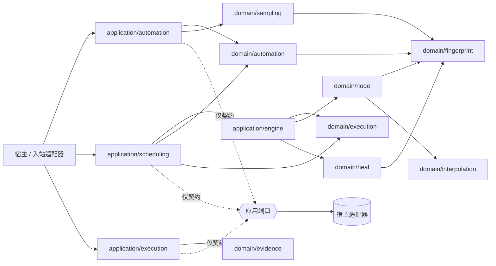

# 系统总览

## 架构定位

Healix Core 把“可发布的自动化定义”和“不可变的浏览器执行”分离。领域层保存规则与值语义；应用层负责跨聚合、调度、编译和凭据装配；宿主适配器负责 IO 与事务。

## 八个领域包

| 包 | 上下文 | 当前职责 | 状态 |
|---|---|---|---|
| [`domain/automation`](../../domain/automation) | Automation | Environment、Folder、Node、Workflow、TestTask 的聚合、版本发布、生命周期、发布快照与引用锁定规则 | **已实现** |
| [`domain/sampling`](../../domain/sampling) | Automation | 采样会话、匹配、处理结果及发布输入 | **已实现** |
| [`domain/execution`](../../domain/execution) | Execution | 密封多入口 Plan、预算与状态不变量 | **已实现** |
| [`domain/node`](../../domain/node) | Execution | 可运行节点树、Driver/Recorder/ExecutionSink 等运行端口、等待/动作/校验机制 | **已实现**；浏览器实现是适配器义务 |
| [`domain/heal`](../../domain/heal) | Execution | 定位修复、评分、评估和候选证据 | **已实现**；候选持久化/审核工作流由应用与适配器完成 |
| [`domain/evidence`](../../domain/evidence) | Execution | 进度事实、终态事件、校验/修复观察及原子提交不变量 | **已实现**；持久化是仅端口契约 |
| [`domain/fingerprint`](../../domain/fingerprint) | 共享内核 | NodeSpec、选择器、指纹、框架检测值语义 | **已实现** |
| [`domain/interpolation`](../../domain/interpolation) | 共享内核 | 运行变量插值 | **已实现** |

## 四个应用模块

| 模块 | 职责 | Core 提供什么 | 宿主仍需提供什么 |
|---|---|---|---|
| [`application/automation`](../../application/automation) | 聚合命令、乐观并发保存、采样发布、修复审核 | 服务与 Repository 接口 | 数据库事务、ID/时钟策略、查询 API |
| [`application/scheduling`](../../application/scheduling) | Publication 到密封 Plan 的映射；串行推进与失败策略 | 纯决策器、Coordinator、Claim/状态/写入端口 | 队列、租约、原子状态迁移、重试与唤醒 |
| [`application/engine`](../../application/engine) | 每个 Plan entry 编译独立 Program，并在新 Runtime 中运行 | 编译器、运行协调器、元数据映射 | 选择被调度 entry、注入 Driver/Recorder/Facts/Healer、调用运行 |
| [`application/execution`](../../application/execution) | 执行 worker 的持久化边界与凭据值装配 | WorkerScope、FactCommitter、ProgressWriter、CredentialService | 事实存储事务、密钥后端、授权与审计 |

## 关键设计结论

- **已实现：** `execution.Seal` 校验并复制 Draft，按 `SequenceNumber` 排序，形成不可变多入口 Plan。
- **已实现：** 调度以密封 Plan 为成员、顺序和失败策略的唯一依据，一次最多推进一个 entry。
- **已实现：** `engine.CompilePlan` 为每个 entry 生成独立 `node.Program`、步骤元数据和运行节点映射。
- **仅端口契约：** Core 没有把“领取 entry → 编译 → 运行 → 回写 execution 状态”封装成持久 worker 循环。
- **适配器义务：** claim fencing、乐观并发、幂等、进度写入和终态事实必须在宿主事务中兑现。
- **不支持：** Plan 映射会拒绝不能无损表达的运行参数 scope、entry 参数快照、TestTask item 参数，以及非可选文本参数语义；详见 [`plan_mapper.go`](../../application/scheduling/plan_mapper.go)。
