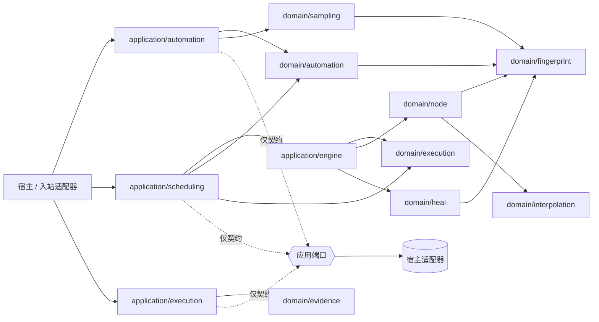

# 系统总览

本文回答「有哪些东西」。边界划在哪里见[上下文地图](context-map.md)，谁能 import 谁见[依赖规则](dependency-rules.md)，一次执行怎么从发布走到证据见[端到端执行](end-to-end-execution.md)。

## 架构定位

Healix Core 把「可发布的自动化定义」和「不可变的执行实例快照及浏览器执行」分离。领域层保存规则与值语义；应用层负责跨聚合、创建执行实例、调度和编译；宿主适配器负责 IO 与事务。Core 没有独立凭据子系统。

## 十个领域包

上下文归属由 [`dependencies_test.go`](../../architecture/dependencies_test.go) 的 `domainContext`（第 371-382 行）判定，不是文档约定。「错误码」列给出该包对外公开的 fault 前缀及注册表中的行数。

| 包 | 上下文 | 职责 | 错误码 |
|---|---|---|---|
| [`domain/automation`](../../domain/automation) | 自动化 | Environment、Folder 等受修订号控制的普通可变资产，以及 Node、Workflow、TestTask 的不可变版本发布、生命周期、发布快照与引用锁定规则 | `AUTOMATION_*`（42） |
| [`domain/sampling`](../../domain/sampling) | 自动化 | 采样会话、匹配、临时工作区及发布前模型 | `SAMPLING_*`（14，其中 11 个由本包产出） |
| [`domain/execution`](../../domain/execution) | 执行 | 不可变执行实例快照、预算、栅栏校验与状态不变量 | `EXECUTION_*`（与 `domain/node` 及三个应用模块共用同一前缀） |
| [`domain/node`](../../domain/node) | 执行 | 临时执行程序/运行时、Driver/Recorder/`ExecutionSink` 等运行端口、等待/动作/校验机制 | 同上；执行程序与运行时不持久化 |
| [`domain/heal`](../../domain/heal) | 执行 | 定位修复、评分、评估和候选证据 | **刻意不拥有 code 家族**，见下 |
| [`domain/evidence`](../../domain/evidence) | 执行 | 进度事实、终态事件、校验/修复观察及原子提交不变量 | `EVIDENCE_*`（7） |
| [`domain/fault`](../../domain/fault) | 共享内核 | 业务错误契约：`Kind`、`Code`、`Violation` 与不泄漏内部 cause 的错误封装 | `VALIDATION_FIELD_*`（4，唯一无上下文前缀的家族） |
| [`domain/fingerprint`](../../domain/fingerprint) | 共享内核 | ElementTargetSpec、选择器、指纹、框架检测值语义 | `FINGERPRINT_*`（5） |
| [`domain/interpolation`](../../domain/interpolation) | 共享内核 | 运行变量插值 | `INTERPOLATION_*`（4） |
| [`domain/parameter`](../../domain/parameter) | 共享内核 | 类型化 Value、Binding 与跨上下文参数语义 | `PARAMETER_*`（5） |

## 四个应用模块

| 模块 | 职责 | Core 提供什么 | 宿主仍需提供什么 |
|---|---|---|---|
| [`application/automation`](../../application/automation) | 聚合命令、乐观并发保存、采样发布、修复审核 | 服务与 Repository 接口 | 数据库事务、ID/时钟策略、查询 API |
| [`application/scheduling`](../../application/scheduling) | 创建不可变执行实例、冻结 `latest`、串行推进与失败策略 | `CreateInstanceService`、纯决策器、命令服务与端口 | 队列、租约、原子状态迁移、重试与唤醒 |
| [`application/engine`](../../application/engine) | 从执行实例顶层执行项编译临时执行程序，并在新运行时中运行 | 编译器、运行协调器、元数据映射 | 注入 Driver/Recorder/Facts/Healer、调用运行 |
| [`application/execution`](../../application/execution) | 顶层执行项工作器、栅栏校验、进入授权、事实提交与自愈治理 | `EntryExecutor`、`EntryAuthorizer`、`execution.WorkerFence`、`FactCommitter`、`ProgressWriter` | 实现 `AuthorizeEntry`、事实存储事务、领取执行权/租约、审计 |

## 错误契约

权威清单是 [`docs/contracts/error-code-registry.md`](../contracts/error-code-registry.md)，它由 [`fault_contract_guard_test.go`](../../architecture/fault_contract_guard_test.go) 在运行时逐行解析比对。下面这条封套规则对**所有**上下文成立，各领域文档只描述自己那一份特例，不重复它：

- 失败以注册过的 `Code` 返回，前缀标明所属上下文；未注册的 code、重复 code、跨上下文前缀和公开 `errors.New` 哨兵都算契约违规。
- **多字段校验产出一个顶层 fault，不产出嵌套 fault。** 位置信息由其中有序的 [`fault.Violation`](../../domain/fault/fault.go) 承担：`field` 是逻辑路径（集合下标 **0 基**），`code` 取自共享内核的四个 `VALIDATION_FIELD_*` 词（[`violation_codes.go`](../../domain/fault/violation_codes.go)）。子校验失败降级为父封套的一条 violation，宿主因此无需递归解包即可分类。
- 单个封套最多携带 `fault.MaxViolations` = 32 条 violation（[`fault.go:50`](../../domain/fault/fault.go)）；超出后保留确定性前缀并丢弃其余，**消费方不得把 violation 条数当作完整清单**。
- 公共文本不含身份 ID、被拒的枚举取值、selector、页面内容、URL 或 cause。闭集之外的取值按定义就是任意调用方输入，同样不回显。宿主注入的适配器错误只作为私有 cause 挂在 fault 上，经 `Unwrap` 可达。

`domain/heal` 是唯一刻意不拥有 code 家族的领域：它的导出面只被 `domain/node` 调用，分类因此发生在 `domain/node` 的 `EXECUTION_*` 边界上，再加一个 `HEAL_*` 家族等于给同一个失败两个 code。理由与其可达性证据记在注册表的「Contexts that deliberately own no code family」一节。

## 关键不变式

- 调度在创建执行实例的事务中解析并冻结 `latest`，把 Environment 的当前状态克隆为 `execution.EnvironmentSnapshot`，并生成包含策略、类型化参数和已发布 Node/Workflow/TestTask 具体版本依赖闭包的不可变 `execution.InstanceSnapshot`。
- 调度以执行实例的顶层执行项顺序和失败策略为唯一依据，一次最多推进一个顶层执行项。
- 执行引擎从当前顶层执行项生成临时 `node.Program`，并为每个顶层执行项创建新的 `node.Runtime`；嵌套 workflow 共享该运行时。
- `EntryExecutor` 在创建浏览器会话**之前**完成授权：先 `WorkerFence.Validate`，再 `EntryAuthorizer.AuthorizeEntry`，通过后才 `BrowserSessionFactory.Create`（[`entry_executor.go:136-146`](../../application/execution/entry_executor.go)）。`engine.RunProgram` 内部那道校验来得太晚 —— 它跑在宿主的 `EntryRunner` 里，届时浏览器已经开出来了。
- `application/engine` 的 `ExecutionOutcome` 用 `OutcomeSucceeded` / `OutcomeFailed` / `OutcomeCanceled` / `ExecutionNotStarted` 表达一次运行的结果（[`engine.go:86-89`](../../application/engine/engine.go)）；它与 `domain/execution` 的 `EntryStatus` 是两组独立状态值，不应互相替换。
- 参数使用 `parameter.Value`/`Binding` 保持复合类型，不再限制为字符串。
- 显式中止由 `AbortInstanceService` 要求宿主事务原子提交权威的 `execution.Aborted` 并失效工作器栅栏，随后发送取消信号；信号失败保留已提交结果并以 `EXECUTION_INSTANCE_SIGNAL_RETRYABLE` 返回（[`instance_command_services.go:88`](../../application/scheduling/instance_command_services.go)）。普通执行上下文取消仍映射为 `CANCELED`，是不同操作。
- 领取栅栏校验、乐观并发、幂等、进度写入和终态事实必须在宿主事务中兑现 —— 这是适配器义务，Core 只声明协议字段。
