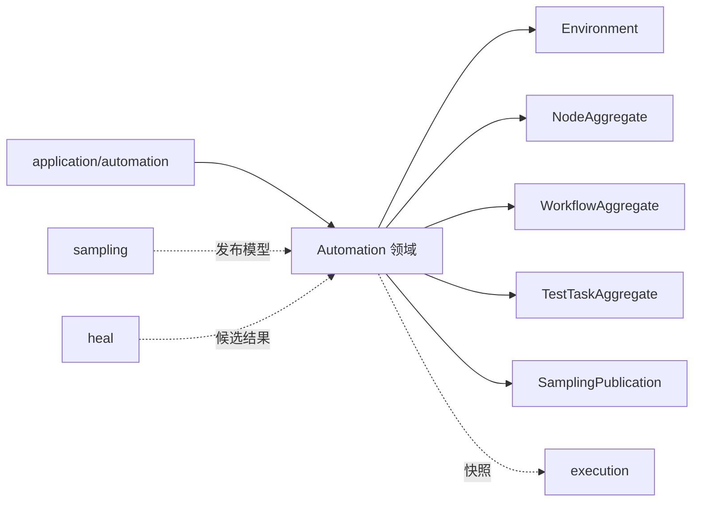
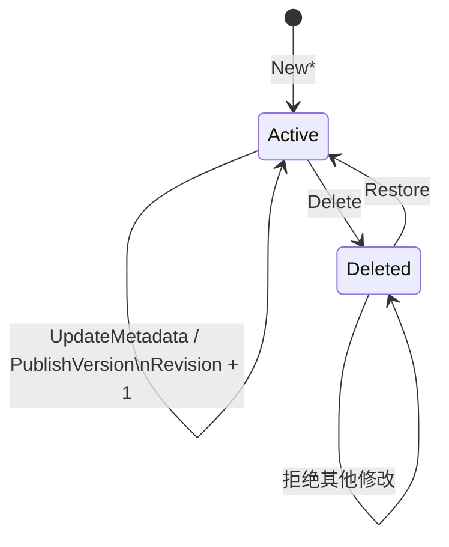

# Automation 领域

## 目的与边界
Automation 是可持久化自动化资产的权威模型：环境、文件夹、节点及版本、工作流及版本、测试任务及版本，以及采样发布和修复候选审核。它负责身份、版本、生命周期、乐观并发与静态合法性；不负责浏览器执行、调度、元素定位、评分或存储实现。

## 术语与公开模型
- `Revision`：持久化聚合的非零乐观并发版本。
- `NodeAggregate` / `WorkflowAggregate` / `TestTaskAggregate`：根对象、当前版本与历史版本的组合。
- `VersionSource`：`MANUAL`、`SAMPLING`、`AUTO_HEAL`。
- `WorkflowStep`：Action、Wait、Repeat、WorkflowRef、Validation、ValidationGroup 的判别联合。
- `TestTaskVersionPlan`：已解析的工作流、节点和引用依赖快照，并携带预期任务 Revision。
- `HealCandidate`：修复候选的持久化审核状态；它不是评分器。
- `FolderForest`：最大深度为 5 的同类资产目录树。

## 不变量
- 聚合根、Current 与版本所有者/ID/版本号一致；发布追加历史且深拷贝可变字段。
- 已删除聚合不可修改；时间不得倒退；每次成功变更 Revision 只增加一次，溢出失败。
- 当前版本解析包含软删除历史；无 Current 时全部版本必须已删除。
- 工作流步骤 ID、参数名唯一，判别联合不得残留其他 Kind 字段；树深和规模有界。
- 环境拒绝在变量/属性中保存凭据形态的键值，凭据仅以 `CredentialReference` 表达。
- 测试任务的顺序、固定/最新版本解析、参数、环境键、节点依赖和引用环必须一致。
- API 返回副本，发布/生命周期操作不修改调用方已有值。

## 状态与流程

典型发布：应用层加载聚合与预期 Revision，领域验证新版本身份和内容，生成不可变的新聚合；仓储负责条件写入。领域只描述冲突条件，不假设数据库事务或重试策略。

## 失败
错误涵盖空身份、非法 URL/枚举、版本断裂/重复/溢出、Revision 为零或溢出、已删除对象修改、目录环/超深/非空删除、工作流环与依赖变化、参数或环境键不兼容。`ValidationIssues` 提供机器可读代码与位置；仓储错误不属于本领域。

## 并发、安全与资源
- 并发：`Revision` 与计划中的 `ExpectedTaskRevision` 是边界；提交原子性由端口实现，领域不声称锁或事务行为。
- 安全：环境仅保存凭据引用；保留/凭据形态变量会被拒绝；不解析或读取秘密。
- 资源：文件夹深度、步骤树、版本号、修复 streak 与验证等待等均有显式界限；嵌套校验避免无界结构。

## 交互
Application/automation 编排仓储；scheduling/engine 把已发布资产编译为 execution 快照；sampling 产出 `SamplingPublication`；heal/evidence 的结论可形成候选和审核命令。Automation 不调用浏览器适配器，也不定义其行为。

## 已实现与未支持
已实现：不可变生命周期、版本发布/历史校验、目录、工作流/验证契约、任务依赖计划、截图策略、采样发布 DTO、修复候选状态与策略快照。未支持：具体持久化、跨仓储事务、浏览器采集/执行、秘密解析、调度队列、自动审批策略之外的 UI/通知。

## 源码与测试
- [资产模型](../../domain/automation/assets.go)、[生命周期](../../domain/automation/lifecycle.go)、[版本规则](../../domain/automation/versioning.go)
- [任务计划](../../domain/automation/test_task.go)、[验证模型](../../domain/automation/workflow_validation.go)、[采样发布](../../domain/automation/sampling_publication.go)
- [生命周期测试](../../domain/automation/lifecycle_test.go)、[版本矩阵](../../domain/automation/versioning_matrix_test.go)、[工作流契约矩阵](../../domain/automation/workflow_contract_matrix_test.go)、[应用服务测试](../../application/automation/test_task_service_test.go)
