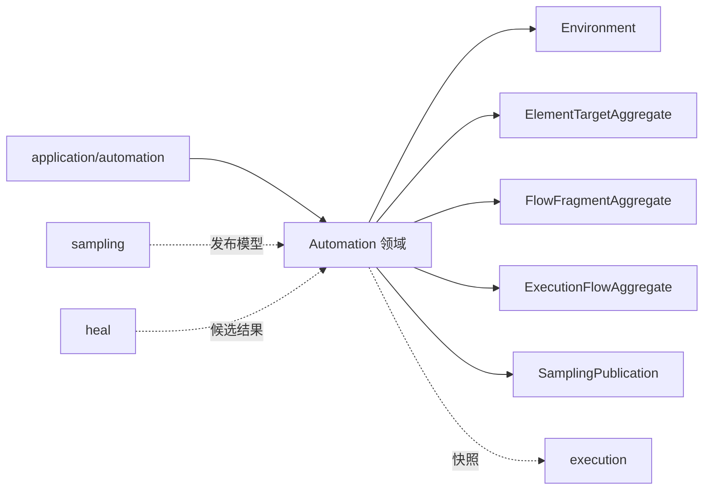
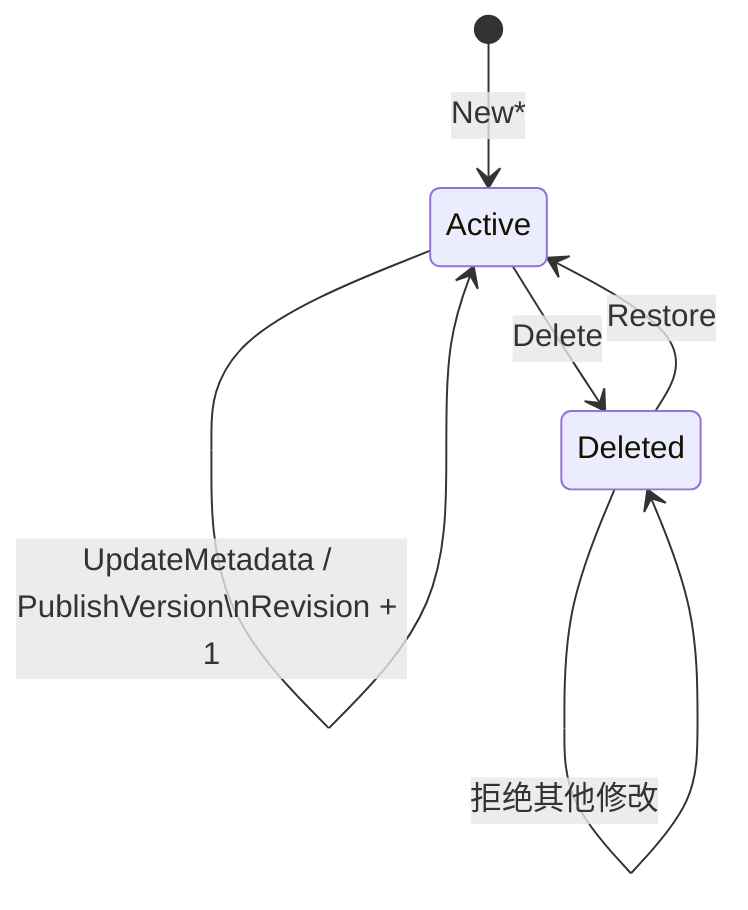

# 自动化领域

## 目的与边界

自动化是可持久化自动化资产的权威模型：环境、文件夹、节点及版本、工作流及版本、测试任务及版本，以及采样发布和修复候选审核。它负责身份、版本、生命周期、乐观并发与静态合法性。文件夹能力由 Core 公开，整体移交规则记录在[退役契约](../contracts/retirement-plan.md)。

它**不**负责浏览器执行、调度、元素定位、评分或存储实现。具体持久化、跨仓储事务、浏览器采集/执行、调度队列，以及自动审批策略之外的 UI 与通知都在本领域之外。自动化不调用浏览器适配器，也不定义其行为。

## 聚合与值对象

| 类型 | 角色 |
|---|---|
| `Revision` | 持久化聚合的**非零**乐观并发版本 |
| [`ElementTargetAggregate`](../../domain/automation/assets.go) / [`FlowFragmentAggregate`](../../domain/automation/assets.go) / [`ExecutionFlowAggregate`](../../domain/automation/test_task_types.go) | 根对象、当前版本与版本集合的组合 |
| `VersionSource`（[`assets.go:82-88`](../../domain/automation/assets.go)） | `MANUAL`、`SAMPLING`、`AUTO_HEAL` 三值 |
| `FlowFragmentStep`（[`assets.go:374`](../../domain/automation/assets.go)） | 步骤模型，见下 |
| `ResolvedExecutionFlow`（[`test_task_types.go:64`](../../domain/automation/test_task_types.go)） | 已解析的工作流、节点和引用依赖快照，携带 `ExpectedExecutionFlowRevision` |
| `HealCandidate`（[`healing.go:121-131`](../../domain/automation/healing.go)） | 修复候选的**持久化审核状态**；它不是评分器 |
| `FolderForest` | 同类资产的目录树，最大深度 5（[`folders.go:52`](../../domain/automation/folders.go)）。其移交范围和宿主接管条件见[退役契约](../contracts/retirement-plan.md)。 |

**`FlowFragmentStep` 是带标签的联合，不是 Go sum type。** 它是单个 struct，用 `Kind StepKind` 判别（六值：`ACTION`、`WAIT`、`REPEAT`、`WORKFLOW_REF`、`VALIDATION`、`VALIDATION_GROUP`，[`assets.go:358-365`](../../domain/automation/assets.go)），可选载荷分别挂在 `Validation`、`ValidationGroup`、`Reference`、`Children` 上。判别联合不得残留其他 Kind 的字段 —— 这条是校验规则，不是类型系统给的保证。注意常量名与取值不同名：`StepFlowFragmentRef` 的值是 `"WORKFLOW_REF"`。

## 不变量

- 聚合根、Current 与版本的所有者/ID/版本号一致；发布追加版本并深拷贝可变字段。
- 已删除聚合不可修改；时间不得倒退；每次成功变更 `Revision` 只增加一次，溢出失败。
- 当前版本解析包含软删除版本；无 Current 时全部版本必须已删除。
- 工作流步骤 ID、参数名唯一；树深和规模有界。
- 环境变量是 `EnvironmentVariables = map[string]parameter.Value`（[`assets.go:22`](../../domain/automation/assets.go)），原生支持五种参数值；键名和值必须合法。**不存在独立的凭据子系统。**
- 测试任务的顺序、固定/最新版策略、类型化参数、环境属性、节点依赖和引用环必须一致；**`latest` 只在调度创建执行实例时解析并冻结**，不在发布时。
- API 返回副本，发布/生命周期操作不修改调用方已有值。

## 状态与流程

典型发布：应用层加载聚合与预期 `Revision`，领域验证新版本身份和内容，生成不可变的新聚合；仓储负责条件写入。**领域只描述冲突条件，不假设数据库事务或重试策略。**

## 失败语义

遵循[统一 fault 封套](../architecture/system-overview.md#错误契约)。`AUTOMATION_*` 前缀在[错误码注册表](../contracts/error-code-registry.md)里共 42 行，其中 31 个由 `domain/automation` 声明，11 个由 `application/automation` 声明。此外 `application/automation` 还产出三个 `SAMPLING_*` code，那是[刻意的前缀错位](../architecture/context-map.md#一处刻意的前缀错位)。

错误涵盖空身份、非法 URL/枚举、版本断裂/重复/溢出、`Revision` 为零或溢出、已删除对象修改、目录环/超深/非空删除、工作流环与依赖变化、参数或环境键不兼容。仓储错误不属于本领域。

当前校验契约不使用独立的 `ValidationIssues` 类型。多字段校验一律产出**一个**顶层 `AUTOMATION_*` fault，位置信息由其中有序的 `fault.Violation` 承担。内部子校验（例如 `VersionSource.Validate`）保持普通 Go error，由拥有 code 的聚合边界降级为自己的一条 violation，因此越界枚举值不会外泄。

## 并发、安全与资源

- **并发**：`Revision` 与 `ResolvedExecutionFlow.ExpectedExecutionFlowRevision` 是边界；提交原子性由端口实现，领域不声称锁或事务行为。
- **安全**：环境保存命名的普通类型化 `Variables`；敏感值的治理属于宿主边界，Core 不提供 `CredentialReference`、密钥解析或凭据服务。
- **资源**：文件夹深度（5）、步骤树、版本号、修复 streak 与验证等待等均有显式界限；嵌套校验避免无界结构。

## 交互

`application/automation` 编排仓储；`application/scheduling` 与 `application/engine` 把已发布资产编译为[执行快照](execution.md)；[采样](sampling.md)产出 `SamplingPublication`；[自愈](heal.md)与[执行证据](evidence.md)的结论可形成候选和审核命令。

## 源码证据

- [资产模型](../../domain/automation/assets.go)、[生命周期](../../domain/automation/lifecycle.go)、[版本规则](../../domain/automation/versioning.go)、[目录树](../../domain/automation/folders.go)、[修复候选](../../domain/automation/healing.go)
- [任务计划](../../domain/automation/test_task.go)、[任务类型](../../domain/automation/test_task_types.go)、[验证模型](../../domain/automation/workflow_validation.go)、[采样发布](../../domain/automation/sampling_publication.go)
- [生命周期测试](../../domain/automation/lifecycle_test.go)、[版本矩阵](../../domain/automation/versioning_matrix_test.go)、[工作流契约矩阵](../../domain/automation/workflow_contract_matrix_test.go)、[应用服务测试](../../application/automation/test_task_service_test.go)
- [唯一深拷贝守卫](../../architecture/unified_language_boundary_test.go) · `TestFlowFragmentStepHasExactlyOneDeepCopy`
- [已发布版本不留临时身份](../../architecture/unified_language_boundary_test.go) · `TestPublishedVersionsCarryNoTemporaryIdentity`
