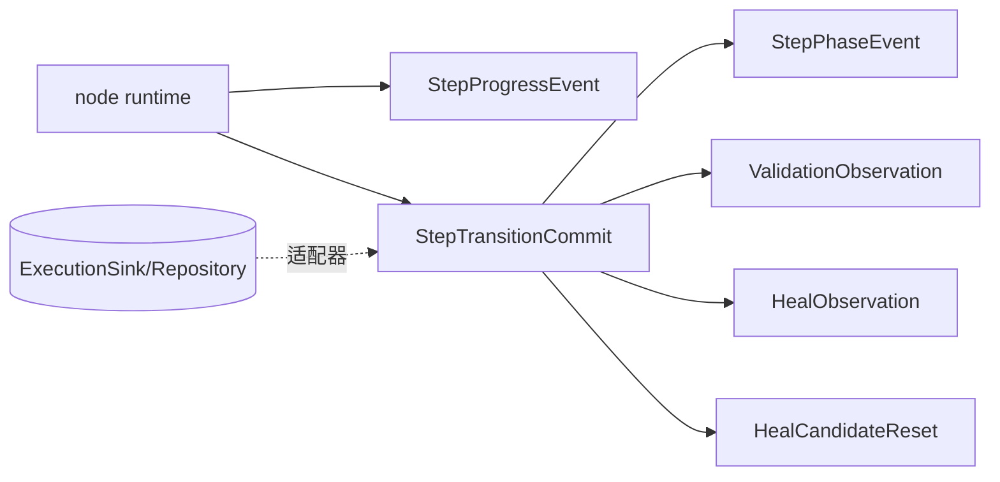
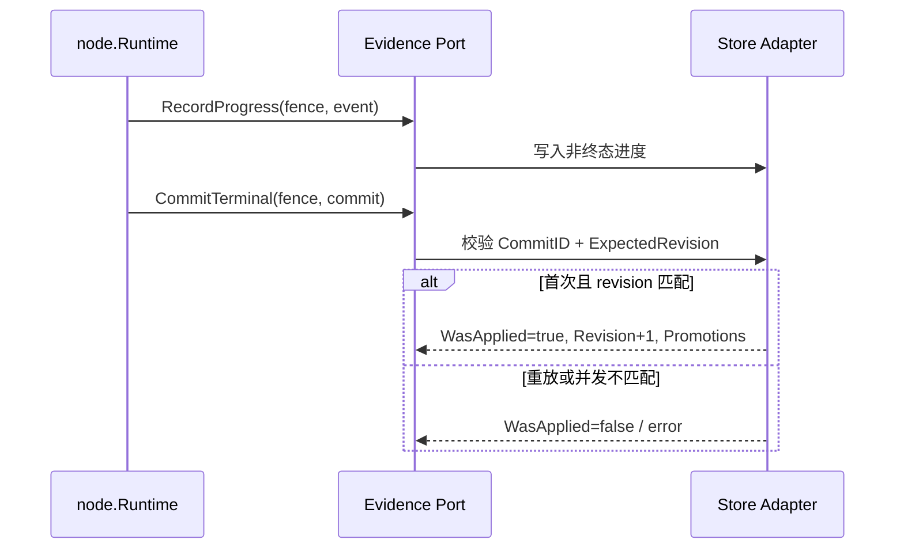

# 执行证据领域

## 目的与边界

执行证据定义执行期间可持久化的事实、进度事件、验证观察、修复观察和原子步骤提交协议。它拥有「什么可以作为证据」的校验语义。

它**不**执行步骤、不评分候选，也不实现数据库、事件总线或重试。持久化 schema、事务实现、去重表、事件发布保证、保留期、加密与脱敏基础设施、跨运行聚合查询一律属于宿主。

## 聚合与值对象

| 类型 | 角色 |
|---|---|
| [`StepProgressEvent`](../../domain/evidence/events.go) | 非终态运行相位的进度事件 |
| [`StepPhaseEvent`](../../domain/evidence/events.go) | 终态事件，作为提交的主体 |
| [`StepFact`](../../domain/evidence/facts.go) | SUCCEEDED / FAILED / CANCELED / ABORTED 终态事实 |
| [`StepTransitionCommit`](../../domain/evidence/commits.go) | 把终态事件、最终验证、修复观察和原选择器重置组合为**单个**提交意图 |
| [`StepTransitionCommitResult`](../../domain/evidence/commits.go) | 提交结果，含 `WasApplied` 与 `Promotions` |
| [`HealObservation`](../../domain/evidence/observations.go) | 提交的输入证据，**不包含晋升** |
| [`HealCandidateReset`](../../domain/evidence/commits.go) | 原选择器重置 |
| [`ValidationObservation`](../../domain/evidence/observations.go) / `ValidationProgressObservation` / `ValidationGroupTerminalObservation` | 验证观察的三种形态 |
| `StepRevision` | 步骤提交的并发版本 |
| `DecisionBand` | 明确区分 APPLIED、BELOW_CAP 和 UNKNOWN |

权威的已晋升 NodeVersion 身份由 `StepTransitionCommitResult.Promotions` 返回，后续治理由应用层决定 —— `HealObservation` 自己不携带这个结论。

## 证据坐标与它保证的范围

`StepProgressEvent`（[`events.go:17-25`](../../domain/evidence/events.go)）与 `StepPhaseEvent`（[`events.go:53-61`](../../domain/evidence/events.go)）声明坐标三元组 `(EntryID, InvocationPath, Occurrence)`。`Occurrence` 另有六个结构携带 —— `HealCandidateReset`、`StepFact`、`HealObservation`、`ValidationGroupTerminalObservation`、`ValidationProgressObservation` 与 `ValidationObservation` —— 使 `RepeatNode` 在同一 NodeID 上跑出的各轮事后可区分。

`EntryID` 与 `InvocationPath` 是不可能持有无意义值的值类型，坐标的第三个分量却是裸 `int`。因此正数规则集中在 [`appendOccurrenceViolations`](../../domain/evidence/observations.go) 一处，由每个带 `Validate` 的载体调用，而不是各写一遍让措辞漂移。[`occurrence_test.go`](../../domain/evidence/occurrence_test.go) · `TestEveryValidatingCoordinateCarrierRejectsNonPositiveOccurrence` 对六个载体逐一钉住 `0` 与 `-1` 被拒。

消费方仍需知道的两条边界：

- **`StepPhaseEvent` 与 `HealCandidateReset` 没有 `Validate()` 方法**，因为二者都不单独抵达存储。[`StepTransitionCommit.Validate`](../../domain/evidence/commits.go) 拥有它们：它检查 `Event.Occurrence` 为正，并要求每条成员的 `Occurrence` 与事件相等。单独持有一份，没有自校验入口。
- **两个事件类型上的 `InvocationPath` 由宿主填，值由 Core 给。** 编译器把每个步骤所属的调用域写进 `StepMetadata`（[`compiler.go`](../../application/engine/compiler.go) 的三处字面量），宿主据此构造事件，不必自行推算。这条投递由 [`evidence_coordinate_test.go`](../../architecture/evidence_coordinate_test.go) · `TestEvidenceCoordinateW2` 守卫：生产代码里任何声明了该字段的类型，其字面量都必须给它赋值。

## 不变量

- 所有事实必须有稳定 ID、执行实例/顶层执行项/步骤坐标和正时间。
- Progress 只接受非终态运行相位；`StepFact` 只接受终态。
- 最终提交中的验证必须为 `Final=true`，观察身份需与提交事件一致。
- 提交内每条验证、分组、修复观察与 selector reset 的 `Occurrence` 必须等于事件的 `Occurrence`，另一轮产生的事实不能搭车进入本次提交。
- `HealObservation` 的置信度有限且在 `[0,1]`；候选哈希与 `DecisionBand` 的组合一致。
- 提交 ID 与 `ExpectedRevision` 必须有效；集合和总载荷受界限限制。
- `StepTransitionCommitResult.WasApplied` 支持幂等提交表达，但不承诺存储实现方式。

## 状态与流程

## 失败语义

遵循[统一 fault 封套](../architecture/system-overview.md#错误契约)。本领域拥有 `EVIDENCE_*` 前缀下的 7 个 code，清单见[错误码注册表](../contracts/error-code-registry.md)。缺少身份、非法相位、非正时间、事件与提交的非正 `Occurrence`、未知审核状态、无效 selector/fingerprint、置信度越界、决策带与候选不一致、提交内部坐标不一致及载荷超限都会失败。存储冲突和可用性错误由实现端口返回，领域不将其自动吞掉。

三条本领域特有的边界：

- **载荷超限单独用 `EVIDENCE_COMMIT_FACT_LIMIT_EXCEEDED`（`OUT_OF_RANGE`）**，因为补救动作是「拆分该 commit」而非「修正某个字段」。它在所有其他 commit 规则**之前**检查（[`commits.go:43-45`](../../domain/evidence/commits.go)），因为它同时限定了后续 violation 遍历的规模 —— 否则一个超大 commit 会被完整走完才因为太大而被拒。
- **封套顺序只由输入决定。** 分组拓扑检查会先消耗各分组声明的成员，再报告剩余成员；剩余部分按源切片顺序遍历，而非遍历 map —— 后者会让同一份 commit 在不同运行中被以不同错误拒绝。
- **一切身份与观察值都不进公共文本。** commit / execution / step / validation / heal / group / ElementTarget 的 ID 均为调用方所有；`expected` 与 `actual` 是被观测的页面内容，正是本领域最不能外泄的东西。

## 并发、安全与资源

工作器栅栏、`ExpectedRevision` 与 `CommitID` 为防止失效工作器和重复终态写入提供**协议字段**；真正的比较交换和原子事务属于适配器。验证敏感值可由 node 在生成观察时抑制；执行证据本身不做秘密抓取或通用脱敏。提交对条目数和估算字节数设限，避免无界证据载荷。

## 交互

node 产生进度和终态提交；heal 提供 `Decision`/`CandidateSample` 的来源，但执行证据使用自己的稳定观察模型；自动化可根据晋升/reset 维护候选与版本。领域不假定 SQL、消息队列或对象存储行为。

## 源码证据

- [提交模型](../../domain/evidence/commits.go)、[事件](../../domain/evidence/events.go)、[终态事实](../../domain/evidence/facts.go)、[观察](../../domain/evidence/observations.go)
- [提交测试](../../domain/evidence/commits_test.go)、[事件测试](../../domain/evidence/events_test.go)、[事实测试](../../domain/evidence/facts_test.go)、[观察测试](../../domain/evidence/observations_test.go)
- [坐标类型守卫](../../architecture/evidence_coordinate_test.go) · `TestEvidenceCoordinateW2`
- [node 的栅栏/终态测试](../../domain/node/step_test.go)
