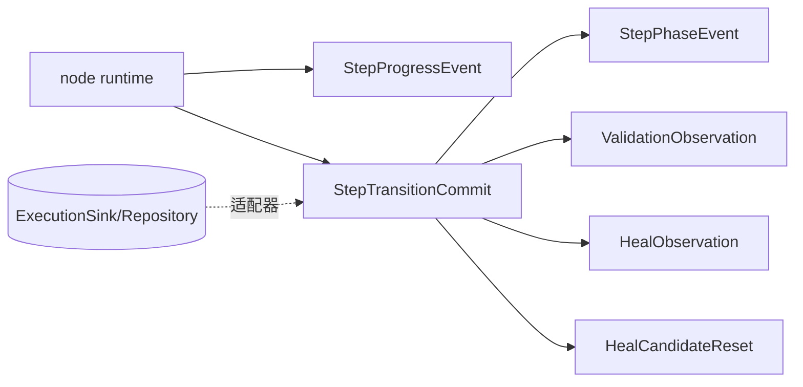
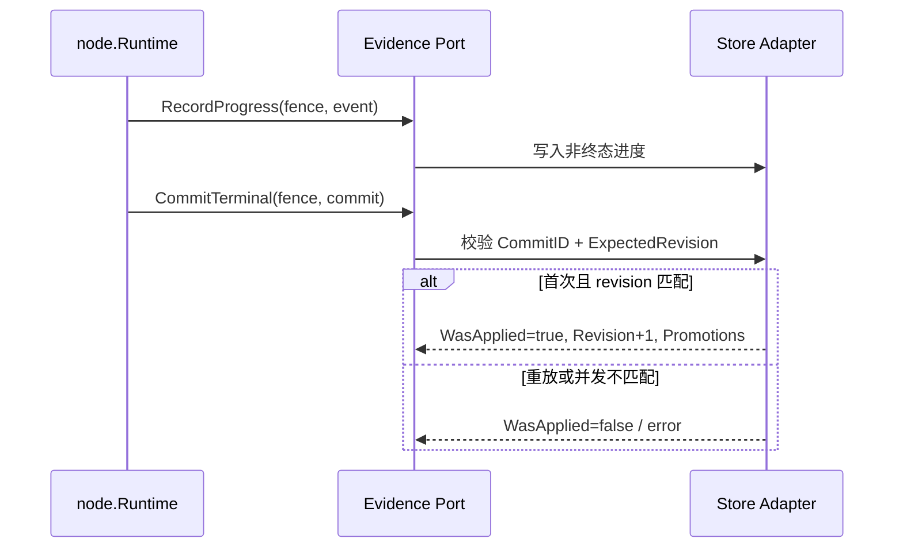

# 执行证据领域

## 目的与边界
执行证据 定义执行期间可持久化事实、进度事件、验证观察、修复观察和原子步骤提交协议。它拥有“什么可作为证据”的校验语义；不执行步骤、不评分候选，也不实现数据库、事件总线或重试。

## 术语与公开模型
`StepProgressEvent` 和 `StepPhaseEvent` 均携带证据身份三元组 (EntryID, InvocationPath, Occurrence)；`StepFact` 是 SUCCEEDED/FAILED/CANCELED/ABORTED 终态事实。`StepRevision` 是步骤提交并发版本。`StepTransitionCommit` 把终态事件、最终验证、修复观察和原选择器重置组合为单个提交意图；结果含 `WasApplied` 与 Promotions。`HealObservation` 是提交输入的观察事实，不包含 晋升；权威的已晋升 NodeVersion 身份由 `StepTransitionCommitResult.Promotions` 返回，后续治理由应用层决定。`DecisionBand` 明确区分 APPLIED、BELOW_CAP 和 UNKNOWN。

## 不变量
- 所有事实必须有稳定 ID、执行实例/顶层执行项/步骤坐标/调用路径（EntryID, InvocationPath, Occurrence）和正时间。
- Progress 只接受非终态运行相位；StepFact 只接受终态。
- 最终提交中的验证必须为 `Final=true`，观察身份需与提交事件一致。
- `HealObservation` 的置信度有限且在 `[0,1]`；候选哈希与 DecisionBand 的组合一致。
- 提交 ID 与 ExpectedRevision 必须有效；集合和总载荷受界限限制。
- `CommitResult.Applied` / `WasApplied` 支持幂等提交表达，但不承诺存储实现方式。

## 状态与流程

## 失败
缺少身份、非法相位、非正时间/Occurrence、未知审核状态、无效 selector/fingerprint、置信度越界、决策带与候选不一致、提交内部坐标不一致及载荷超限都会失败。存储冲突和可用性错误由实现端口返回，领域不将其自动吞掉。

失败一律以注册的 `EVIDENCE_*` fault 形式返回，共 7 个 code（见 `docs/refactor/business-error-contract/error-code-registry.md`）。多字段校验产出**一个**顶层 fault，携带有序 `fault.Violation`：字段路径是逻辑路径（集合下标 0 基），原因走共享内核的 `VALIDATION_FIELD_*` 词表。

四条边界值得单独记住：

- **子校验失败降级为父封套的 violation，不产出嵌套 fault。** 被包含的观察与分组不再以 `fmt.Errorf("… %s: %w", id, err)` 形式外传 —— 那种写法既回显身份 ID，又迫使宿主递归解包才能分类。
- **载荷超限单独用 `EVIDENCE_COMMIT_FACT_LIMIT_EXCEEDED`（`OUT_OF_RANGE`）**，因为补救动作是「拆分该 commit」而非「修正某个字段」。它在所有其他 commit 规则**之前**检查，因为它同时限定了 violation 遍历的规模。
- **封套顺序只由输入决定。** 分组拓扑检查会先消耗各分组声明的成员，再报告剩余成员；剩余部分按源切片顺序遍历，而非遍历 map —— 后者会让同一份 commit 在不同运行中被以不同错误拒绝。
- **一切身份与观察值都不进公共文本。** commit / execution / step / validation / heal / group / ElementTarget 的 ID 均为调用方所有；expected 与 actual 是被观测的页面内容，正是本领域最不能外泄的东西。

单个封套最多携带 `fault.MaxViolations` 条 violation；超出后保留确定性前缀并丢弃其余，故消费方不得把 violation 条数当作完整清单。

## 并发、安全与资源
工作器栅栏、ExpectedRevision 与 CommitID 为防止失效 工作器 和重复终态写入提供协议字段；真正的比较交换和原子事务属于适配器。验证敏感值可由 node 在生成观察时抑制；执行证据 本身不做秘密抓取或通用脱敏。提交对条目数和估算字节数设限，避免无界证据载荷。

## 交互
node 产生进度和终态提交；heal 提供 Decision/CandidateSample 的来源，但 执行证据 使用自己的稳定观察模型；自动化 可根据 晋升/reset 维护候选与版本。领域不假定 SQL、消息队列或对象存储行为。

## 已实现与未支持
已实现：事件/事实/观察校验、决策带、步骤 Revision、原子提交 DTO 与 晋升 结果、资源界限。未支持：持久化 schema、事务实现、去重表、事件发布保证、保留期、加密/脱敏基础设施、跨运行聚合查询。

## 源码与测试
- [提交模型](../../domain/evidence/commits.go)、[事件](../../domain/evidence/events.go)、[终态事实](../../domain/evidence/facts.go)、[观察](../../domain/evidence/observations.go)
- [提交测试](../../domain/evidence/commits_test.go)、[事件测试](../../domain/evidence/events_test.go)、[事实测试](../../domain/evidence/facts_test.go)、[观察测试](../../domain/evidence/observations_test.go)
- [node 的 栅栏/终态测试](../../domain/node/step_test.go)
