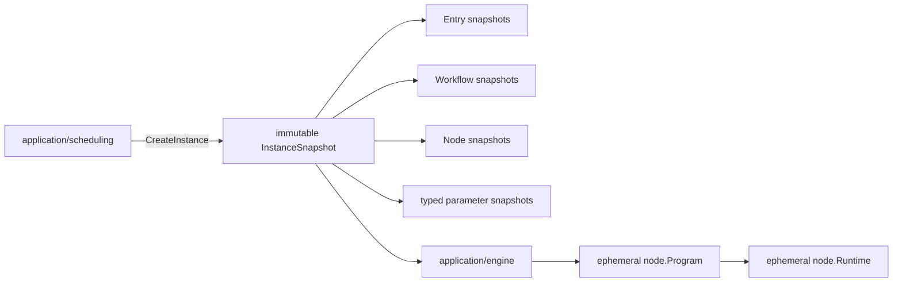

# 执行领域

## 目的与边界

执行定义创建后不可变的 `InstanceSnapshot`、顶层执行项状态机、工作器栅栏与静态资源预算。调度在创建执行实例时读取自动化发布物，把固定版本和 `latest` 都解析为具体版本并冻结环境、策略、参数与完整依赖闭包。

**执行不在运行时回读可变资产。** 持久化原子性、领取执行权/租约与乐观并发由应用端口和宿主适配器兑现，本领域只定义协议字段和不变量。

## 聚合与值对象

`CreateInstanceCommand` 是创建请求；`Instance` 与其封存的 [`InstanceSnapshot`](../../domain/execution/instance_snapshot.go) 是唯一的持久执行真相。其中的 `Entry`、`WorkflowSnapshot`、`NodeSnapshot`、`EnvironmentSnapshot`、参数绑定和策略均为冻结值。

参数由共享内核 `domain/parameter` 的 `Value` 与 `Binding` 表达，仅支持 `TEXT`、`NUMBER`、`BOOLEAN`、`SINGLE_SELECT`、`MULTI_SELECT` 五种封闭类型；`NUMBER` 内部使用规范化十进制字符串。

`Program` 与 `Runtime` 只是执行期模型，**不是**可持久化聚合或快照。

### 环境快照有两种形状，当前只用一种

`EnvironmentSnapshot`（[`instance_snapshot.go`](../../domain/execution/instance_snapshot.go)）同时声明了 `Properties map[string]string` 和 `Variables map[string]parameter.Value`，两者互斥，由快照的 schema 版本决定：

| schema | 环境载荷 | 校验 |
|---|---|---|
| `InstanceSnapshotSchemaV1` | `Properties`（纯字符串） | 出现任何 `Variables` 即非法 |
| `InstanceSnapshotSchemaV2`（`…SchemaCurrent`） | `Variables`（类型化） | 出现任何 `Properties` 即非法 |

这道互斥由 [`environment_snapshot_validation.go`](../../domain/execution/environment_snapshot_validation.go) 强制，digest 编码也按同一分支走（[`instance_snapshot.go`](../../domain/execution/instance_snapshot.go)）。当前版本 `InstanceSnapshotSchemaCurrent = V2`（[`instance_snapshot.go`](../../domain/execution/instance_snapshot.go)），而创建构建器只填 `Variables`（[`create_instance_builder.go`](../../application/scheduling/create_instance_builder.go)）。

因此 **`env.` 命名空间里的值是类型化 `parameter.Value`，不是字符串**：引擎在 [`compiler.go`](../../application/engine/compiler.go) 上从 `environment.Variables` 逐项拼出 `env.<name>` 注入根作用域，同名冲突直接让编译失败。V1 快照可携带 `Properties`，V2 快照必须使用 `Variables`；创建服务默认构造 V2。

Core 没有 `CredentialReference`、`CredentialResolver` 或 `CredentialService` 子系统；敏感值保护属于宿主的存储、授权与日志责任。

## 不变量

- `InstanceID`、顶层执行项身份/序号、快照身份唯一且互相引用一致；所有 `latest` 引用在创建执行实例的调度事务内解析为具体版本。
- 执行实例创建后不可修改其资产、环境、参数、截图/修复策略或依赖闭包；访问器返回隔离副本。
- 工作流引用无环且解析完整；节点、调用边与参数绑定必须存在并类型兼容。
- 参数作用域按执行实例 → 顶层执行项 → 测试任务条目 → 工作流调用逐层覆盖，复合值保持结构与类型。
- 工作器栅栏单调且参与领取执行权、进度和终态写入，过期工作器不得提交。
- 步骤判别联合、导航 URL、等待、重复、验证、深度、边数和展开预算均受验证。
- 封存快照的 digest 依赖一组持久化 wire tag；改动任何一个都会静默作废全部已存 digest，清单见[摘要 wire tag 登记表](../contracts/digest-wire-tags.md)。

## 状态与流程

执行实例与顶层执行项状态由调度命令服务推进。顶层执行项的合法迁移由 [`EntryStatus.CanTransitionTo`](../../domain/execution/status.go)（`status.go`）穷举，只有两行：

| 起点 | 允许到达 |
|---|---|
| `PENDING` | `RUNNING`、`FAILED`、`CANCELED`、`SKIPPED` |
| `RUNNING` | `SUCCEEDED`、`FAILED`、`CANCELED`、`ABORTED` |

其余组合一律以 `EXECUTION_STATUS_TRANSITION_INVALID`（`FAILED_PRECONDITION`）拒绝。两处不对称值得单独记住：**`SKIPPED` 只能从 `PENDING` 到达，`ABORTED` 只能从 `RUNNING` 到达**；终态没有出边。`IsTerminalEntryStatus`（[`status.go`](../../domain/execution/status.go)）把 `SUCCEEDED`、`FAILED`、`CANCELED`、`ABORTED`、`SKIPPED` 判为终态，`PENDING` 与 `RUNNING` 不是。

这个状态机由生产调用落实。[`DecideAdvance`](../../application/scheduling/decision.go) 发出的两个迁移 —— 下一个待运行项的 `PENDING → RUNNING`（`decision.go`）、后继项的 `PENDING → SKIPPED`（`decision.go`）—— 都先经 `ValidateEntryStatusTransition`，并由 [`entry_status_enforcement_test.go`](../../architecture/entry_status_enforcement_test.go) · `TestEntryStatusMachineHasProductionCallers` 守住调用关系。

**`RUNNING → 终态` 一侧尚无对应的纯决策函数。** `DecideAdvance` 只看得到状态、看不到执行结果，终态写入目前由宿主适配器在事务里完成 —— 这是当前设计的真实缺口，不是文档省略。

显式中止由 `AbortInstanceService` 要求宿主事务原子提交权威的 `execution.Aborted` 并失效工作器栅栏，提交成功后才发送取消信号；信号失败保留已提交结果并以 `EXECUTION_INSTANCE_SIGNAL_RETRYABLE` 返回（[`instance_command_services.go`](../../application/scheduling/instance_command_services.go)）。普通执行上下文取消仍映射为 `CANCELED`，是独立于显式中止的操作。

## 失败语义

遵循[统一 fault 封套](../architecture/system-overview.md#错误契约)。本领域的失败落在 `EXECUTION_*` 前缀下（与 `domain/node` 及三个应用模块共用该前缀），`domain/execution` 自身声明 10 个 code。

失败包括非法状态迁移、未知枚举、身份重复/缺失、引用环或孤儿解析、版本解析失败、依赖归属错误、参数缺失/类型不兼容、危险导航 URL、过期栅栏，以及任一资源预算超限。**创建执行实例任一步失败都不得暴露部分冻结快照。**

栅栏有两个语义不同的 code：`EXECUTION_WORKER_FENCE_INVALID`（`INVALID_ARGUMENT`）表示栅栏格式不对，`EXECUTION_WORKER_FENCE_STALE`（`CONFLICT`）表示格式良好的栅栏当前没有执行权。两者的补救动作不同，因此不合并；栅栏原始值和 claim token 都不进公共文本。

## 并发、安全与资源

执行实例是不可变值，可安全并发读取。持久化原子性、领取执行权/租约与乐观并发由应用端口和宿主适配器兑现 —— 领域不声称锁或事务行为。

## 交互

调度创建并持久化执行实例、冻结 `latest`，并决定串行推进；执行引擎从单个执行实例的顶层执行项编译临时执行程序；每个顶层执行项使用新的运行时和浏览器会话；[执行证据](evidence.md)接收进度与终态结果。嵌套工作流共享该顶层执行项的运行时和浏览器会话，但每条调用路径拥有根据绑定派生的独立类型化参数作用域。

## 源码证据

- [执行实例与状态](../../domain/execution/instance.go)、[顶层执行项状态机](../../domain/execution/status.go)、[不可变执行实例快照](../../domain/execution/instance_snapshot.go)、[环境快照校验](../../domain/execution/environment_snapshot_validation.go)、[校验与上限](../../domain/execution/validation.go)、[工作器栅栏](../../domain/execution/worker_fence.go)
- [类型化参数](../../domain/parameter/value.go)、[参数绑定](../../domain/parameter/binding.go)
- [执行实例创建](../../application/scheduling/create_instance_service.go)、[创建构建器](../../application/scheduling/create_instance_builder.go)、[推进决策](../../application/scheduling/decision.go)、[顶层执行项执行器](../../application/execution/entry_executor.go)
- [执行实例快照测试](../../domain/execution/instance_snapshot_test.go)、[快照不变量测试](../../domain/execution/instance_snapshot_invariants_test.go)、[参数校验测试](../../domain/execution/parameter_validation_test.go)、[执行实例创建测试](../../application/scheduling/create_instance_test.go)
- [状态机生产调用方守卫](../../architecture/entry_status_enforcement_test.go) · `TestEntryStatusMachineHasProductionCallers`
- [状态迁移字面量守卫](../../architecture/entry_status_enforcement_test.go) · `TestExecutionTransitionLiteralsUseValidStatusTransitions`
