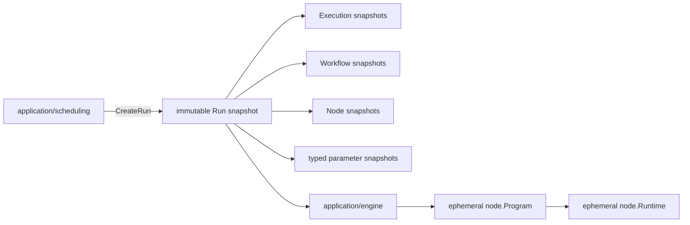

# 执行领域

## 目的与边界
执行定义创建后不可变的 `Run` 快照、顶层执行项状态机、工作器栅栏与静态资源预算。调度在创建执行实例时读取自动化发布物，把固定版本和 `latest` 都解析为具体版本并冻结环境、策略、参数与完整依赖闭包；执行不在运行时回读可变资产。

## 术语与公开模型
`CreateRunCommand` 是创建请求，`Run` 是唯一持久执行真相；其中的 `WorkflowEntry`、`WorkflowSnapshot`、`NodeSnapshot`、`EnvironmentSnapshot`、参数绑定和策略均为冻结值。参数由共享内核 `domain/parameter` 的 `Value` 与 `Binding` 表达，仅支持 `TEXT`、`NUMBER`、`BOOLEAN`、`SINGLE_SELECT` 与 `MULTI_SELECT` 五种封闭类型；`NUMBER` 内部使用规范化十进制字符串。`Program` 与 `Runtime` 只是执行期模型，不是可持久化聚合或快照。

## 不变量
- `RunID`、顶层执行项身份/序号、快照身份唯一且互相引用一致；所有 `latest` 引用在创建执行实例的调度事务内解析为具体版本。
- 执行实例创建后不可修改其资产、环境、参数、截图/修复策略或依赖闭包；访问器返回隔离副本。
- 工作流引用无环且解析完整；节点、调用边与参数绑定必须存在并类型兼容。
- 参数作用域按执行实例 → 顶层执行项 → 测试任务条目 → 工作流调用逐层覆盖，复合值保持结构与类型。
- 工作器栅栏单调且参与领取执行权、进度和终态写入，过期工作器不得提交。
- 步骤判别联合、导航 URL、等待、重复、验证、深度、边数和展开预算均受验证。

## 状态与流程
执行实例与顶层执行项状态由调度命令服务推进。显式中止由 `AbortRunService` 要求宿主事务原子提交权威的 `execution.Aborted` 并失效工作器栅栏，提交成功后才发送取消信号；信号失败保留已提交结果并返回 `ErrRunSignalRetryable`。普通执行上下文取消仍映射为 `CANCELED`，是独立于显式中止的操作。

## 失败
失败包括非法状态迁移、未知枚举、身份重复/缺失、引用环或孤儿解析、版本解析失败、依赖归属错误、参数缺失/类型不兼容、危险导航 URL、过期栅栏，以及任一资源预算超限。创建执行实例任一步失败都不得暴露部分冻结快照。

## 并发、安全与资源
执行实例 是不可变值，可安全并发读取；持久化原子性、领取执行权/租约 与乐观并发由应用端口和宿主适配器兑现。环境是普通字符串 `Properties`（`map[string]string`），并注入 `env.` 参数命名空间；Core 没有 CredentialReference、CredentialResolver 或 CredentialService 子系统。敏感值保护属于宿主的存储、授权与日志责任。

## 交互
调度创建并持久化执行实例、冻结 `latest`，并决定串行推进；执行引擎从单个执行实例的顶层执行项编译临时执行程序；每个顶层执行项使用新的运行时和浏览器会话；Evidence 接收进度与终态结果。嵌套工作流共享该顶层执行项的运行时和浏览器会话，但每条调用路径拥有根据绑定派生的独立类型化参数作用域。

## 已实现
已实现：不可变执行实例快照、类型化参数与绑定、创建事务/解析一致性、工作器栅栏、编译与执行入口服务，以及显式中止的 `ABORTED` 原子提交、提交后信号和可重试信号失败语义。中止实现与验收见 [`run_command_services.go`](../../application/scheduling/run_command_services.go)、[`run_command_services_test.go`](../../application/scheduling/run_command_services_test.go) 和 [`run_command_transaction_conformance_test.go`](../../application/scheduling/run_command_transaction_conformance_test.go)。

## 源码与测试
- [运行与状态](../../domain/execution/run.go)、[不可变 执行实例 快照](../../domain/execution/run_snapshot.go)、[校验与上限](../../domain/execution/validation.go)、[工作器 栅栏](../../domain/execution/worker_fence.go)
- [类型化参数](../../domain/parameter/value.go)、[参数绑定](../../domain/parameter/binding.go)
- [执行实例创建](../../application/scheduling/create_run_service.go)、[创建构建器](../../application/scheduling/create_run_builder.go)、[顶层执行项执行器](../../application/execution/entry_executor.go)
- [执行实例快照测试](../../domain/execution/run_snapshot_test.go)、[参数校验测试](../../domain/execution/parameter_validation_test.go)、[执行实例创建测试](../../application/scheduling/create_run_test.go)
