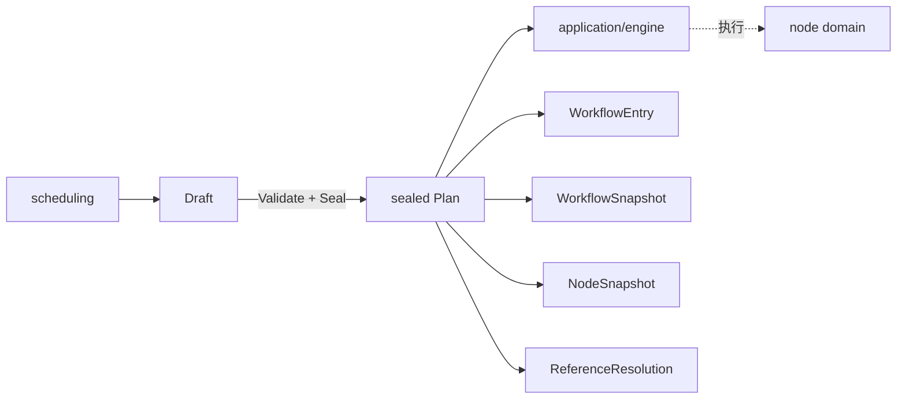
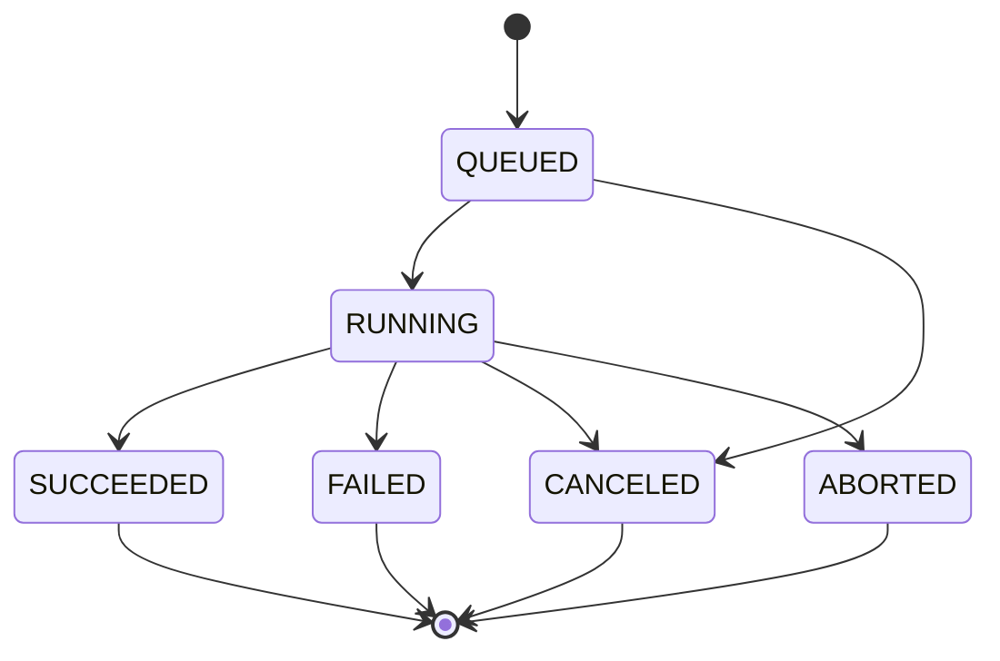

# Execution 领域

## 目的与边界
Execution 定义可执行计划的密封快照、运行/执行状态机、环境公开描述与静态资源预算。它保证进入执行器的依赖闭包完整且不可变；不负责从 Automation 读取资产、排队、编译节点树、驱动浏览器或保存事实。

## 术语与公开模型
`Draft` 是待验证输入；`Plan` 只能由 `Seal` 产生。`WorkflowEntry` 是按 `SequenceNumber` 排序的顶层执行入口；`WorkflowSnapshot`、`NodeSnapshot` 和 `ReferenceResolution` 是冻结依赖。`Run` 表示整体运行，`ExecutionStatus` 表示入口执行。`FailurePolicy` 为停止或继续。`EnvironmentDescriptor` 不含秘密，`CredentialReference` 只描述秘密边界。

## 不变量
- 未经 `Seal` 的零值 `Plan` 必须返回 `ErrUnsealedPlan`。
- Seal 校验后深拷贝所有切片、映射、嵌套步骤和 fingerprint，并规范化入口顺序；访问器再次返回副本。
- RunID、入口身份/序号、快照身份唯一且互相引用一致；固定版本不能空缺或归属错误。
- 可达工作流引用无环、解析项完整且无孤儿；节点依赖必须存在。
- Step 是严格判别联合；导航 URL、等待、重复、验证及组分支必须满足各自约束。
- 展开执行次数、累计等待、深度、边数、集合数量、字符串字节均受上限保护。

## 状态与流程

入口执行状态另有 `PENDING -> RUNNING|SKIPPED|CANCELED|ABORTED`，运行中可终结为成功、失败、取消或中止；终态不可重开。

## 失败
失败包括未密封计划、非法状态迁移、未知枚举、身份重复/缺失、引用环或孤儿解析、依赖归属错误、非法步骤字段、危险导航 URL，以及任一资源预算超限。校验在克隆大输入之前先执行聚合界限，降低拒绝服务风险。

## 并发、安全与资源
Plan 是值快照，可安全供并发读取，但没有内部同步或运行时可变状态。状态持久化并发由调用者负责。环境描述明确不携带 credential 字段，秘密只能经应用层执行端口解析。资源常量包括 64 层步骤、32 层引用、10000 步、1000 工作流、10000 节点、百万展开执行和 24 小时累计等待等。

## 交互
Scheduling 负责从仓储读取并构造 Draft；Engine 仅接受密封 Plan 并映射为 node Program；evidence 接收执行事实。Execution 不规定 Driver、CredentialResolver、仓储或队列适配器的行为。

## 已实现与未支持
已实现：Seal、防变更快照、完整依赖/预算验证、Run 与 Execution 状态矩阵、环境/凭据公开边界。未支持：资产加载、计划缓存、分布式锁、队列优先级、浏览器生命周期、事实原子提交、秘密提供商语义。

## 源码与测试
- [计划](../../domain/execution/plan.go)、[校验与上限](../../domain/execution/validation.go)、[预算](../../domain/execution/budget.go)
- [运行状态](../../domain/execution/run.go)、[执行状态](../../domain/execution/status.go)、[环境边界](../../domain/execution/environment.go)
- [计划矩阵测试](../../domain/execution/validation_test.go)、[运行测试](../../domain/execution/run_test.go)、[环境安全测试](../../domain/execution/environment_test.go)、[引擎契约测试](../../application/engine/engine_contract_matrix_test.go)
