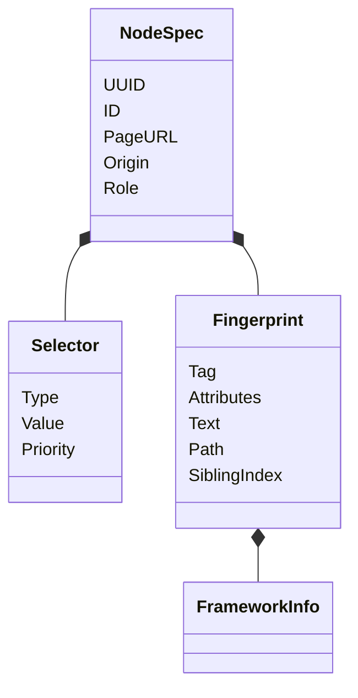
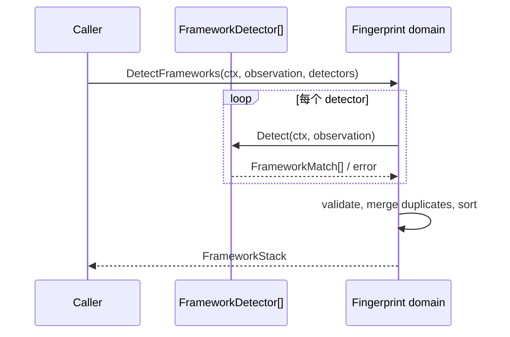

# 元素指纹领域

## 目的与边界
Fingerprint 定义可移植的元素身份：selector、结构/语义指纹、NodeSpec，以及前端框架检测结果的规范化。它验证并排序观察数据；不查询 DOM、不执行 selector、不评分修复候选，也不内置具体框架探测器。

## 术语与公开模型
SelectorType 支持 role、testid、css、xpath、text；Priority 表示优先级。Fingerprint 组合 tag、attributes、text、ARIA、祖先 path、兄弟索引、neighbors、label/form 与 FrameworkStack。NodeSpec 增加 UUID/ID、PageURL、Origin 和 Role。PageObservation 是探测输入，FrameworkDetector 是外部探测算法端口。

## 不变量
- Selector type 必须受支持，Value 非空，Priority 合法。
- Fingerprint 的关键身份与集合字段必须合法，框架栈需逐项验证。
- NodeSpec 要求业务 ID、合法 URL/origin、至少一个合法 selector 与合法 fingerprint；UUID 可选，但一旦提供必须格式有效。
- FrameworkInfo 的 kind、confidence、evidence 合法；栈规范化时合并重复项并稳定排序。
- Clone/Sort 返回新切片，不把内部集合交给调用者修改。

## 状态与流程

## 失败
未知 selector/framework/evidence 类型、空值、非法 priority/confidence、畸形 URL/origin/UUID、无 selector 或 detector 返回无效结果会失败。领域不重试或降级伪造结果。

失败一律以注册的 `FINGERPRINT_*` fault 形式返回，共 5 个 code（见 `docs/refactor/business-error-contract/error-code-registry.md`）。多字段校验产出**一个**顶层 fault，携带有序 `fault.Violation`：字段路径是逻辑路径（集合下标 0 基），原因走共享内核的 `VALIDATION_FIELD_*` 词表。子校验失败降级为父 fault 的 violation，**不产出嵌套 fault**，故宿主无需递归解包即可分类。

被拒的 selector 值、UUID、framework/evidence 取值一律不进公共文本 —— 闭集之外的取值按定义就是任意调用方输入。Detector 错误**不再原样外传**：宿主注入的探测器其错误文本不受 Core 约束（可能含页面 URL 或 DOM 片段），只作为私有 cause 挂在 `FINGERPRINT_FRAMEWORK_DETECTOR_FAILED`（`INTERNAL`）上，经 `Unwrap` 可达。该失败归 `INTERNAL` 而非 `INVALID_ARGUMENT`，因为调用方没有运行时补救动作。

## 并发、安全与资源
模型是普通值；map/slice 需要调用者遵守所有权，`FrameworkStack.Clone` 提供浅值复制，Fingerprint map/path 的深拷贝由聚合边界负责。检测接受 context 取消。URL/origin 验证减少跨站身份混淆，但 selector 内容不会在此执行，真正注入安全由 Driver 适配器负责。当前没有显式 selector/attribute/path 数量上限；执行 `Seal` 对计划聚合输入设限。

## 交互
采样 创建 NodeSpec；自动化 版本保存 selector/fingerprint；执行 冻结副本；Node 用 Driver 定位；自愈 用特征评分；框架 detector 由外部提供。这里不推断 Playwright、CDP 或任何 DOM adapter 的 selector 语义。

## 已实现与未支持
已实现：selector、fingerprint、NodeSpec 校验；框架信息/栈校验、克隆、排序；多 detector 聚合、去重和规范化。未支持：selector 实际解析/执行、DOM 特征抽取、内置 React/Vue 等 detector、持久化、候选相似度评分。

## 源码与测试
- [核心模型](../../domain/fingerprint/fingerprint.go)、[框架模型](../../domain/fingerprint/framework.go)、[检测编排](../../domain/fingerprint/detection.go)
- [核心与模糊测试](../../domain/fingerprint/fingerprint_test.go)、[框架检测测试](../../domain/fingerprint/framework_test.go)
- [自愈 使用](../../domain/heal/scorer.go)、[采样 使用](../../domain/sampling/session.go)
