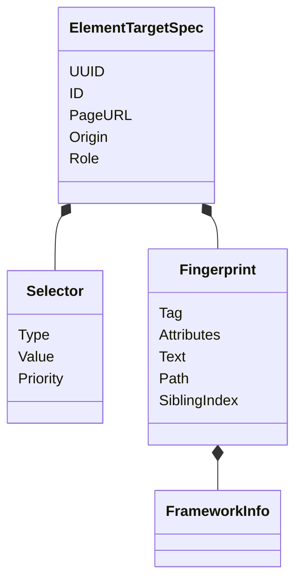
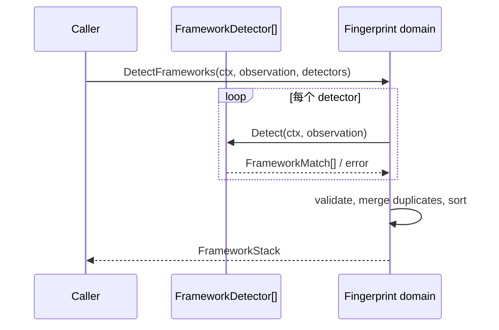

# 元素指纹领域

## 目的与边界

Fingerprint 定义可移植的元素身份：selector、结构/语义指纹、`ElementTargetSpec`，以及前端框架检测结果的规范化。它验证并排序观察数据。

它**不**查询 DOM、不执行 selector、不评分修复候选，也不内置具体框架探测器。selector 的实际解析与执行、DOM 特征抽取、内置 React/Vue detector、持久化和候选相似度评分都在本领域之外。

## 聚合与值对象

- **`Selector`**（[`fingerprint.go`](../../domain/fingerprint/fingerprint.go)）：`Type` 取自封闭集 `role` / `testid` / `css` / `xpath` / `text`，加上 `Value` 与 `Priority`。
- **`Fingerprint`**（[`fingerprint.go`](../../domain/fingerprint/fingerprint.go)）：`Tag`、`Attributes`、`Text`、`ARIA`、祖先 `Path`、`SiblingIndex`、`Neighbors`、`LabelText`、`FormID` 与 `Framework`。**刻意不记录视口边界框** —— 页面布局、视口尺寸和缩放在录制与回放之间无法保证一致，位置信号只会引入噪音。
- **`ElementTargetSpec`**（[`fingerprint.go`](../../domain/fingerprint/fingerprint.go)）：在 selector 与 fingerprint 之上加 `UUID`、`ID`、`PageURL`、`Origin`、`Role`。
- **`PageObservation`** 是探测输入，**`FrameworkDetector`** 是外部探测算法端口（[`detection.go`](../../domain/fingerprint/detection.go)）。

`Fingerprint.Clone`（[`fingerprint.go`](../../domain/fingerprint/fingerprint.go)）是该类型当前唯一的深拷贝契约。所有调用方都通过拥有类型的拷贝获得独立值，新增引用类型字段也由同一入口统一处理；[`unified_language_boundary_test.go`](../../architecture/unified_language_boundary_test.go) · `TestFingerprintHasExactlyOneDeepCopy` 强制这一边界。

## 不变量

- Selector 的 `Type` 必须受支持，`Value` 非空，`Priority` 合法。
- Fingerprint 的关键身份与集合字段必须合法（`Tag` 非空、`Attributes` 非 nil、`SiblingIndex` 非负），框架栈需逐项验证。
- `ElementTargetSpec` 要求业务 ID、合法 URL/origin、至少一个合法 selector 与合法 fingerprint；`UUID` 可选，但一旦提供必须格式有效（[`fingerprint.go`](../../domain/fingerprint/fingerprint.go)）。
- `FrameworkInfo` 的 kind、confidence、evidence 合法；栈规范化时合并重复项并稳定排序。
- `Clone`/`Sort` 返回新切片，不把内部集合交给调用者修改。

## 状态与流程

## 失败语义

遵循[统一 fault 封套](../architecture/system-overview.md#错误契约)。本领域拥有 `FINGERPRINT_*` 前缀下的 5 个 code，清单见[错误码注册表](../contracts/error-code-registry.md)。未知 selector/framework/evidence 类型、空值、非法 priority/confidence、畸形 URL/origin/UUID、无 selector 或 detector 返回无效结果都会失败；领域不重试，也不降级伪造结果。

两条本领域特有的边界：

- **Detector 错误不原样外传。** 宿主注入的探测器其错误文本不受 Core 约束（可能含页面 URL 或 DOM 片段），只作为私有 cause 挂在 `FINGERPRINT_FRAMEWORK_DETECTOR_FAILED` 上（[`detection.go`](../../domain/fingerprint/detection.go)），经 `Unwrap` 可达。该失败归 `INTERNAL` 而非 `INVALID_ARGUMENT`，因为调用方没有运行时补救动作。已被分类过的 detector 错误直接透传（[`detection.go`](../../domain/fingerprint/detection.go)）。
- **被拒的 selector 值、UUID、framework/evidence 取值一律不进公共文本** —— 闭集之外的取值按定义就是任意调用方输入。

## 并发、安全与资源

模型是普通值；map/slice 需要调用者遵守所有权，`FrameworkStack.Clone`（[`framework.go`](../../domain/fingerprint/framework.go)）是浅值复制（元素只含 string/float64，因此没有别名残留），`Fingerprint` 的 map/path 深拷贝由 `Fingerprint.Clone` 负责。检测接受 context 取消。URL/origin 验证减少跨站身份混淆，但 selector 内容不会在此执行，真正的注入安全由 Driver 适配器负责。

**本领域没有任何输入数量上限** —— selector、attribute、path 条数均不受限，包内唯一的上界是 violation 封套的 `fault.MaxViolations`，那是输出上界不是输入上界。对计划聚合输入设限的是执行侧的 `Seal`。

## 交互

采样创建 `ElementTargetSpec`；自动化版本保存 selector/fingerprint；执行冻结副本；Node 用 Driver 定位；自愈用特征评分；框架 detector 由外部提供。这里不推断 Playwright、CDP 或任何 DOM adapter 的 selector 语义。

## 源码证据

- [核心模型](../../domain/fingerprint/fingerprint.go)、[框架模型](../../domain/fingerprint/framework.go)、[检测编排](../../domain/fingerprint/detection.go)
- [核心与模糊测试](../../domain/fingerprint/fingerprint_test.go)、[框架检测测试](../../domain/fingerprint/framework_test.go)
- [唯一深拷贝守卫](../../architecture/unified_language_boundary_test.go) · `TestFingerprintHasExactlyOneDeepCopy`
- 下游用法：[自愈评分](../../domain/heal/scorer.go)、[采样会话](../../domain/sampling/session.go)
