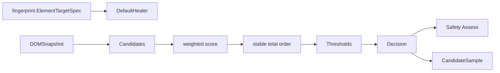
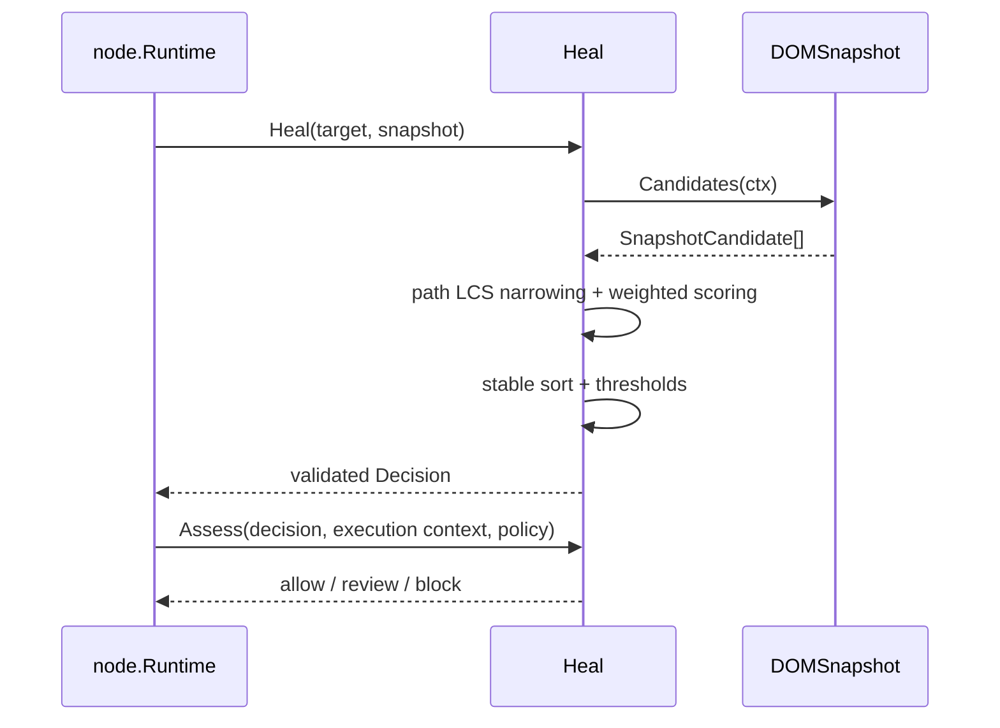

# 自愈领域

## 目的与边界

自愈根据目标 fingerprint 与 `DOMSnapshot` 候选计算排序、阈值决策和安全评估，并生成可审计样本。它是**纯候选决策域**。

它不定位元素、不执行动作、不保存候选、不修改 `ElementTargetSpec`，也不决定自动化的版本发布。DOM 抓取适配器、机器学习模型、持久化、自动版本发布、用户审核流程和候选容量控制都在本领域之外。Node 是执行者和策略调用方，自愈只回答「该换成哪个候选」。

## 聚合与值对象

- **`Candidate`** 是 selector、fingerprint 与 score 的组合。
- **`Decision.Outcome`**（[`heal.go:15-26`](../../domain/heal/heal.go)）是四值封闭集：`applied`、`below_cap`、`no_candidate`、`safety_rejected`。
- **`Thresholds`**（[`healer.go:12-16`](../../domain/heal/healer.go)）只有 `AppliedCap` 与 `ReviewCap`。默认值 `0.85 / 0.60`。
- **`Weights`**（[`scorer.go:17-29`](../../domain/heal/scorer.go)）十一个维度：`Tag`、`ID`、`RoleName`、`Class`、`Attrs`、`Text`、`Index`、`Neighbor`、`LabelText`、`Container`、`Framework`。打分按加权平均归一化（`Σw·sim / Σw`），因此权重只表示**相对**重要性，不要求总和为 1；`LabelText` 与 `Container` 是 Healix 扩展维度。
- **`Assessment`**（[`assessment.go:12-38`](../../domain/heal/assessment.go)）独立给出 `allow` / `review` / `block`，并附上 `ReasonCode` 列表（八个：`no_candidate`、`origin_mismatch`、`page_mismatch`、`role_mismatch`、`tag_mismatch`、`form_mismatch`、`ambiguous`、`below_cap`）。

## 不变量

- 权重、阈值、score、置信度均有限且在合法区间。
- **`ReviewCap` 必须严格低于 `AppliedCap`**（[`healer.go:32-34`](../../domain/heal/healer.go)：`ReviewCap >= AppliedCap` 直接报错）。两者相等会被拒绝 —— 那样就不存在可供人工复审的 `below_cap` 区间了。落在 `[ReviewCap, AppliedCap)` 的分数会应用，但强制 `NeedsReview=true`（[`healer.go:114-117`](../../domain/heal/healer.go)）。
- `Decision` 的 `Outcome`、`Best`、`Candidates`、`NeedsReview` 组合严格一致（[`heal.go:48-96`](../../domain/heal/heal.go)）。
- Candidates 按稳定全序排列，`Best` 必须是首项（[`heal.go:94-96`](../../domain/heal/heal.go)）。并列时依次比较 selector 的 type / value / priority，再比较 fingerprint 规范键（[`order.go:12-26`](../../domain/heal/order.go)）；规范键先对 map 的键显式排序（[`order.go:44`](../../domain/heal/order.go)），因此结果不受 Go map 迭代顺序影响。
- 候选 selector/fingerprint 必须有效；空快照得到 `no_candidate`。
- 打分只对目标存在的可选信号计权，避免缺失信号获得奖励。
- Safety `Assess` 检查 origin/page、role/tag/form、歧义与 margin；不会静默覆盖评分决策。
- Samples 的 hash、rank、selected/eligible/status 和 evidence 必须自洽。

## 状态与流程

## 失败语义

**本领域刻意不拥有 fault code 家族。** `domain/heal` 不 import `domain/fault`，所有失败都是普通 `fmt.Errorf`。这不是待办事项，理由与可达性证据记在[错误码注册表](../contracts/error-code-registry.md)的「Contexts that deliberately own no code family」一节：自愈的导出面只被 `domain/node` 调用，分类因此发生在 `domain/node` 的 `EXECUTION_*` 边界上；再加一个 `HEAL_*` 家族等于给同一个失败两个 code，并把自愈内部词表推进已发布契约。

支撑这个决定的两个条件都是承重的：

- **`domain/node` 必须在自己的边界上分类。** 四个调用点 —— [`step.go:210`](../../domain/node/step.go) 与 `:216`、[`validation.go:339`](../../domain/node/validation.go) 与 `:353` —— 全部经过 `classifyNodeFault`，它对已带 code 的 cause 原样透传，否则落到一个 `EXECUTION_*` code 上。这四处曾是 `fmt.Errorf("invalid heal decision: %w", err)` 这类无 code 包装，会让自愈失败以零分类跨过公共边界。
- **自愈文本必须不含观测值。** 本领域不回显任何 selector、页面 URL、origin 或 fingerprint 值。它唯一格式化的动态值是 `policy.MinimumMargin`（[`assessment.go:46`](../../domain/heal/assessment.go)），那是调用方自己传入的配置浮点数，不是页面内容或用户输入。

Nil snapshot、快照读取错误、非法配置、无效候选、非法 `Decision`、URL/上下文不一致或安全策略无效会返回错误或阻断评估。**「没有候选」和「低于阈值」是合法 Outcome，不是错误** —— 它们经 `Decision` 正常返回。

## 并发、安全与资源

`DefaultHealer` 在配置不变且 `DOMSnapshot` 实现并发安全时无内部共享可变状态；接口本身不承诺快照的并发性。context 传入候选读取以支持取消。

安全评估阻止跨 origin/page 和语义不匹配，`review` 保留人工审查信号。LCS 使用滚动缓冲把空间降到 O(min(n,m))，并在候选之间复用同一块 workspace（[`lcs.go:14-42`](../../domain/heal/lcs.go)）；评分是候选的线性遍历。**本领域不设候选数量上限**，输入规模应由适配器或执行侧限制。

## 交互

fingerprint 提供目标与候选特征；node 通过 `HealingPort` 调用并维护 selector overlay；evidence/node 可保存 Samples 和 `Decision`；自动化可把稳定候选晋升为新版本。自愈不知道 Driver、数据库或审核 UI 的存在。

## 源码证据

- [公开决策](../../domain/heal/heal.go)、[默认 Healer](../../domain/heal/healer.go)、[评分](../../domain/heal/scorer.go)、[安全评估](../../domain/heal/assessment.go)
- [策略](../../domain/heal/policy.go)、[排序](../../domain/heal/order.go)、[LCS 缩窄](../../domain/heal/lcs.go)、[样本](../../domain/heal/sample.go)、[证据](../../domain/heal/evidence.go)
- [Healer 测试](../../domain/heal/healer_test.go)、[评估矩阵](../../domain/heal/assessment_business_matrix_test.go)、[评分测试](../../domain/heal/scorer_test.go)、[优化等价测试](../../domain/heal/scorer_optimization_test.go)、[LCS 测试](../../domain/heal/lcs_test.go)
- 边界侧：[node 的 fault 分类](../../domain/node/fault_classification.go)
