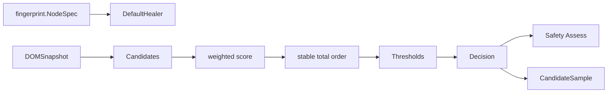
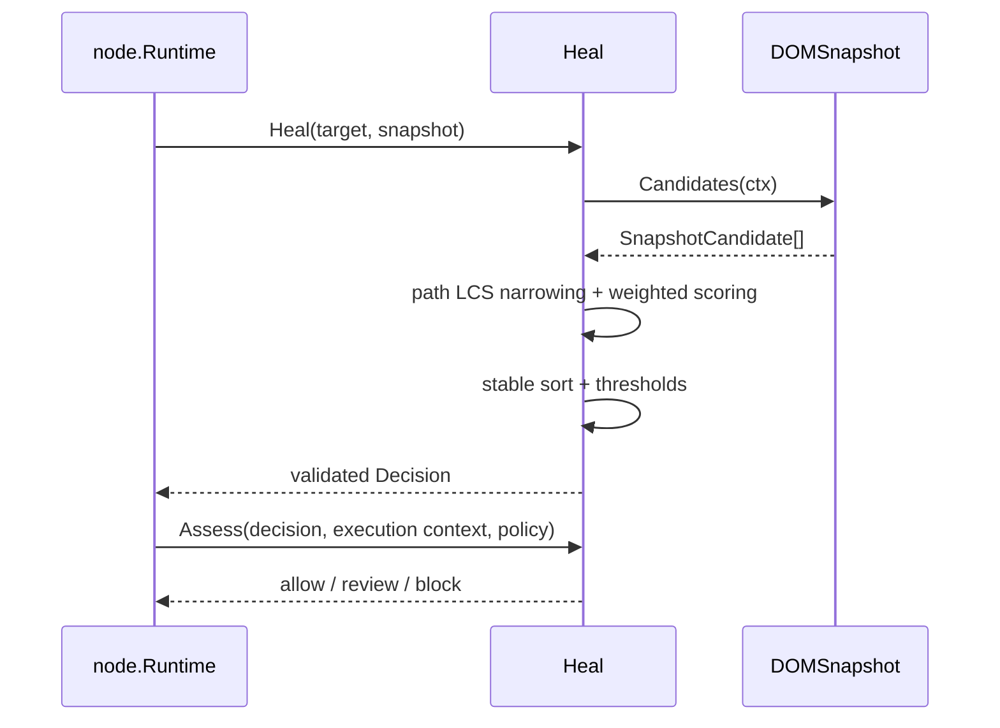

# Heal 领域

## 目的与边界
Heal 根据目标 fingerprint 与 DOMSnapshot 候选计算排序、阈值决策和安全评估，并生成可审计样本。它不定位元素、不执行动作、不保存候选、不修改 NodeSpec，也不决定 Automation 的版本发布。Node 与 Heal 分离：Node 是执行者和策略调用方，Heal 是纯候选决策域。

## 术语与公开模型
`Candidate` 是 selector、fingerprint 与 score；`Decision` 的 Outcome 为 applied、below_cap、no_candidate、safety_rejected。`Thresholds` 中 AppliedCap 高于等于 ReviewCap；中间带会应用但 `NeedsReview=true`。`Weights` 控制 tag、ID、ARIA、class、attrs、text、index、neighbor、label、container、framework。`Assessment` 独立给出 allow/review/block 与原因。

## 不变量
- 权重、阈值、score、置信度均有限且在合法区间；ReviewCap 不得高于 AppliedCap。
- Decision 的 Outcome、Best、Candidates、NeedsReview 组合严格一致。
- Candidates 按稳定全序排列，Best 必须是首项；并列使用 selector 与 fingerprint 规范键确定顺序，不受 map 插入顺序影响。
- 候选 selector/fingerprint 必须有效；空快照得到 no_candidate。
- 打分只对目标存在的可选信号计权，避免缺失信号奖励。
- Safety Assess 检查 origin/page、role/tag/form、歧义与 margin；不会静默覆盖评分决策。
- Samples 的 hash、rank、selected/eligible/status 和 evidence 必须自洽。

## 状态与流程

## 失败
Nil snapshot、快照错误、非法配置、无效候选、非法 Decision、URL/上下文不一致或安全策略无效会返回错误/阻断评估。没有候选和低于阈值是合法 Outcome，不是基础设施错误。

## 并发、安全与资源
DefaultHealer 在配置不变且 DOMSnapshot 实现并发安全时无内部共享可变状态；接口本身不承诺快照并发性。context 传入候选读取以支持取消。安全评估阻止跨 origin/page 和语义不匹配，Review 带保留人工审查信号。LCS 使用滚动缓冲降低空间；评分为候选线性遍历，当前领域未设置候选数量上限，适配器/Execution 应限制输入。

## 交互
fingerprint 提供目标与候选特征；node 通过 HealingPort 调用并维护 selector overlay；evidence/node 可保存 Samples 和 Decision；Automation 可把稳定候选晋升为新版本。Heal 不知道 Driver、数据库或审核 UI。

## 已实现与未支持
已实现：默认权重/策略 v1、评分、框架可选维度、LCS 缩窄、稳定排序、阈值决策、Decision 校验、安全评估、证据维度和样本哈希。未支持：DOM 抓取适配器、机器学习模型、持久化、自动版本发布、用户审核流程、候选容量控制。

## 源码与测试
- [公开决策](../../domain/heal/heal.go)、[默认 Healer](../../domain/heal/healer.go)、[评分](../../domain/heal/scorer.go)、[安全评估](../../domain/heal/assessment.go)
- [策略](../../domain/heal/policy.go)、[排序](../../domain/heal/order.go)、[样本](../../domain/heal/sample.go)、[证据](../../domain/heal/evidence.go)
- [Healer 测试](../../domain/heal/healer_test.go)、[评估矩阵](../../domain/heal/assessment_business_matrix_test.go)、[评分测试](../../domain/heal/scorer_test.go)、[优化等价测试](../../domain/heal/scorer_optimization_test.go)、[LCS 测试](../../domain/heal/lcs_test.go)
