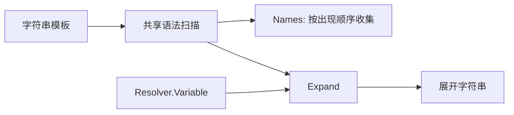
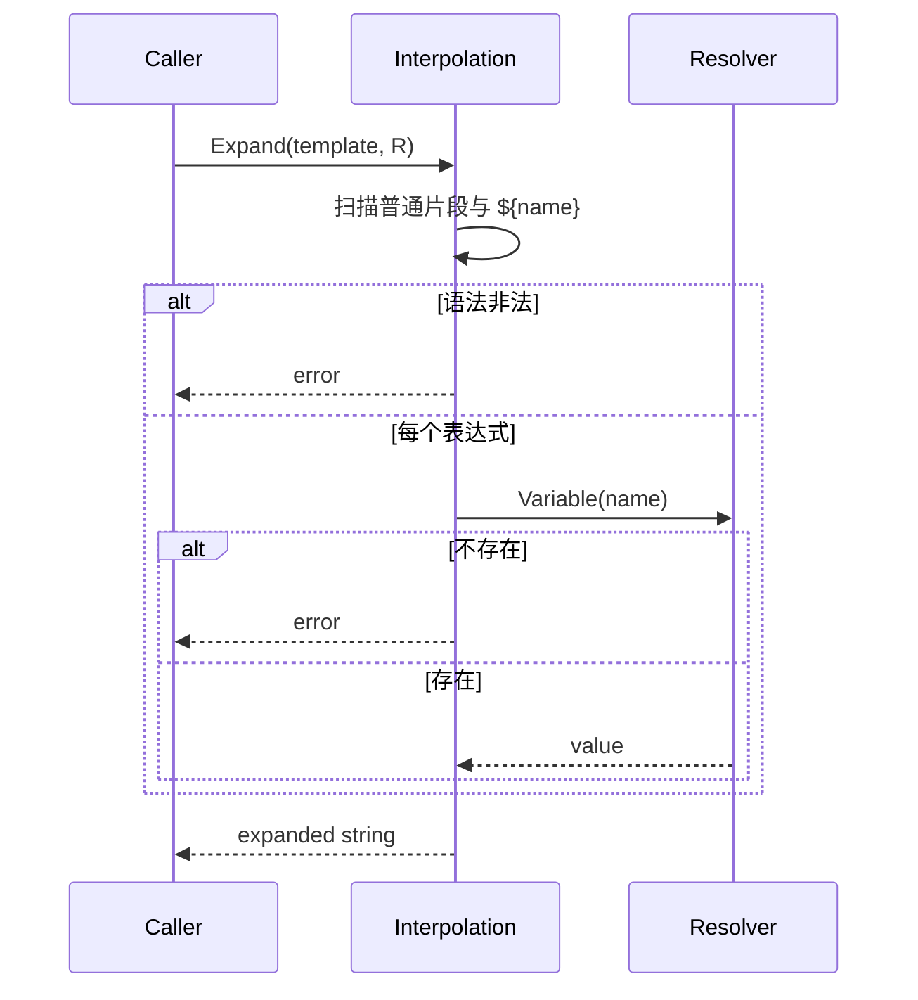

# 插值领域

## 目的与边界

Interpolation 提供单一、大小写敏感的 `${name}` 表达式语法，用于提取变量名和按 `Resolver` 展开字符串。整个领域只有一个源文件。

它**不**拥有变量存储、作用域、秘密、类型转换或模板语言控制结构。默认值、转义、嵌套表达式、条件/循环、类型化值、异步 Resolver、秘密标注和输出大小配额都不支持。

## 聚合与值对象

`Resolver`（[`variables.go`](../../domain/interpolation/variables.go)）是单方法接口 `Variable(name string) (string, bool)`。`Names` 静态收集表达式中的变量，`Expand` 用 Resolver 替换变量。两者共用同一套扫描与名称校验，因此不可能出现「能分析但不能展开」的分歧。

## 不变量

- `Names` 与 `Expand` 使用同一语法和同一名称校验。
- 表达式必须闭合，名称非空且不含空白或 `{}$`；非法语法明确失败。
- **`Names` 按出现顺序返回，不排序也不去重。** 同一名称出现两次就返回两次（[`variables.go`](../../domain/interpolation/variables.go) 只做 `append`）。调用方若需要集合语义，必须自行排序去重。
- 仅模板实际含变量时才要求非 nil Resolver。
- 缺失变量失败，**不保留未展开占位符** —— 部分构建的结果会被丢弃（[`variables.go`](../../domain/interpolation/variables.go)）。
- 变量名区分大小写：`${Name}` 与 `${name}` 是两个变量。
- 展开不修改输入字符串或 Resolver。

## 状态与流程

## 失败语义

遵循[统一 fault 封套](../architecture/system-overview.md#错误契约)。本领域拥有 `INTERPOLATION_*` 前缀下的 4 个 code（[`variables.go`](../../domain/interpolation/variables.go)），全部不携带 violation：

| Code | Kind | 触发条件 |
|---|---|---|
| `INTERPOLATION_RESOLVER_REQUIRED` | `FAILED_PRECONDITION` | 模板含 `${` 但 Resolver 为 nil（[`variables.go`](../../domain/interpolation/variables.go)） |
| `INTERPOLATION_EXPRESSION_INVALID` | `INVALID_ARGUMENT` | 表达式未闭合，或名称为空/含非法字符（[`variables.go`](../../domain/interpolation/variables.go)） |
| `INTERPOLATION_VARIABLE_UNDEFINED` | `NOT_FOUND` | Resolver 报告变量不存在（[`variables.go`](../../domain/interpolation/variables.go)） |
| `INTERPOLATION_EXPANSION_TOO_LARGE` | `RESOURCE_EXHAUSTED` | 展开结果超过 `MaxExpansionBytes`（1 MiB）上限（[`variables.go`](../../domain/interpolation/variables.go)） |

一处顺序上的细节：**nil-Resolver 的检查早于语法校验**，而且它的门槛只是字面量 `${` 是否出现。因此 `Expand("${broken", nil)` 返回的是 `INTERPOLATION_RESOLVER_REQUIRED` 而不是 `INTERPOLATION_EXPRESSION_INVALID`。

源表达式与变量名一律不进公共文本。`Resolver` 接口本身不返回 error，因此外部读取错误必须在构造 Resolver 的阶段处理，或折叠进「未找到」语义；领域不伪造适配器错误。

## 并发、安全与资源

函数无共享状态，并发安全完全取决于 Resolver 实现。该领域会把解析到的值写入返回字符串，**不识别秘密，也不负责日志脱敏** —— 调用方不得把含敏感展开值的结果写入证据。实现是线性扫描，但没有模板长度或变量数量上限，上层边界应限制不受信输入。

## 交互

- **自动化**用 `Names` 推导环境键（[`test_task.go`](../../domain/automation/test_task.go)）。
- **执行**同样用 `Names` 做步骤形状校验（[`step_shape.go`](../../domain/execution/step_shape.go)），并保存未解析模板，保证密封快照不含运行时秘密。
- **Node** 实现 Resolver：`runtimeVariables`（[`step.go`](../../domain/node/step.go)）读取运行时 Scratchpad 与参数作用域，在动作（[`step.go`](../../domain/node/step.go)）与验证（[`validation.go`](../../domain/node/validation.go)）期展开。工作流调用的参数传递走 `parameter.Binding` 而非本领域，两者是不同机制。

Interpolation 不读取环境变量、Vault、数据库或浏览器。

## 源码证据

- [变量语法与展开](../../domain/interpolation/variables.go)
- [矩阵、大小写与 fuzz 测试](../../domain/interpolation/variables_test.go)
- 消费方：[自动化环境键](../../domain/automation/test_task.go)、[执行步骤形状校验](../../domain/execution/step_shape.go)、[Node 运行时 Resolver](../../domain/node/step.go)
