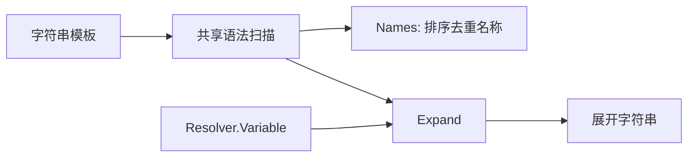
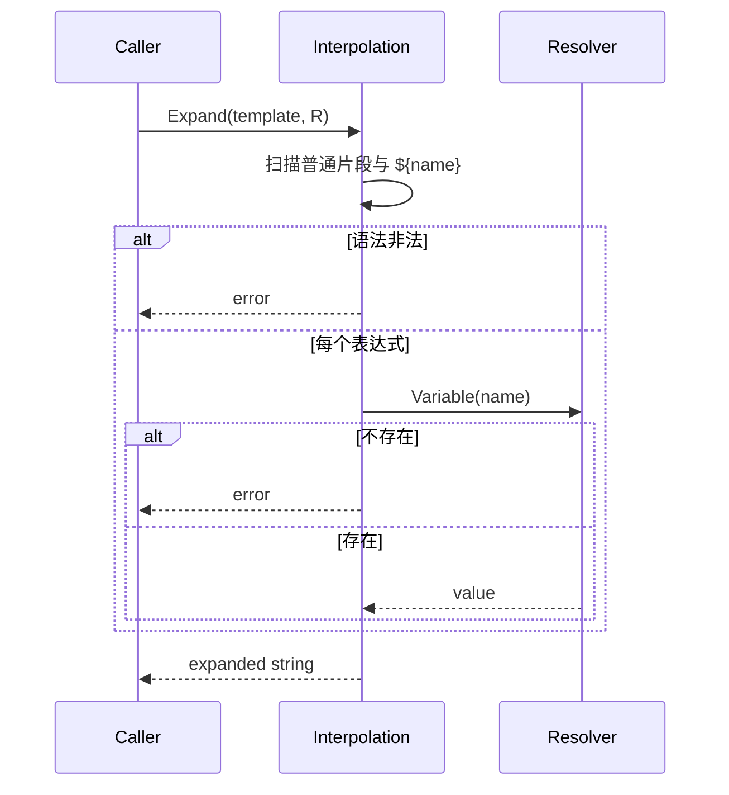

# 插值领域

## 目的与边界
Interpolation 提供单一、大小写敏感的 `${name}` 表达式语法，用于提取变量名和按 Resolver 展开字符串。它不拥有变量存储、作用域、秘密、类型转换或模板语言控制结构。

## 术语与公开模型
`Resolver` 只有 `Variable(name) (string, bool)`；`Names` 静态收集表达式中的变量；`Expand` 用 Resolver 替换变量。变量名区分大小写；普通字符串无需 Resolver。

## 不变量
- Names 与 Expand 使用同一语法和同一名称校验，不能出现“能分析但不能展开”的分歧。
- 表达式必须闭合，名称非空且满足允许字符规则；非法语法明确失败。
- Names 返回排序且去重的名称。
- 仅模板实际含变量时才要求非 nil Resolver。
- 缺失变量失败，不保留未展开占位符；大小写不同视为不同变量。
- 展开不修改输入字符串或 Resolver。

## 状态与流程

## 失败
未闭合表达式、空/非法名称、模板含变量但 Resolver 为 nil、Resolver 报告变量不存在都会失败。Resolver 接口不返回 error，因此外部读取错误必须在构造 Resolver 前或通过“未找到”语义处理；领域不伪造适配器错误。

## 并发、安全与资源
函数无共享状态，并发安全取决于 Resolver 实现。该领域会把解析到的值写入返回字符串，不识别秘密，也不负责日志脱敏；调用方不得把含敏感展开值的结果写入证据。实现是线性扫描，但没有显式模板长度/变量数量上限，上层边界应限制不受信输入。

## 交互
自动化 用 Names 推导环境键；Node 用 运行时/Scratchpad 或工作流绑定实现 Resolver，并在动作、参数和验证期展开。执行 保存未解析模板，保证密封计划不含运行时秘密。Interpolation 不读取环境变量、Vault、数据库或浏览器。

## 已实现与未支持
已实现：共享语法的 Names/Expand、排序去重、大小写敏感、nil/缺失变量错误及 fuzz 一致性验证。未支持：默认值、转义、嵌套表达式、条件/循环、类型化值、异步 Resolver、秘密标注、输出大小配额。

## 源码与测试
- [变量语法与展开](../../domain/interpolation/variables.go)
- [矩阵、大小写与 fuzz 测试](../../domain/interpolation/variables_test.go)
- [自动化 环境键使用](../../domain/automation/test_task.go)、[Node 运行时使用](../../domain/node/step.go)、[工作流绑定](../../domain/node/composite.go)
