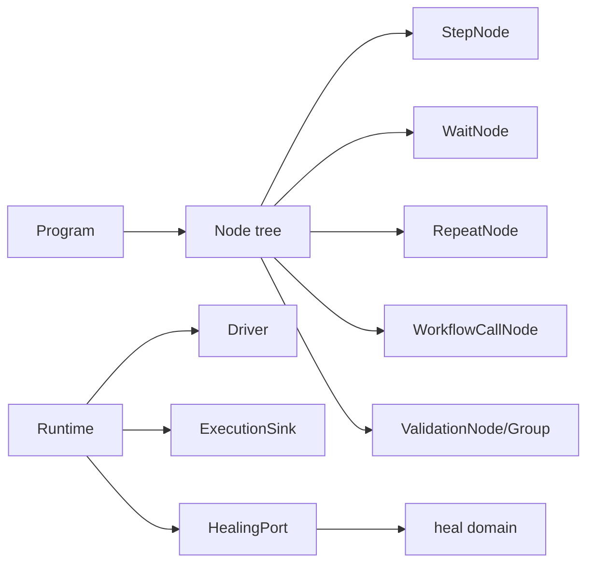
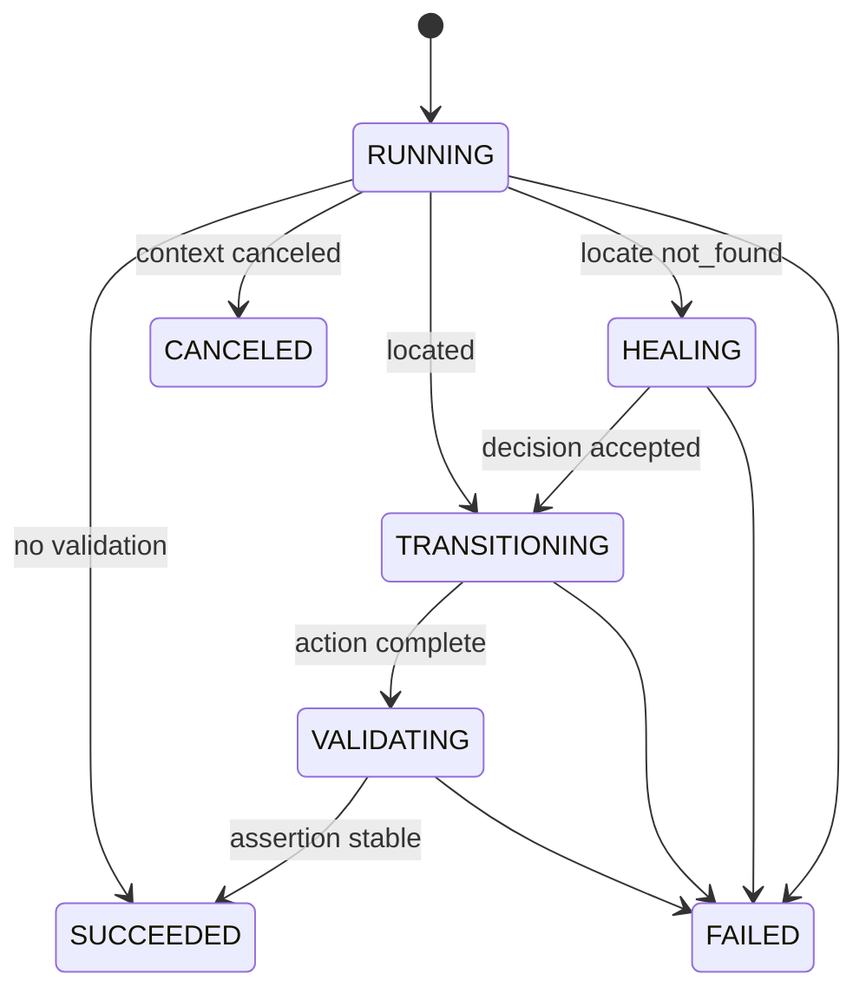

# 节点领域

## 目的与边界
Node 是运行时执行模型：节点树、动作、等待、重复、工作流调用、验证、阶段事件、错误分类、重试、节拍与自愈接缝。它通过小接口声明运行所需能力。Node 与自愈 是独立领域：Node 决定何时请求恢复及如何应用结果；自愈 只计算候选决策。

## 术语与公开模型
`Node` 只有 `ID` 与 `Run`；`Program` 包含根节点和按规格 ID 索引的 `NodeSpec`。`Runtime` 持有运行身份、`WorkerFence`、`Driver`、`Specs`、选择器覆盖层、变量暂存区及可选端口。`StepExecution` 管理阶段。`OperationRunner`/`Poller` 分离重试与轮询机制。`ValidationGroupNode` 表示 OR 分支，每个分支内部为 AND。

`TimelineMark` 以录制零点后的 `Offset + Sequence` 标记事件；`StepTimelineEvent` 只表达叶子步骤的 `STARTED`/`FINISHED`。`NodeCompletionChain` 在每次叶子节点出现完成后，按注册顺序阻塞执行只读完成处理器；处理器结果不改变节点原始结果。

## 不变量
- 每个叶子节点在开始前按 `StepInterval` 节拍；取消等待会阻止下一个叶子节点。
- 节点出现次数按 `NodeID` 分配且支持嵌套同 ID 的 LIFO；`RUNNING` 写失败回滚编号，终态失败后清理编号以便复用。
- 阶段只能按允许图迁移；终态通过带 `RunID`/`ClaimToken` 的栅栏提交。
- 只有显式瞬态错误可重试；系统定位错误、上下文关闭等不得误触发自愈。
- `Optional` 仅对缺失目标跳过；无效自愈 `Decision` 或安全拒绝仍记录并失败。
- 选择器覆盖层按规格 ID 共享，不修改编译后的 `NodeSpec`/`Action`。
- 工作流参数绑定创建作用域并在返回后恢复；变量展开不修改模板。
- ValidationGroup 必须同一分支持续全部为真，不能拼接不同轮次的通过结果。
- `StepNode`、`WaitNode`、`ValidationNode` 与 `ValidationGroupNode` 是叶子节点；`Workflow`、`WorkflowCall` 与 `Repeat` 只负责编排，不产生步骤时间线或完成处理链。
- `Retry` 属于同一次节点出现；`Repeat` 每轮产生新的节点出现。`Optional` 缺失目标的执行阶段保持成功，完成快照标记为 `SKIPPED`。
- 完成处理器严格串行、失败后继续且不改变节点结果；`ReadOnlyBrowser` 复用选择器覆盖层并深复制返回值。

## 状态与流程

## 失败
错误被分类为 not_found、not_visible、not_interactable、timeout、navigation、assertion、context_closed、transient_driver 或 unknown。关键事实写入错误会传播；最佳努力 operation observation 使用独立超时且不改变业务结果。轮询区分父 context 取消与自身 deadline。

## 并发、安全与资源
运行时包含可变映射、节点出现栈和选择器覆盖层，未声明可由多个 goroutine 并发共享。终态/观察写使用 5 秒独立超时；等待/验证尊重上下文。导航 URL 在执行前校验，变量展开错误显式返回；敏感验证证据由目标/断言判断后避免记录值。重试次数、等待超时、轮询间隔、步骤间隔限制资源；执行程序规模由 `CompilePlan(snapshot execution.RunSnapshot)` 从冻结快照编译顶层执行项时约束。

## 交互
`CompilePlan(snapshot execution.RunSnapshot)` 从不可变执行实例快照编译所有顶层执行项，当前引擎不以已封存 `Plan` 作为输入。Program 保持在带身份封印的 `CompiledEntry` 内部，只能交给 `RunProgram`。`Driver`、`HealingPort`、`ExecutionSink`、`Recorder`、`StepTimelineSink` 与 `ReadOnlyBrowser` 提供运行时所需能力；插值展开运行时变量。如需接入具体执行、事实记录、相对时间线或叶子节点完成后读取能力，可实现相应端口。

## 已实现与契约边界
已实现：动作与组合节点、等待/轮询、参数作用域、阶段/栅栏、重试分类、节拍、选择器覆盖层、自愈调用、验证全集与证据暂存、录制相对时间轴、叶子步骤边界和阻塞式完成处理链。运行时不支持跨 goroutine 共享；其余能力以公开端口契约为边界。

## 源码与测试
- [运行时与端口](../../domain/node/runtime.go)、[叶子生命周期与完成处理链](../../domain/node/lifecycle.go)、[步骤](../../domain/node/step.go)、[组合节点](../../domain/node/composite.go)、[验证](../../domain/node/validation.go)
- [错误与重试](../../domain/node/errors.go)、[机制](../../domain/node/mechanisms.go)、[自愈 端口](../../domain/node/healing_port.go)
- [业务矩阵](../../domain/node/business_matrix_test.go)、[步骤契约](../../domain/node/step_test.go)、[验证测试](../../domain/node/validation_test.go)、[节拍测试](../../domain/node/pacing_test.go)、[取消测试](../../domain/node/poller_cancellation_test.go)
