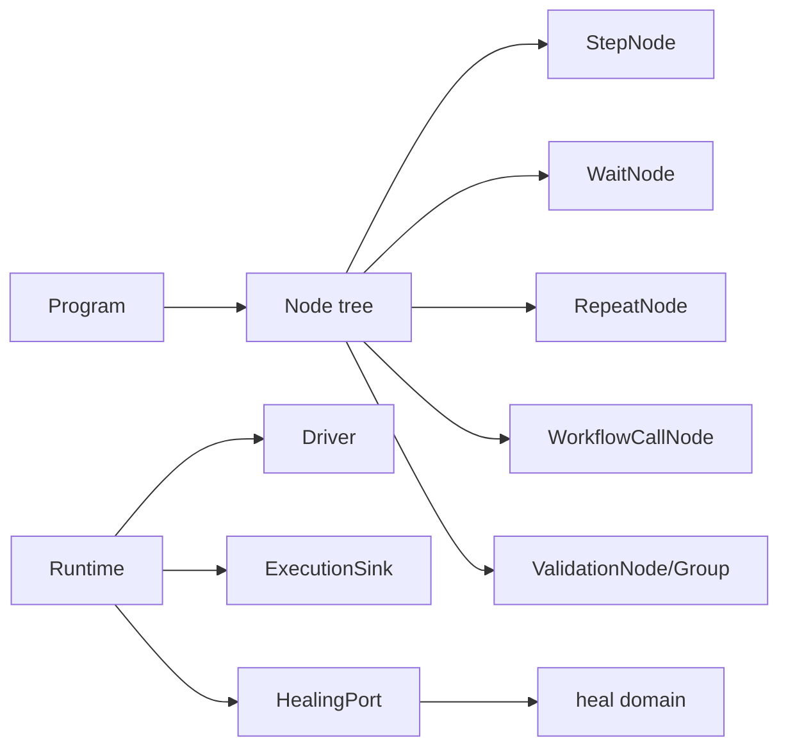
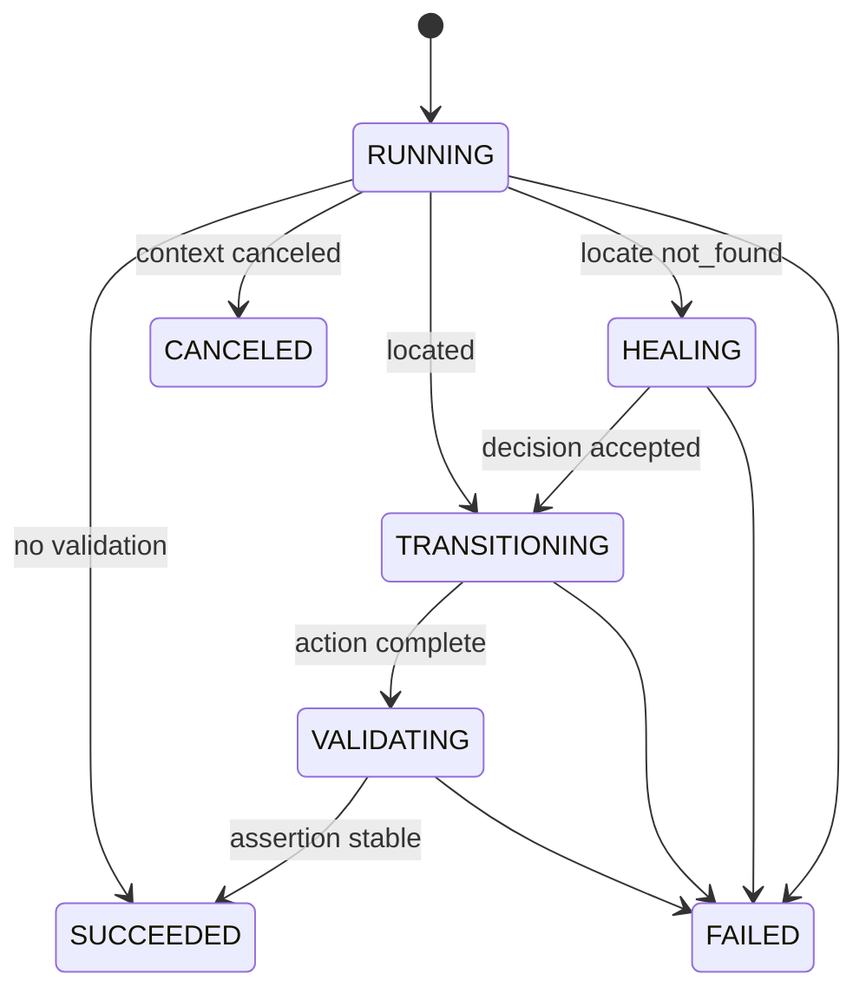

# Node 领域

## 目的与边界
Node 是浏览器无关的运行时执行模型：节点树、动作、等待、重复、工作流调用、验证、阶段事件、错误分类、重试、节拍与自愈接缝。它依赖小接口驱动外部能力，但不实现浏览器 Driver、事实仓储、录屏器或 DOM 快照适配器。Node 与 Heal 是独立领域：Node 决定何时请求恢复及如何应用结果；Heal 只计算候选决策。

## 术语与公开模型
`Node` 只有 `ID` 与 `Run`；`Program` 包含 Root 和按 spec ID 索引的 NodeSpec。`Runtime` 持有运行身份、WorkerFence、Driver、Specs、selector overlay、变量 scratchpad 及可选端口。`StepExecution` 管理阶段。`OperationRunner/Poller` 分离重试与轮询机制。`ValidationGroupNode` 表示 OR 分支，每个分支内部为 AND。

## 不变量
- 每个 leaf 在开始前按 `StepInterval` 节拍；取消等待会阻止下一 leaf。
- occurrence 按 NodeID 分配且支持嵌套同 ID 的 LIFO；RUNNING 写失败回滚编号，终态失败后清理可复用。
- 阶段只能按允许图迁移；终态通过带 RunID/ClaimToken 的 fence 提交。
- 只有显式 transient error 可重试；系统定位错误、上下文关闭等不得误触发 Heal。
- Optional 仅对缺失目标跳过；无效 Heal Decision 或安全拒绝仍记录并失败。
- selector overlay 按 spec ID 共享，不修改编译后的 NodeSpec/Action。
- 工作流参数绑定创建作用域并在返回后恢复；变量展开不修改模板。
- ValidationGroup 必须同一分支持续全部为真，不能拼接不同轮次的通过结果。

## 状态与流程

## 失败
错误被分类为 not_found、not_visible、not_interactable、timeout、navigation、assertion、context_closed、transient_driver 或 unknown。关键事实写入错误会传播；最佳努力 operation observation 使用独立超时且不改变业务结果。轮询区分父 context 取消与自身 deadline。

## 并发、安全与资源
Runtime 含可变 map、occurrence 栈和 overlay，未声明可由多个 goroutine 并发共享。终态/观察写使用 5 秒独立超时；等待/验证尊重 context。导航 URL 在执行前校验，变量展开错误显式返回；敏感验证证据由目标/断言判断后避免记录值。重试次数、wait timeout、poll interval、步骤间隔限制资源，但 Program 总规模由 Execution Seal 预先约束。

## 交互
Engine 把 sealed Plan 编译成 Program；Driver/Element 提供浏览器能力；HealingPort 适配 heal.Healer；ExecutionSink 接收进度、终态、修复和验证 staging；interpolation 展开运行时变量。接口不承诺具体适配器的定位、截图、事务或网络行为。

## 已实现与未支持
已实现：动作与组合节点、等待/轮询、参数作用域、阶段/fence、重试分类、节拍、selector overlay、自愈调用、验证全集与证据 staging。未支持：浏览器实现、跨 goroutine Runtime 安全、分布式调度、事实存储事务实现、录屏实现、Heal 算法本身。

## 源码与测试
- [运行时与端口](../../domain/node/runtime.go)、[步骤](../../domain/node/step.go)、[组合节点](../../domain/node/composite.go)、[验证](../../domain/node/validation.go)
- [错误与重试](../../domain/node/errors.go)、[机制](../../domain/node/mechanisms.go)、[Heal 端口](../../domain/node/healing_port.go)
- [业务矩阵](../../domain/node/business_matrix_test.go)、[步骤契约](../../domain/node/step_test.go)、[验证测试](../../domain/node/validation_test.go)、[节拍测试](../../domain/node/pacing_test.go)、[取消测试](../../domain/node/poller_cancellation_test.go)
