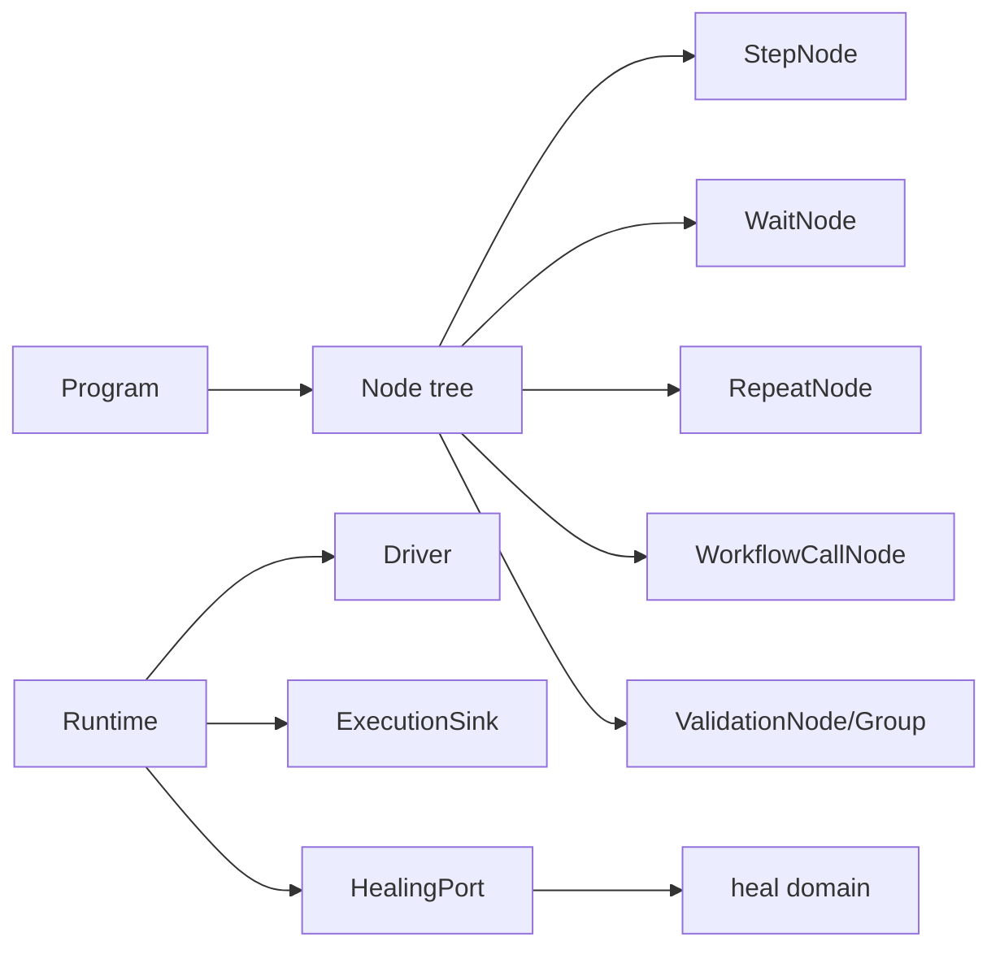

# 节点领域

## 目的与边界

Node 是运行时执行模型：节点树、动作、等待、重复、工作流调用、验证、阶段事件、错误分类、重试、节拍与自愈接缝。它通过小接口声明运行所需能力。

Node 与自愈是独立领域：**Node 决定何时请求恢复及如何应用结果，自愈只计算候选决策。** 运行时不支持跨 goroutine 共享；其余能力以公开端口契约为边界。

## 聚合与值对象

- **`Node`**（[`step.go:22-25`](../../domain/node/step.go)）只有 `ID` 与 `Run`。
- **`Program`**（[`runtime.go:34-37`](../../domain/node/runtime.go)）包含根节点和按规格 ID 索引的 `fingerprint.ElementTargetSpec`。
- **`Runtime`**（[`runtime.go:212-248`](../../domain/node/runtime.go)）持有 `InstanceID` / `EntryID` / `ClaimToken`、`Driver`、`Specs`、`SelectorOverlay`、`Scratchpad` 及一组可选端口。它**没有** `WorkerFence` 字段 —— 栅栏在每次写事实时由 `InstanceID` 和 `ClaimToken` 现场构造（[`runtime.go:371`](../../domain/node/runtime.go)）。
- **`StepExecution`** 管理阶段；`OperationRunner` / `Poller` 分离重试与轮询机制。
- **`ValidationGroupNode`** 表示 OR 分支，每个分支内部为 AND。
- **`TimelineMark`**（[`lifecycle.go:20-23`](../../domain/node/lifecycle.go)）以录制零点后的 `Offset + Sequence` 标记事件；`StepTimelineEvent` 只表达叶子步骤的 `STARTED` / `FINISHED`。
- **`NodeCompletionChain`** 在每次叶子节点出现完成后，按注册顺序**阻塞**执行只读完成处理器；处理器结果不改变节点原始结果。

## 不变量

- 每个叶子节点在开始前按 `StepInterval` 节拍；取消等待会阻止下一个叶子节点。
- 阶段只能按允许图迁移；终态通过带 `InstanceID`/`ClaimToken` 的 `execution.WorkerFence` 提交。
- 只有显式瞬态错误可重试；系统定位错误、上下文关闭等不得误触发自愈。
- `Optional` 仅对缺失目标跳过；无效自愈 `Decision` 或安全拒绝仍记录并失败。
- 选择器覆盖层按规格 ID 共享，不修改编译后的 `ElementTargetSpec`/`Action`。
- 工作流参数绑定创建作用域并在返回后恢复；变量展开不修改模板。
- ValidationGroup 必须同一分支持续全部为真，不能拼接不同轮次的通过结果。
- `Retry` 属于同一次节点出现；`Repeat` 每轮产生新的节点出现。`Optional` 缺失目标的执行阶段保持成功，完成快照标记为 `SKIPPED`。
- 完成处理器严格串行、失败后继续且不改变节点结果；`ReadOnlyBrowser` 复用选择器覆盖层并深复制返回值。

### 叶子节点与编排节点

只有四类节点会开启叶子生命周期，因而只有它们产生步骤时间线和完成处理链 —— `beginLeafLifecycle` 全仓恰好四个调用点：`StepNode`（[`step.go:97`](../../domain/node/step.go)）、`WaitNode`（[`composite.go:88`](../../domain/node/composite.go)）、`ValidationNode`（[`validation.go:98`](../../domain/node/validation.go)）与 `ValidationGroupNode`（[`validation.go:501`](../../domain/node/validation.go)）。`WorkflowNode`、`WorkflowCallNode` 与 `RepeatNode` 只负责编排。

### 节点出现编号

编号按 `NodeID` 分配，支持嵌套同 ID 的 LIFO 栈。它会作为 `Occurrence` 随事件、观察与事实一路带进[执行证据](evidence.md)（`OperationObservation` 同时携带 `EntryID` 与 `Occurrence`，[`runtime.go:123-136`](../../domain/node/runtime.go)），`RepeatNode` 在同一 `NodeID` 上跑出的各轮因此事后可区分。取出编号走的是 nil 安全访问器（[`runtime.go:319-328`](../../domain/node/runtime.go)），最佳努力观察不会因取不到编号而打断执行。

两处容易记反的细节（均在 [`runtime.go:380-391`](../../domain/node/runtime.go)）：

- **`RUNNING` 写失败会回滚编号** —— 计数器只在 `recordErr == nil` 之后才提交。
- **终态写失败则不释放编号。** 释放同样只发生在 `recordErr == nil` 时。而且 `rt.occurrences[nodeID]` 是单调递增的计数器，从不递减：释放只是弹出活动栈，**编号本身永不复用**。

## 状态与流程

阶段机由 [`stepPhaseTransitions`](../../domain/node/runtime.go)（`runtime.go:68-84`）穷举，共七个阶段，终态没有出边。注意 node 的 `Phase` 里**没有** `ABORTED` —— 那是 `domain/execution` 的顶层执行项状态，不是步骤阶段。

| 起点 | 允许到达 |
|---|---|
| （初始） | `RUNNING` |
| `RUNNING` | `HEALING`、`TRANSITIONING`、`VALIDATING`、`SUCCEEDED`、`FAILED`、`CANCELED` |
| `HEALING` | `TRANSITIONING`、`FAILED`、`CANCELED` |
| `TRANSITIONING` | `VALIDATING`、`SUCCEEDED`、`FAILED`、`CANCELED` |
| `VALIDATING` | `SUCCEEDED`、`FAILED`、`CANCELED` |

`ValidatePhaseTransition`（[`runtime.go:98-103`](../../domain/node/runtime.go)）向持久化适配器公开同一道保护，因此部分写入或重复写入无法造出不可能的 `StepExecution` 历史。

## 失败语义

遵循[统一 fault 封套](../architecture/system-overview.md#错误契约)。Node 的失败落在 `EXECUTION_*` 前缀下（与 `domain/execution` 及三个应用模块共用该前缀），本包声明的 code 在 [`fault_codes.go`](../../domain/node/fault_codes.go)。

分类入口是 [`classifyNodeFault`](../../domain/node/fault_classification.go)（`fault_classification.go:17-33`），只有四条分支：

| 输入 | 结果 |
|---|---|
| 已经带 code 的 cause | **原样透传**，绝不套第二层 fault |
| `context.Canceled` | `EXECUTION_OPERATION_CANCELED`（`CANCELED`） |
| `context.DeadlineExceeded` | `EXECUTION_OPERATION_TIMEOUT`（`DEADLINE_EXCEEDED`） |
| 已是 `EXECUTION_ELEMENT_NOT_FOUND` | `EXECUTION_ELEMENT_NOT_FOUND`（`NOT_FOUND`） |
| 其余一切 | `EXECUTION_OPERATION_FAILED`（`INTERNAL`），cause 永不公开 |

`EXECUTION_TRANSIENT_DRIVER` 不走这条分类，它由 `transientDriverFault`（[`fault_classification.go:10`](../../domain/node/fault_classification.go)）在 Driver 明确声明可重试时单独产出 —— 只有显式瞬态才可重试，是自愈不被误触发的前提。

Node 对外只产生上表中的 `EXECUTION_*` 分类。宿主持久化时应保存 `fault.Kind` 与 `fault.Code`；Core 不定义 `ErrorKind` 或双读映射。

关键事实写入错误会传播；最佳努力的 operation observation 使用独立超时且不改变业务结果。轮询区分父 context 取消与自身 deadline。

## 并发、安全与资源

运行时包含可变映射、节点出现栈和选择器覆盖层，**未声明可由多个 goroutine 并发共享** —— Runtime、Driver、Page 和 Element 端口当前均要求由单个顺序执行器访问。

四个显式超时常量：终态事件写 5 秒、operation observation 写 5 秒（[`runtime.go:17-19`](../../domain/node/runtime.go)），完成处理器单个 5 秒、整条完成链 30 秒（[`lifecycle.go:16-17`](../../domain/node/lifecycle.go)）。等待与验证尊重上下文。

导航 URL 在执行前校验，变量展开错误显式返回；敏感验证证据由目标/断言判断后避免记录值。重试次数、等待超时、轮询间隔、步骤间隔限制资源；执行程序规模由 `CompilePlan` 从冻结快照编译顶层执行项时约束。

## 交互

[`CompilePlan(snapshot execution.InstanceSnapshot)`](../../application/engine/compiler.go)（`compiler.go:118`）从不可变执行实例快照编译所有顶层执行项，当前引擎不以已封存 `Plan` 作为输入。`Program` 保持在带身份封印的 `CompiledEntry` 内部，只能交给 `RunProgram`。

`Driver`、`HealingPort`、`ExecutionSink`、`Recorder`、`StepTimelineSink` 与 `ReadOnlyBrowser` 提供运行时所需能力；插值展开运行时变量。如需接入具体执行、事实记录、相对时间线或叶子节点完成后读取能力，实现相应端口即可。

## 源码证据

- [运行时与端口](../../domain/node/runtime.go)、[叶子生命周期与完成处理链](../../domain/node/lifecycle.go)、[步骤](../../domain/node/step.go)、[组合节点](../../domain/node/composite.go)、[验证](../../domain/node/validation.go)
- [错误分类](../../domain/node/fault_classification.go)、[code 声明](../../domain/node/fault_codes.go)、[错误判定辅助](../../domain/node/errors.go)、[机制](../../domain/node/mechanisms.go)、[自愈端口](../../domain/node/healing_port.go)
- [业务矩阵](../../domain/node/business_matrix_test.go)、[步骤契约](../../domain/node/step_test.go)、[验证测试](../../domain/node/validation_test.go)、[节拍测试](../../domain/node/pacing_test.go)、[取消测试](../../domain/node/poller_cancellation_test.go)
