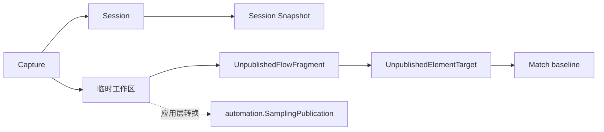
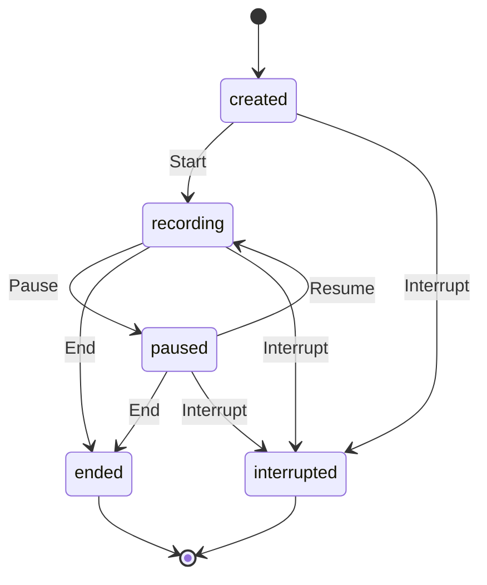

# 采样领域

## 目的与边界

采样管理录制会话、捕获幂等性、临时工作区、节点匹配与发布前模型。它把用户捕获整理为临时节点和工作流。

它**不**操作真实浏览器、不持久化正式资产，也不替应用层决定事务和 ID 映射。浏览器协议、会话持久化、线程安全、自动发布事务、人工 UI、容量配额和跨会话去重都在本领域之外。

## 聚合与值对象

`Session`（[`session.go`](../../domain/sampling/session.go)）保存状态、捕获去重表、identity 到稳定 NodeUUID 的映射及顺序动作；其 `Snapshot` 只是会话的隔离副本。

`UnpublishedFlowFragment` / `UnpublishedElementTarget`（[`workspace.go`](../../domain/sampling/workspace.go)）是**独立的**可编辑发布准备模型，支持临时资产与重写。它们不是 `Session` 或 `Session Snapshot` 的别名 —— 临时工作区不是会话快照，也不替代会话生命周期。

`CaptureID` 是重试幂等键，`IdentityKey` 是同一录制中的节点身份。`MatchProfile` 组合 selectors、fingerprint、origin；`ResolutionMode` 是四值封闭集 `UNDECIDED` / `CREATE` / `MERGE` / `REUSE`（[`workspace.go:48-51`](../../domain/sampling/workspace.go)），没有第五个取值。

## 不变量

- 新会话要求 workflowID 与合法 startURL；UUID 使用 v7（[`session.go:396`](../../domain/sampling/session.go) 写入版本位 `0x70`）。
- 仅 `recording` 可 Record；Pause/Resume/End/Interrupt 遵守状态矩阵，终态不可恢复；Interrupt/Fail 幂等。
- 同一 `CaptureID` 的重试返回原结果，即使载荷变化；新动作序号单调。
- `IdentityKey` 稳定复用 NodeUUID；`ElementTargetSpec` 新建与更新均校验。
- `Snapshot` 深拷贝 Nodes、Actions、Values、Validation 与 fingerprint。
- Match 对称且位于 `[0,1]`，重复 selector 只计一次，缺失可选信号不产生奖励。
- 重建引用要求临时节点与步骤映射一致；正式发布合法性最终由自动化校验。

### 未发布资产不得携带正式身份

`UnpublishedElementTarget` 上唯一的引用字段是 [`ExistingNodeID`](../../domain/sampling/workspace.go) —— 它指向**已经**发布出去的 ElementTarget，不是这份草稿自己的身份。Version、VersionNumber、Revision、CurrentVersionID 这类正式身份只能由自动化在发布成功之后分配；草稿先带上它，就可能在任何东西发布它之前被执行或被引用。

[`unified_language_boundary_test.go`](../../architecture/unified_language_boundary_test.go) · `TestUnpublishedSamplingAssetsCarryNoFormalIdentity` 对两个类型的字段名同时做两道检查：禁用子串（`Version`/`VersionNumber`/`Revision`/`CurrentVersionID`/`ElementTargetVersionID`）和禁用前缀（`Saved`/`Published`/`Promoted`/`Formal`）。两道都需要 —— 曾经存在的 `SavedWorkflowID` 不含任何一个禁用子串，只有前缀那一道拦得住它。`Saved` 与 `Existing` 的区别是语义的而非语法的：「Saved」说这份资产在发布前就握有正式身份，「Existing」说它引用了别人已经发布的东西。

## 状态与流程

每个终态只有一个名字。`StatusCompleted` / `StatusFailed` 常量别名与 `Session.Complete` / `Session.Fail` 转发方法曾让 `Ended` / `Interrupted` 各自有两个公开名字，现已删除；`TestNoExportedConstAliasKeepsAnOldNameAlive` 与 `TestNoExportedMethodAliasKeepsAnOldNameAlive` 守住这两种形状，它们是原类型别名守卫看不见的。

## 失败语义

遵循[统一 fault 封套](../architecture/system-overview.md#错误契约)。`SAMPLING_*` 前缀在[错误码注册表](../contracts/error-code-registry.md)里共 14 行，其中 **11 个由 `domain/sampling` 产出**；另外三个（`SAMPLING_PUBLICATION_IDENTITY_CONFLICT`、`SAMPLING_PUBLICATION_AUTHORITY_INVALID`、`SAMPLING_PUBLICATION_COMMAND_INVALID`）由 `application/automation` 产出，前缀与产出包刻意不对齐，理由见[上下文地图](../architecture/context-map.md#一处刻意的前缀错位)。

缺少业务身份、非法 URL/动作种类、状态不允许、无效 `ElementTargetSpec`、捕获字段不兼容、临时引用断裂都会失败。`CaptureHandler` 仅是函数类型，不规定 I/O、重试或错误翻译；匹配函数不返回适配器错误。

三条本领域特有的边界：

- **起始 URL 解析失败只作为私有 cause。** `url.Error` 会把完整 URL（含 path 与 query）格式化进自己的文本，故它绝不进公共文本；公共 violation 只说明 `startUrl` 格式非法。
- **捕获到的 `ElementTargetSpec` 校验失败原样上传 `FINGERPRINT_ELEMENT_TARGET_SPEC_INVALID`**，不再套一层 `SAMPLING_CAPTURE_INVALID` —— 嵌套 fault 会迫使宿主递归解包才能分类。
- **step / 临时 ElementTarget 的身份 ID 一律不进公共文本。** 会话状态与动作种类虽是闭集，但被拒的取值按定义就在闭集之外，即任意调用方输入，同样不回显。

`nil` 接收者与 UUID 熵源失败合并为 `SAMPLING_INTERNAL`：两者都没有调用方可执行的补救动作，分成两个 code 只会多出一个没人能处理的 i18n key。

## 并发、安全与资源

`Session` 是含 map/slice 的可变对象，**未提供锁**；调用方必须串行化访问，`Snapshot` 仅提供副本隔离。`ValidationSample` 的 `Sensitive` 标识敏感证据，但本领域不实现存储加密或浏览器脱敏。会话数据驻留内存且当前没有容量或时长上限，上层应控制生命周期和输入规模。

## 交互

fingerprint 提供 `ElementTargetSpec` 和相似度信号；自动化提供临时步骤/属性类型及正式发布模型；应用服务负责仓储读取、候选决策、正式 ID 分配与提交。不得从这些类型推断浏览器适配器会如何捕获 DOM。

## 源码证据

- [会话](../../domain/sampling/session.go)、[匹配](../../domain/sampling/matching.go)、[工作区](../../domain/sampling/workspace.go)、[捕获处理器类型](../../domain/sampling/handler.go)
- [会话矩阵](../../domain/sampling/session_matrix_test.go)、[会话测试](../../domain/sampling/session_test.go)、[匹配与模糊测试](../../domain/sampling/matching_test.go)
- [身份边界守卫](../../architecture/unified_language_boundary_test.go) · `TestUnpublishedSamplingAssetsCarryNoFormalIdentity`
- [聚合构造与持久化守卫](../../architecture/dependencies_test.go) · `TestSamplingOwnsNoAutomationAggregateConstructionOrPersistence`
- [自动化侧的采样发布模型](../../domain/automation/sampling_publication.go)
