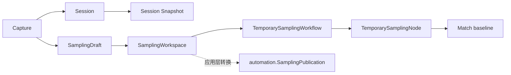
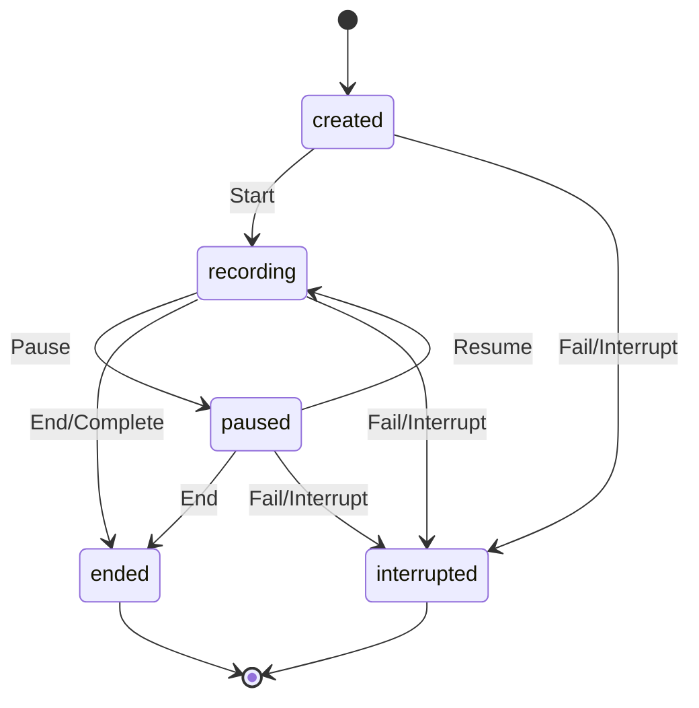

# 采样领域

## 目的与边界
采样管理录制会话、捕获幂等性、临时工作区、节点匹配与发布前模型。它把用户捕获整理为临时节点和工作流；不操作真实浏览器、不持久化正式资产，也不替 Application 决定事务和 ID 映射。

## 术语与公开模型
`Session` 保存状态、捕获去重表、identity 到稳定 NodeUUID 的映射及顺序动作；其 Snapshot 只是会话的隔离副本。`SamplingDraft`/`SamplingWorkspace` 是独立的可编辑发布准备模型，支持临时资产与重写，不是 Session 或 Session Snapshot 的别名。`CaptureID` 是重试幂等键，`IdentityKey` 是同一录制中的节点身份。`MatchProfile` 组合 selectors、fingerprint、origin；ResolutionMode 为 CREATE/MERGE/REUSE/FORCE_CREATE。

## 不变量
- 新会话要求 workflowID 与合法 startURL；UUID 使用 v7。
- 仅 Recording 可 Record；Pause/Resume/End/Interrupt 遵守状态矩阵，终态不可恢复；Interrupt/Fail 幂等。
- 同一 CaptureID 的重试返回原结果，即使载荷变化；新动作序号单调。
- IdentityKey 稳定复用 NodeUUID；NodeSpec 新建与更新均校验。
- Snapshot 深拷贝 Nodes、Actions、Values、Validation 与 fingerprint。
- Match 对称且位于 `[0,1]`，重复 selector 只计一次，缺失可选信号不产生奖励。
- 重建引用要求临时节点与步骤映射一致；正式发布合法性最终由 自动化 校验。

## 状态与流程

## 失败
缺少业务身份、非法 URL/动作种类、状态不允许、无效 NodeSpec、捕获字段不兼容、临时引用断裂会失败。`CaptureHandler` 仅是函数类型，不规定 I/O、重试或错误翻译。匹配函数不返回适配器错误。

失败一律以注册的 `SAMPLING_*` fault 形式返回，共 11 个 code（见 `docs/refactor/business-error-contract/error-code-registry.md`）。多字段校验产出**一个**顶层 fault，携带有序 `fault.Violation`：字段路径是逻辑路径（集合下标 0 基），原因走共享内核的 `VALIDATION_FIELD_*` 词表。

三条边界值得单独记住：

- **起始 URL 解析失败只作为私有 cause。** `url.Error` 会把完整 URL（含 path 与 query）格式化进自己的文本，故它绝不进公共文本；公共 violation 只说明 `startUrl` 格式非法。
- **捕获到的 ElementTargetSpec 校验失败原样上传 `FINGERPRINT_ELEMENT_TARGET_SPEC_INVALID`**，不再套一层 `SAMPLING_CAPTURE_INVALID` —— 嵌套 fault 会迫使宿主递归解包才能分类。
- **step / 临时 ElementTarget 的身份 ID 一律不进公共文本**；会话状态与动作种类虽是闭集，但被拒的取值按定义就在闭集之外，即任意调用方输入，同样不回显。

`nil` 接收者与 UUID 熵源失败合并为 `SAMPLING_INTERNAL`：两者都没有调用方可执行的补救动作。

## 并发、安全与资源
Session 是含 map/slice 的可变对象，未提供锁；调用方必须串行化访问，Snapshot 仅提供副本隔离。ValidationSample 的 `Sensitive` 标识敏感证据，但本领域不实现存储加密或浏览器脱敏。会话数据驻留内存且当前未见容量/时长上限；上层应控制生命周期和输入规模。

## 交互
fingerprint 提供 NodeSpec 和相似度信号；自动化 提供临时步骤/属性类型及正式发布模型；应用服务负责仓储读取、候选决策、正式 ID 分配与提交。不得从这些类型推断浏览器适配器会如何捕获 DOM。

## 已实现与未支持
已实现：会话状态机、捕获幂等、稳定节点身份、顺序动作、深拷贝快照、匹配、临时工作区/候选/解析模式与引用重建。未支持：浏览器协议、持久化会话、线程安全、自动发布事务、人工 UI、容量配额、跨会话去重。

## 源码与测试
- [会话](../../domain/sampling/session.go)、[匹配](../../domain/sampling/matching.go)、[工作区](../../domain/sampling/workspace.go)、[捕获处理器类型](../../domain/sampling/handler.go)
- [会话矩阵](../../domain/sampling/session_matrix_test.go)、[会话测试](../../domain/sampling/session_test.go)、[匹配与模糊测试](../../domain/sampling/matching_test.go)
- [自动化 采样发布](../../domain/automation/sampling_publication.go)
